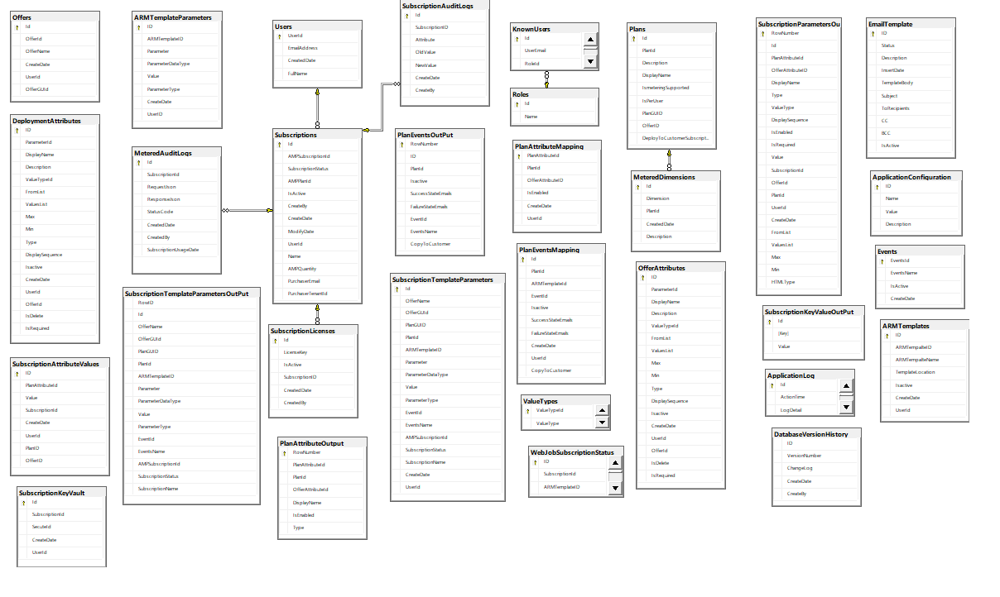

# Transactable SaaS SDK Database

## Introduction

The customer portal and the publisher portal sample web applications use SQL Server database as the data source to store marketplace subscriptions and the status, metered dimensions by plans, and activity against subscriptions.

## Install Using SQL Scripts

The SQL scripts build on top of each other. When setting up your database, do the following.

1. Start with a blank database
2. Run AMP-DB-2.1.sql

## Description

The following picture illustrates the entities and the relationships among them:

| Entity | Description |
| --- | --- |  
| ApplicationConfiguration | Holds application level configuration like SMTP details and feature flags |
| ApplicationLog | Activity in the application is tracked via a custom logger implementation |
| DatabaseVersionHistory | Tracks the changes to the database by versions |
| EmailTemplate | Predefined set of email templates |
| Events | List of events that occur in the context of a subscription against a plan which can be configured for email notifications |
| KnownUsers | Admin users on the publisher side that can log on to the Publisher portal|
| MeteredAuditLogs | The request and response against metering service API is stored here. Helps troubleshoot issuses when posting usage data to Azure |
| MeteredDimensions  | Stores the meters related to plans |
| OfferAttributes | Global set of attributes that could appear as additional input paramteters during the purchase of a subscription |
| Offers | Marketplace related to the publisher |
| PlanAttributeMapping | Overrides for the input attributes defined at the offer level|
| PlanEventsMapping | Event configuration by plan |
| Plans | Plans associated with the Marketplace offer|
| Roles | User roles |
| SubscriptionAttributeValues | Values provided by the user on the landing page, for the additional input attributes as configured at the plan level |
| SubscriptionAuditLogs | Activity on the subscription is saved to this table |
| Subscriptions | List of SaaS subscriptions
| Users | Users ( auto-registered due to purchase of subscriptions) |
| ValueTypes | Type of attributes, for the fields that appear on the subscription landing page|
| WebJobSubscriptionStatus | Status changes on the subscription as processed by the webjob are logged here |

### Application Configuration

Application configuration is initialized with the following keys that the publisher has to update with appropriate values:

| Key | Description|
| --- | -- |
| ApplicationName | Name of the application |
| IsEmailEnabledForSubscriptionActivation | Flag that defines if an email has to be sent out when a subscription is activated (Default: False, Allowed values : True / False)|
| IsEmailEnabledForUnsubscription | Flag that defines if an email has to be sent out when a subscription is deleted (Default: False, Allowed values : True / False)|
| IsAutomaticProvisioningSupported | Flag that enables activation workflow. If the value is False, the options - Change Plan & Unsubscribe are not available to the customer. Clicking **Activate** button on the landing page would place the subscription in PendingActivation status and doesn't activate the subscription yet. Publisher has the option to activate the subscription, change plan and unsubscribe. If the value is True, customer can activate, change plan and unsubscribe without any intervention required from the publisher.
| IsEmailEnabledForPendingActivation | Flag to indicate if an email should be sent out to publisher when activation workflow is enabled.
| SMTPFromEmail | From email address for the emails |
| SMTPHost | SMTP server name |
| SMTPPassword | Password in the credential to connect to the SMTP server |
| SMTPPort | SMTP Port name |
| SMTPSslEnabled | Is SMTP SSL enabled |
| SMTPUserName | Username in the credential to connect to the SMTP server |

### EmailTemplate

Email template table contains a predefined set of templates for the emails sent out when a subscription is activated / deleted.
Publisher is required to update the ToRecipients ( list of emails separted by a ;), CC and BCC on the template entries in the EmailTemplate table.
The Body of the email is HTML and can be modified using a text editor.
