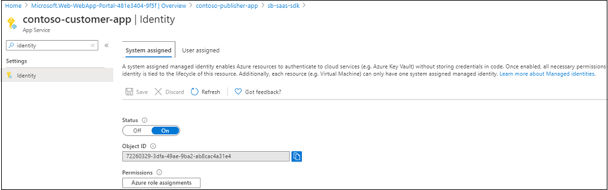
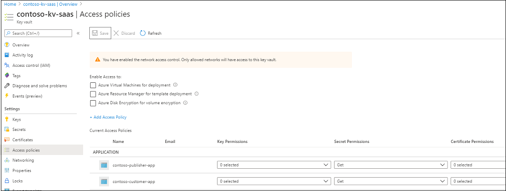
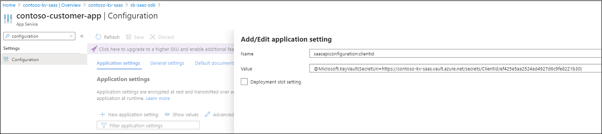
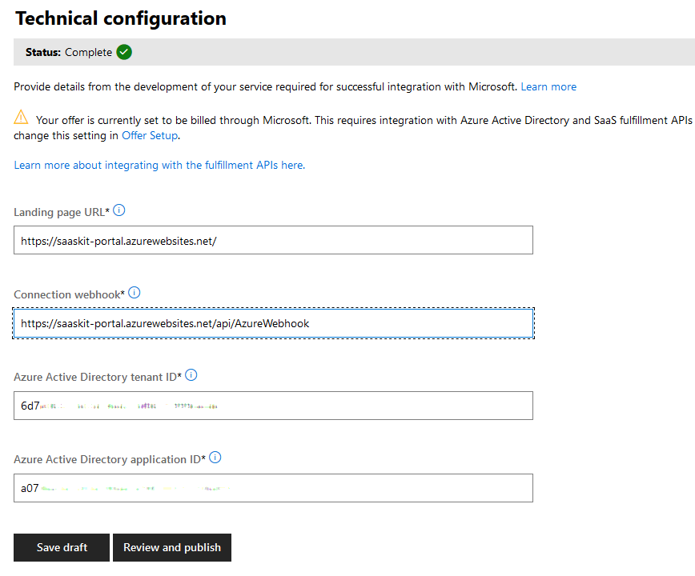

 # Installation instructions

  - [Overview](#overview)
  - [Deploy web applications and SQL Azure database using Powershell](#deploy-web-applications-and-sql-azure-database-using-powershell)
  - [Change configuration](#change-configuration)
  - [Create Web Apps on Azure and deploy the code](#create-web-apps-on-azure-and-deploy-the-code)
    + [Running the solution locally](#running-the-solution-locally)
  - [Landing page and webhook settings for the SaaS offer on Partner Center](#landing-page-and-webhook-settings-for-the-saas-offer-on-partner-center)
  - [Next steps](#next-steps)
    - [Configuring the Customer Provisioning web application](./Customer-Experience.md)
    - [Configuring the Publisher Provisioning web application](./Publisher-Experience.md)

## Overview

This document describes how to implement the required components to enable the SaaS Accelerator for the SaaS Fulfillment API (v2), Marketplace Metering Service API, and additional components that demonstrate how to build a customer provisioning interface, logging, and administration of the customer's subscriptions.

Learn more about what's included and how to use the SaaS Accelerator [here](https://github.com/Azure/Commercial-Marketplace-SaaS-Accelerator/blob/master/README.md).

Please note: the SaaS Accelerator is community-supported. If you need help or have questions about using the SaaS Accelerator, please create a GitHub issue. Do not contact the marketplace publisher support alias directly regarding use of the SaaS Accelerator. Thank you.

> **Note**
>  - The template uses the **Web App Name Prefix** to create two web applications. For example, if the value provided for this field is **contoso**, the deployment creates the customer portal - https://contoso-portal.azurewebsites.net and the publisher portal - https://contoso-admin.azurewebsites.net.
> - **_Important_** For the login to the portals to work, it is important that you configure the **Redirect URIs** in the AD application to use these web applications. Here are the redirect URIs that should be in place:

> - https://contoso-portal.azurewebsites.net    
> - https://contoso-portal.azurewebsites.net/
> - https://contoso-portal.azurewebsites.net/Home/Index
> - https://contoso-portal.azurewebsites.net/Home/Index/
> - https://contoso-admin.azurewebsites.net
> - https://contoso-admin.azurewebsites.net/
> - https://contoso-admin.azurewebsites.net/Home/Index
> - https://contoso-admin.azurewebsites.net/Home/Index/

## Deploy web applications and SQL Azure database using Powershell

### Using Azure Cloud Shell
   
   1. Copy the following section to an editor and update it to match your company preference. Replace SOME-UNIQUE-STRING with your Team name or some other random string.
``` powershell
dotnet tool install --global dotnet-ef; `
git clone https://github.com/Azure/Commercial-Marketplace-SaaS-Accelerator.git -b 7.6.1 --depth 1; `
cd ./Commercial-Marketplace-SaaS-Accelerator/deployment; `
.\Deploy.ps1 `
 -WebAppNamePrefix "marketplace-SOME-UNIQUE-STRING" `
 -ResourceGroupForDeployment "marketplace-SOME-UNIQUE-STRING" `
 -PublisherAdminUsers "user@email.com" `
 -Location "East US" 
 ```

  2. Paste the updated command in an Azure Cloud Shell PowerShell window.

### Local deployment

   1. Install Powershell 7.0.2
   - [Windows Store](https://www.microsoft.com/store/productId/9MZ1SNWT0N5D)
   - [GitHub](https://github.com/PowerShell/PowerShell/releases)
   2. Start a Windows PowerShell window as administrator and run the following commands to install Azure modules:
> Note: Make sure that you are using the latest Powershell version to avoid issues in Compress-Archive in 5.1 that got resolved in the latest version.
```powershell
Install-Module -Name Az -AllowClobber
```
   3. Clone the repository
   4. Navigate to the folder **.\deployment**
   5. Set the priorities running
```powershell
Set-ExecutionPolicy -Scope Process -ExecutionPolicy Bypass
```
   6. Choose "A", to change the policy to Yes to All. If you get a permission error, you can try:
        * Run the PowerShell terminal as an Administrator
        * Set the priorities running Set-ExecutionPolicy -ExecutionPolicy unrestricted.
   7. Run the command **Connect-AzureAD -Confirm** for the App Registration
   8. Run the command **.\Deploy.ps1** with the following paramters

| Parameter | Description |
|-----------| -------------|
| WebAppNamePrefix | _[required]_ A unique prefix used for creating web applications. Example: `contoso` |
| ResourceGroupForDeployment | Name of the resource group to deploy the resources. Default: `WebAppNamePrefix` value |
| Location | _[required]_ Location of the resource group |
| PublisherAdminUsers | _[required]_ Provide a list of email addresses (as comma-separated-values) that should be granted access to the Publisher Portal |
| TenantID | The value should match the value provided for Active Directory TenantID in the Technical Configuration of the Transactable Offer in Partner Center. If value not provided, you will be asked to select the tenant during deployment |
| AzureSubscriptionID | Id of subscription where the resources will be deployed. Subscription must be part of the Tenant Provided. If value not provided, you will be asked to select the subscription during deployment. |
| ADApplicationID | The value should match the value provided for Active Directory Application ID in the Technical Configuration of the Transactable Offer in Partner Center. If value not provided, a new application will be created. |
| ADApplicationSecret | Valid secret for the ADApplication. Required if ADApplicationID is provided. If `ADApplicationID` is not provided, a secret will be generated. |
| ADMTApplicationID | A valid App Id for an Azure AD Application configured for SSO login. If value not provided, a new application will be created. |
| SQLServerName | A unique name of the database server (without database.windows.net). Default: `WebAppNamePrefix`-sql |
| LogoURLpng | The url of the company logo image in .png format with a size of 96x96 to be used on the website |
| LogoURLico | The url of the company logo image in .ico format |
| Quiet | Disable verbose output when running the script


> **Example** 
```powershell
.\Deploy.ps1 `
    -WebAppNamePrefix "contoso" `
    -TenantID "tenandId" `
    -ADApplicationID "single-tenant clientId" `
    -ADApplicationSecret "single-tenant secret" `
    -ADMTApplicationID "multi-tenant clientId" `
    -PublisherAdminUsers "user@contoso.com" `              
    -AzureSubscriptionID "subscriptionId" `
    -ResourceGroupForDeployment "resourcegroup" `
    -Location "East US" `

```
## Change configuration

Open the files **appsettings.json** under the project **CustomerSite** and **AdminSite** update the values as follows:
- **GrantType** - Leave this as `client_credentials`
- **ClientId** - Azure Active Directory Application ID (the value for marketplace offer in Partner Center, under technical configuration tab). Steps to register an Azure AD application are [here](https://docs.microsoft.com/en-us/azure/marketplace/partner-center-portal/pc-saas-registration)
- **ClientSecret** - Secret from the Azure Active Directory Application
- **Resource** - Set this to *20e940b3-4c77-4b0b-9a53-9e16a1b010a7* **this value is important, it is the resource ID for the fulfillment API**
- **FulFillmentAPIBaseURL** - https://marketplaceapi.microsoft.com/api
- **SignedOutRedirectUri** - Set the path to the page the user should be redirected to after signing out from the application
- **TenantId** - Provide the tenant ID detail that was submitted in the. **Technical configuration** section of your marketplace offer in Partner Center.
- **FulfillmentApiVersion** - Use 2018-08-31 for the production version of the fulfillment APIs
- **AdAuthenticationEndpoint** - https://login.microsoftonline.com
- **SaaSAppUrl** - URL to the SaaS solution 
- **DefaultConnection** - Set the connection string to connect to the database.     

After making all of the above changes, the **appSettings.json** would look like sample below.

```json
{
  "Logging": {
    "LogLevel": {
      "Default": "Information",
      "Microsoft": "Warning",
      "Microsoft.Hosting.Lifetime": "Information"
    }
  },
  "SaaSApiConfiguration": {
    "GrantType": "client_credentials",
    "ClientId": "<Azure AD application ID>",
    "ClientSecret": "<client secret>",
    "Resource": "20e940b3-4c77-4b0b-9a53-9e16a1b010a7",
    "FulFillmentAPIBaseURL": "https://marketplaceapi.microsoft.com/api",
    "SignedOutRedirectUri": "<provisioning_or_publisher_web_app_base_path>/Home/Index",
    "TenantId": "<TenantID of AD application>",
    "FulFillmentAPIVersion": "2018-08-31",
    "AdAuthenticationEndPoint": "https://login.microsoftonline.com",
    "SaaSAppUrl" : "<Link-to-SaaS-application>"
  },
  "connectionStrings" : {
    "DefaultConnection": "Data source=<server>;initial catalog=<database>;user id=<username>;password=<password>"
    },
  "AllowedHosts": "*"
}
```

### (Optional but recommended) Setting and Loading above configuration values from KeyVault 
- [Enable Managed Identity on Apps (App Services created in the next section)](https://docs.microsoft.com/en-us/azure/app-service/app-service-key-vault-references)


- [Grant Apps access to Key Vault by setting Access Policies on Key Vault](https://docs.microsoft.com/en-us/azure/app-service/app-service-key-vault-references#granting-your-app-access-to-key-vault)


- [Add AppService-Configuration-**Application Settings** using Key Vault Reference Syntax](https://docs.microsoft.com/en-us/azure/app-service/app-service-key-vault-references#reference-syntax)



## Create Web Apps on Azure and deploy the code

The sample has two web apps to demonstrate the activation of a subscription for a SaaS offer, and potential scenarios for managing subscriptions and users. 

There are many ways to create Web App resources on [App Service](https://docs.microsoft.com/en-us/azure/app-service/) and deploy the code,
- Using Azure portal
- Using command line tools, [Azure CLI](https://docs.microsoft.com/en-us/azure/app-service/samples-cli), [Azure PowerShell](https://docs.microsoft.com/en-us/azure/app-service/samples-powershell) and [Resource Manager (ARM) templates](https://docs.microsoft.com/en-us/azure/app-service/samples-resource-manager-templates)
- [Using Visual Studio Code](https://docs.microsoft.com/en-us/azure/app-service/app-service-web-get-started-nodejs#deploy-the-app-to-azure), the example on this link is showing a Node.js app, but the same principles apply for a .NET solution.
- [Using Visual Studio](https://docs.microsoft.com/en-us/azure/app-service/app-service-web-get-started-dotnet#publish-your-web-app), this example demonstrates how to create a new web app on the Azure App Service, and deploy the code to it. 
- [Continuous deployment](https://docs.microsoft.com/en-us/azure/app-service/deploy-continuous-deployment)

You can use any of the methods above to create the web apps and deploy the code, but for the rest of this document, let's assume the use of [Visual Studio method](https://docs.microsoft.com/en-us/azure/app-service/app-service-web-get-started-dotnet#publish-your-web-app) to deploy the following two apps. Give appropriate names to indicate the applications' roles, for example, **\<yourname\>provisioning**, and **\<yourname\>publisher**. Please remember that these names will be the DNS prefix for the host names of your applications and will eventually be available as yournameprovisioning.azurewebsites.net and yournamepublisher.azurewebsites.net.
1. **Customer provisioning sample web application**, create and deploy the provisioning sample web application project in folder [src/CustomerSite](../src/CustomerSite)
1. **Publisher sample web application**, create and deploy the provisioning sample web application project in folder [src/CustomerSite](../src/AdminSite)

Deploying the debug release, and choosing "self-contained" deployment mode is useful for the initial deployments.


**_Important_**, Add the redirect uri on the Azure AD app registration after deploying the publisher solution following the steps [here](https://docs.microsoft.com/en-us/azure/active-directory/develop/quickstart-configure-app-access-web-apis#add-redirect-uris-to-your-application). The value should be https://\<yourappname\>.azurewebsites.net/Home/Index

### Running the solution locally   

Press **F5** in Visual Studio 2019 to run the application locally.

**_Important_**, Add the redirect uri on the Azure AD app registration after deploying the publisher solution following the steps [here](https://docs.microsoft.com/en-us/azure/active-directory/develop/quickstart-configure-app-access-web-apis#add-redirect-uris-to-your-application). The value should be https://\<yourappname\>.azurewebsites.net/Home/Index

**_Important_**, the actual flow of subscribing to an offer on the Azure marketplace and managing the relevant lifetime events of the subscription, such as activation, cancellation, and upgrade is only possible for the provisioning solution deployed to a location accessible on the internet.

## Landing page and webhook settings for the SaaS offer on Partner Center

The landing page and the webhook endpoint are implemented in the **CustomerSite** application. 

The landing page is the home page of the solution, for example, if you have deployed the solution to \<yourappname\>, the landing page value should be **https://\<yourappname\>.azurewebsites.net**.

Webhook endpoint is at **https://\<yourappname\>.azurewebsites.net/api/AzureWebhook**

The **Technical Configuration** section of the Marketplace offer with the values filled using the web app names would look like as shown here.



|Field | Value |
|--|--|
|Landing page URL | Path to the Provisioning Service. Eg: https://saaskit-portal.azurewebsites.net
|Connection webhook | Path to the web hook API in the Provisioning Service. Eg: https://saaskit-portal.azurewebsites.net/api/AzureWebhook
|Azure Active Directory Tenant ID | Tenant where the AD application is registered
|Azure Active Directory Application ID | ID of the registered AD application

### Running the webhook locally

You may find yourself wanting to exercise the webhook in your local development environment. There is a challenge here that has been addressed in the webhook code.

There is logic in the webhook to verify the operation that was received via HTTP POST. This is a best practice, but provides challenges when exercising the webhook on your desktop, perhaps by POSTing a webhook payload with Postman or a similar tool. 

To get around this in your development environment, you can set an environmental variable to bypass verifying the operation within the Azure marketplace. Setting this variable on a local development machine can be done in `appsetting.Development.json`. The vey/value pair to add to your environmental variables is as follows.

```json
environment=development
```

> ⚠️ This variable should never be set in production. It is for local development purposes only.

Any other value for the environmental variable, including not having the variable present, will result in the webhook authenticating the operation of the request.

## Next steps

* [Customer portal - Sample web application](./Customer-Experience.md): This document shows how to configure the web solution that enables the registration of a customer purchasing your SaaS Service and how a customer would manage their subscriptions and plans.
* [Publisher portal - Sample web application](./Publisher-Experience.md): This document shows how to configure the web solution that enables the activation of a customer purchasing your SaaS Service and how to send metered billing back to the Marketplace Metering Service API.
