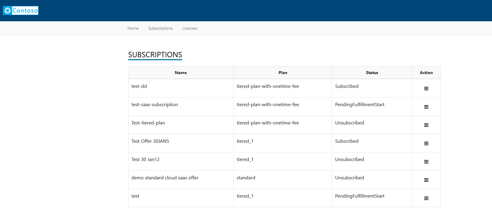
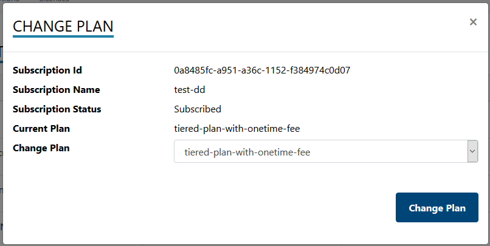

# Customer Portal - Sample Web Application

## Table of contents
- [Customer Portal - Sample Web Application](#customer-portal---sample-web-application)
  - [Table of contents](#table-of-contents)
  - [Overview](#overview)
  - [Subscribing to the offer](#subscribing-to-the-offer)
    - [Activate](#activate)
    - [Change plan](#change-plan)
    - [Unsubscribe](#unsubscribe)
    - [Change Quantity](#change-quantity)
    - [View activity log](#view-activity-log)
  - [Next steps](#next-steps)

## Overview

Customers may subscribe to marketplace offer from different storefronts. This example covers Azure Marketplace storefront with Azure Portal experience.

## Subscribing to the offer
 
Assuming that the SaaS offer was published and is available for the known tenants, or you have logged on as one of the preview users, if the offer is in preview stage, follow the steps for subscribing to the SaaS offer.

1. Log on to [Azure](https://portal.azure.com) 
2. Click **All Services** menu option on the left.


3. Search for resources of type **Software as a Service**. The page lists all the SaaS offers that were previously purchased.


4. Click **Add** to proceed to purchase a new SaaS offer.

> If you don't have prior subscriptions against SaaS offers, the list would be blank and you would get an option to **Create Software as a Service** button to help you proceed with the purchase.


5. Clicking **Add** ( or **Create Software as a Service**) leads you to a page that lists down SaaS offers available for purchase.

6. Search for your SaaS offer 


7. Click on the tile to view the details of the offer


8. **Select a software plan** and click **Create**
9. Fill out the form and click **Subscribe**


- A new resource gets created and appears in the listing


10. Click the text under **Name** to view the details of the subscription. The subscription is not active at this point, and will not be charged before it is activated.
11. Click **Configure Account** option in the header bar. You will now be transferred to the SaaS offer landing page as configured on the technical configuration page of the offer, in a new tab / window

> In a real scenario, the landing page would collect additional details relevant for starting the on-boarding process for the customer.

### Activate

> The below diagram illustrates the flow of information between Azure and the Azure marketplace Accelerator client application.


On the landing page, review the details presented and click **Activate**


> The sample application calls the following client methods in the background

```csharp
// Determine the details of the offer using the marketplace token that is available in the URL during the redirect from Azure to the landing page.
Task<ResolvedSubscriptionResult> ResolveAsync(string marketPlaceAccessToken);

// Activates the subscription to trigger the start of billing 
Task<SubscriptionUpdateResult> ActivateSubscriptionAsync(Guid subscriptionId, string subscriptionPlanID);

```

- Upon successful activation of the subscription, the landing page switches to a view that lists the subscriptions against the offer. 
> You can switch to Azure and note that the **Configure Account** button is replaced by **Manage Account** button indicating that the subscription has been activated.

> **Note** If activation workflow is enabled, by turning on the flag - **IsAutomaticProvisioningSupported** in the ApplicationConfiguration table, the application would put the subscription in PendingActivation status and the Fulfillment API to activate the subscription is not called. Publisher has the option to activate the subscription via the action menu in the subscription listing in the publisher sample application.

### Change plan

> The below diagram illustrates the flow of information between Azure and the Azure marketplace SaaS Accelerator application.

1. Log on to the customer provisioning application.
2. Click **Subscriptions** from the menu on the top, in case you are not on the page that shows you the list of subscriptions. The table on this page lists all the subscriptions and their status.
3. Click **Change Plan** option in the dropdown menu that appears when the icon under the **Actions** column against any of the active subscriptions is clicked.


  A popup appears with a list of plans that you can switch to.

4. Select a desired plan and click **Change Plan**.
5. 

> The sample application calls the following client methods in the background

```csharp
// Initiate the change plan process
Task<SubscriptionUpdateResult> ChangePlanForSubscriptionAsync(Guid subscriptionId, string subscriptionPlanID);

```
>The operation is asynchronous and the call to **change plan** comes back with an operation location that should be queried for status.

```csharp
// Get the latest status of the subscription due to an operation / action.
Task<OperationResult> GetOperationStatusResultAsync(Guid subscriptionId, Guid operationId);
```

> **Note** If activation workflow is enabled, by turning on the flag - **IsAutomaticProvisioningSupported** in the ApplicationConfiguration table, the option to **Change Plan** is disabled for customers. Publisher has the option to change the plan of the subscription via the action menu in the subscription listing in the Publisher Portal.

### Unsubscribe

1. Log on to the customer provisioning application.
2. Click **Subscriptions** from the menu on the top, in case you are not on the page that shows you the list of subscriptions. The table on this page lists all the subscriptions and their status.
3. Click **Unsubscribe** against an active subscription.

4. Confirm your action to trigger the deletion of the subscription.

> The sample application calls the following client methods in the background.

```csharp
// Initiate the delete subscription process
Task<SubscriptionUpdateResult> DeleteSubscriptionAsync(Guid subscriptionId, string subscriptionPlanID);
```

> The operation is asynchronous and the call to **change plan** comes back with an operation location that should be queried for status.

```csharp
// Get the latest status of the subscription due to an operation / action.
Task<OperationResult> GetOperationStatusResultAsync(Guid subscriptionId, Guid operationId);
```
> **Note** If activation workflow is enabled, by turning on the flag - **IsAutomaticProvisioningSupported** in the ApplicationConfiguration table, the option to **Unsubscribe** is disabled for customers. Publisher has the option to delete the subscription via the action menu in the subscription listing in the Publisher Portal.

### Change Quantity

1. Log on to the customer provisioning application.
2. Click **Subscriptions** from the menu on the top, in case you are not on the page that shows you the list of subscriptions. The table on this page lists all the subscriptions and their status.
3. Click **Change quantity** in the menu as shown in the below picture


4. Provide the new quantity and click **Change Quantity** to update the quantity on the subscription


> Note: The update to quantity is applicable if only the subscription is against a Plan that is set to be billed per user
  

> The sample application calls the following client methods in the background.

```csharp
Task<SubscriptionUpdateResult> ChangeQuantityForSubscriptionAsync(Guid subscriptionId, int? subscriptionQuantity);
```
> The operation is asynchronous and the call to **change plan** comes back with an operation location that should be queried for status.
```csharp
// Get the latest status of the subscription due to an operation / action.
Task<OperationResult> GetOperationStatusResultAsync(Guid subscriptionId, Guid operationId);
```

**Update Plan to indicate per user pricing**

Use the following script as an example / template to update the records in **Plans**

```sql
UPDATE Plans SET IsPerUser = 1 WHERE PlanId = '<ID-of-the-plan-as-in-the-offer-in-partner-center>'
```

The Plan ID is available in the **Plan overview** tab of the offer as shown here:


### View activity log

1. Log on to the customer provisioning application.
2. Click **Subscriptions** from the menu on the top, in case you are not on the page that shows you the list of subscriptions.
3. The table on this page lists all the subscriptions and their status.
4. Click **Activity Log** to view the log of activity that happened against the subscription.
 
 
 
 
## Next steps

* [Publisher provisioning experience](./Publisher-Experience.md): This document shows how to configure the web solution that enables the activation of a customer purchasing your SaaS Service and how to send Mettered based billing back to the Commercial Marketplace API.
