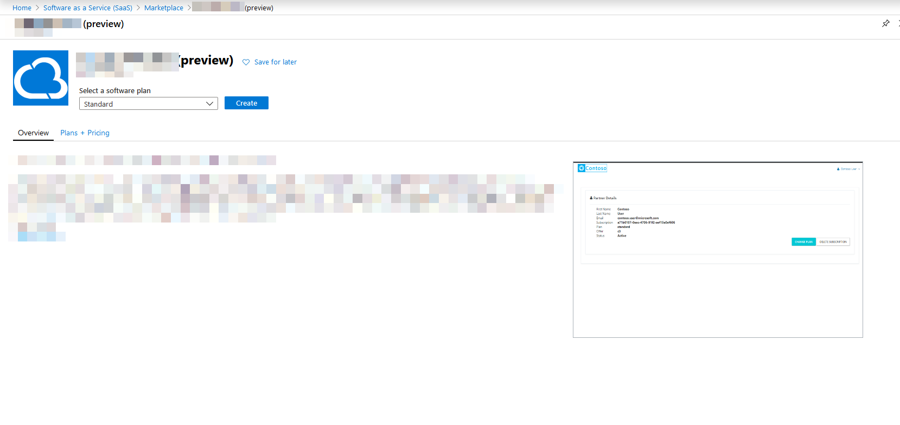
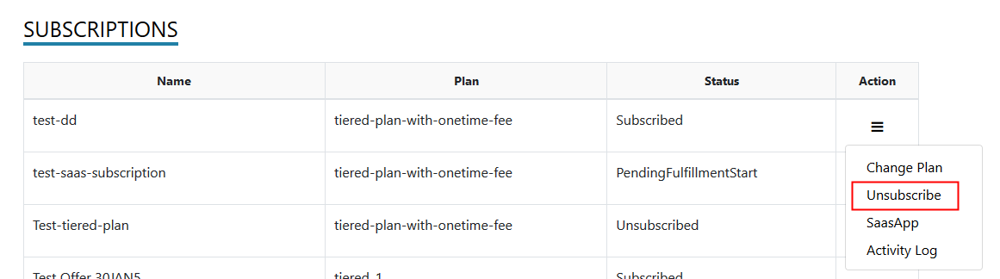

# Customer experience

* [Overview](#overview)
  * [Purchase SaaS offer](#purchase-saas-offer)
  * [Landing Page](#landing-page)
    + [Subscription](#subscription)
    + [Activate](#activate)
    + [Change plan](#change-plan)
    + [Unsubscribe](#unsubscribe)
    + [Change Quantity](#change-quantity)
    + [View activity log](#view-activity-log)
    + [View Licenses](#view-licenses)
  * [Troubleshooting issues](#troubleshooting-issues)

## Overview
The Customer provisioning web application provides the landing page for the customers who purchase the transactable SaaS offer.

## Purchase SaaS offer
SaaS offers that is published in Azure Market Place can be extracted and managed form the portal.
	
Log on to [Azure](https://portal.azure.com) 

- Click **All Services** menu option on the left


- Search for resources of type **Software as a Service**.
- The page enlists all the SaaS offers that were previously purchased.

- Click **Add** to proceed to purchase a new SaaS offer.
> If you don't have prior subscriptions against SaaS offers, the list would be blank and you would get an option to **Create Software as a Service** button to help you proceed with the purchase.


- Clicking **Add** ( or **Create Software as a Service**) leads you to a page that lists down SaaS offers available for purchase.

- Search for **Cloud SaaS** and locate our SaaS offer in the listing


- Click on the tile to view the details of the offer

- **Select a software plan** and click **Create**
- Fill out the form and click **Subscribe**

- A new resource gets created and appears in the listing

- Click the text under **Name** to view the details of the resource
- Click **Configure Account** option in the header bar. You will now be redirected to the SaaS offer landing page offered by the **AMP SDK Sample Client Application** in a new tab / window
- The landing page presents the details of the offer that was purchased with an option to **Activate** the subscription.
> In a real scenario, the landing page would collect additional details relevant for provisioning the target SaaS application and any additional custom information from customer if required .

## Landing Page
- Customer lands on the page served from the Customer provisioning application that presents the details of the subscription related to the purchase. The landing page might present additional input fields in the form based on the configuration set by the Publisher for the plan. Besides, the fields might comprise the following, in case the Publisher has set the **Deploy to customer subscription** switch turned on.
- User needs to fill the fields like below which will help in deploying app in the subscription.
   - *Tenant Id*
   - *Subscription Id*
   - *Client ID*
   - *Client Secret*
    
 - Click **Validate** to validate the deployment parameters
 - Click **Activate** to either place a request for the publisher to act on ( applicable if activation workflow is turned on or activate the subscription, otherwise)

### Subscriptions
- All the subscriptions purchased by the customer will be availabe under the subscriptions screen.
- The status of each subscription will be available in the list.
- From this scree the actions on the subscriptions like Change Plan, Chan Quantity, Activate and unsubscribe can be done depending on the status.


### Activate

The below diagram illustrates the flow of information between Azure and the Azure marketplace SDK client application.


- On the landing page, review the details presented and click **Activate**

> The AMP SDK sample application calls the following AMP SDK API methods in the background

```csharp
// Determine the details of the offer using the marketplace token that is available in the URL during the redirect from Azure to the landing page.
Task<ResolvedSubscriptionResult> ResolveAsync(string marketPlaceAccessToken);

// Activates the subscription to trigger the start of billing 
Task<SubscriptionUpdateResult> ActivateSubscriptionAsync(Guid subscriptionId, string subscriptionPlanID);

```

- Upon successful activation of the subscription, the landing page switches to a view that enlists the subscriptions against the offer. 
> You can switch to Azure and note that the **Configure Account** button is replaced by **Manage Account** button indicating that the subscription has been materialized.

> **Note** If activation workflow is enabled, by turning on the flag - **IsAutomaticProvisioningSupported** in the ApplicationConfiguration table, the application would put the subscription in PendingActivation status and the Fulfillment API to activate the subscription is not called. Publisher has the option to activate the subscription via the action menu in the subscription listing in the Publisher Portal.

### Change plan

The below diagram illustrates the flow of information between Azure and the Azure marketplace SDK client application.

- Log on to [AMP SDK sample application]().
- Click **Subscriptions** from the menu on the top, in case you are not on the page that shows you the list of subscriptions.
- The table on this page enlists all the subscriptions and their status.
- Click **Change Plan** option in the dropdown menu that appears when the icon under the **Actions** column against any of the active subscriptions is clicked.

- A popup appears with a list of plans that you can switch to.
- Select a desired plan and click **Change Plan**.


> The AMP SDK sample application calls the following AMP SDK API methods in the background

```csharp
// Initiate the change plan process
Task<SubscriptionUpdateResult> ChangePlanForSubscriptionAsync(Guid subscriptionId, string subscriptionPlanID);

```
>The operation is asynchronous and the call to **change plan** comes back with an operation location that should be queried for status.

```csharp
// Get the latest status of the subscription due to an operation / action.
Task<OperationResult> GetOperationStatusResultAsync(Guid subscriptionId, Guid operationId);
```

> **Note** If activation workflow is enabled, by turning on the flag - **IsAutomaticProvisioningSupported** in the ApplicationConfiguration table, the option to **Change Plan** is disabled for customers. Publisher has the option to change the plan of the subscription via the action menu in the subscription listing in the Publisher Portal.

### Unsubscribe

- Log on to [AMP SDK sample application]().
- Click **Subscriptions** from the menu on the top, in case you are not on the page that shows you the list of subscriptions.
- The table on this page enlists all the subscriptions and their status.
- Click **Unsubscribe** against an active subscription.

- Confirm your action to trigger the deletion of the subscription.
> The AMP SDK sample application calls the following AMP SDK API methods in the background.

```csharp
// Initiate the delete subscription process
Task<SubscriptionUpdateResult> DeleteSubscriptionAsync(Guid subscriptionId, string subscriptionPlanID);
```

> The operation is asynchronous and the call to **change plan** comes back with an operation location that should be queried for status.

```csharp
// Get the latest status of the subscription due to an operation / action.
Task<OperationResult> GetOperationStatusResultAsync(Guid subscriptionId, Guid operationId);
```
> **Note** If activation workflow is enabled, by turning on the flag - **IsAutomaticProvisioningSupported** in the ApplicationConfiguration table, the option to **Unsubscribe** is disabled for customers. Publisher has the option to delete the subscription via the action menu in the subscription listing in the Publisher Portal.

### Change Quantity

- Log on to [AMP SDK sample application]().
- Click **Subscriptions** from the menu on the top, in case you are not on the page that shows you the list of subscriptions.
- The table on this page enlists all the subscriptions and their status.
- Click **Change quantity** in the menu as shown in the below picture


- Provide the new quantity and click **Change Quantity** to update the quantity on the subscription


> Note: The update to quantity is applicable if only the subscription is against a Plan that is set to be billed per user
  


> The AMP SDK sample application calls the following AMP SDK API methods in the background.


### View activity log

- Log on to [AMP SDK sample application]().
- Click **Subscriptions** from the menu on the top, in case you are not on the page that shows you the list of subscriptions.
- The table on this page enlists all the subscriptions and their status.
- Click **Activity Log** to view the log of activity that happened against the subscription.
 
 

### View Licenses

- Log on to [AMP SDK Sample application]()
- Click **Licenses** menu at the top to view the list of subscriptions and licenses.
- Use the **Copy** button to copy the license text to clipboard


