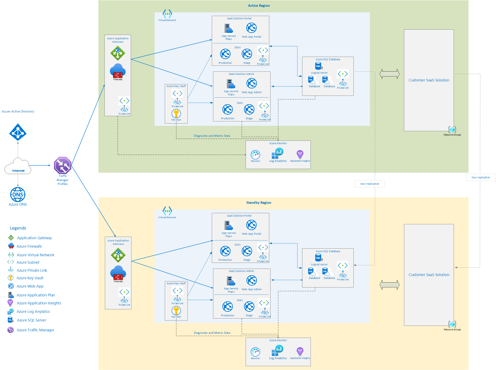

# High Availability Production Reference Architect Example:
 Deploying SaaS Offer to production requirements following  [The Azure Well-Architected Framework](https://docs.microsoft.com/en-us/azure/architecture/framework/) which is a set of guiding tenets that can be used to improve the quality of a workload. The framework consists of five pillars of architectural excellence:
- Reliability
- Security
- Cost Optimization
- Operational Excellence
- Performance Efficiency

There are different options for deploying SaaS over in production:
- [Single Region Deployment based on SaaS Accelerator solution](Enterprise-Reference-Architecture-Single-region.md)
- [Single Region Deployment SaaS Accelerator solution with Custom SaaS solution](Enterprise-Reference-Architecture-Single-region-saas-rg.md)
- High Availability Deployment i.e Multi Region Deployment

## High Availability Deployment Example
This example is useful where publisher will SaaS solution deployed to its Resource Group and use SaaS Accelerator Portal and Admin site to manage subscribers activities and redirect subscribers to the SaaS solution site. This Deployment offer High Availability and Security. 
 The solution follows [Azure Security Center](https://azure.microsoft.com/en-us/services/security-center/) and [The Azure Well-Architected Framework](https://docs.microsoft.com/en-us/azure/architecture/framework/) recommendation.

 This deployment uses the following Azure services.
- [Azure Active Directory](https://docs.microsoft.com/en-us/azure/active-directory/fundamentals/active-directory-whatis)
- [App Service Plan](https://docs.microsoft.com/en-us/azure/app-service/overview-hosting-plans)
- [App Service app](https://docs.microsoft.com/en-us/azure/app-service/overview)
- [Azure SQL Database](https://docs.microsoft.com/en-us/azure/azure-sql/database/sql-database-paas-overview)
- [Application Gateway](https://docs.microsoft.com/en-us/azure/application-gateway/overview)
- [Azure virtual network](https://docs.microsoft.com/en-us/azure/virtual-network/virtual-networks-overview)
- [Network security groups](https://docs.microsoft.com/en-us/azure/virtual-network/network-security-groups-overview)
- [Azure Private DNS](https://docs.microsoft.com/en-us/azure/dns/private-dns-overview)
- [Application Insight](https://docs.microsoft.com/en-us/azure/azure-monitor/app/app-insights-overview)
- [Azure Key Vault](https://azure.microsoft.com/en-us/services/key-vault/)
- [Azure Traffic Manager](https://docs.microsoft.com/en-us/azure/traffic-manager/traffic-manager-overview)

**App Service plan**: An App Service plan provides the managed virtual machines (VMs) that host your app. All apps associated with a plan run on the same VM instances.

**App Service app**: Azure App Service is a fully managed platform for creating and deploying cloud applications.

**Azure SQL Database**: SQL Database is a relational database-as-a-service in the cloud. SQL Database shares its code base with the Microsoft SQL Server database engine.

**Application Insight**: An cloud Service can monitor Azure cloud service apps for availability, performance, failures, and usage by combining data from Application Insights SDKs with Azure Diagnostics data from your cloud services. 

**Azure Key Vault**: Azure Key Vault is a cloud service for securely storing and accessing secrets. A secret is anything that you want to tightly control access to, such as API keys, passwords, certificates, or cryptographic keys.

## Virtual Network
The architecture defines a private virtual network with default address space.

**Network security groups**: Network security groups (NSGs) contain access control lists that allow or deny traffic within a virtual network. NSGs can be used to secure traffic at a subnet or individual VM level. The following NSGs exist:

- 1 NSG for Application Gateway
- 1 NSG for App Service
- 1 NSG for Azure SQL Database
- 1 NSG for Azure KeyVault

Each of the NSGs have specific ports and protocols open so that the solution can work securely and correctly. In addition, the following configurations are enabled for each NSG:

- Diagnostic logs and events are enabled and stored in a storage account
- Azure Monitor logs is connected to the NSG's diagnostics

**Subnets**: Each subnet is associated with its corresponding NSG.

**Private Link**:Azure Private Link enables you to access Azure PaaS Services (for example Azure SQL Database) and Azure hosted customer-owned/partner services over a Private Endpoint in your virtual network. Traffic between your virtual network and the service traverses over the Microsoft backbone network, eliminating exposure from the public Internet.

**Azure Private DNS**: Azure Private DNS manages and resolves domain names in the virtual network without the need to configure a custom DNS solution. By using private DNS zones, you can use your own custom domain name instead of the Azure-provided names during deployment. Using a custom domain name helps you tailor your virtual network architecture to best suit your organization's needs. It provides a naming resolution for virtual machines (VMs) within a virtual network and connected virtual networks. Additionally, you can configure zones names with a split-horizon view, which allows a private and a public DNS zone to share the name.

## Identity management
The following technologies provide identity management capabilities in the Azure environment:

- **Azure Active Directory** is Microsoft's multi-tenant cloud-based directory and identity management service. All users for this solution are created in AAD, including users accessing the Azure SQL Database.
- **Authentication** to the application is performed using AAD. For more information, see Integrating applications with Azure Active Directory. Additionally, the database column encryption uses Azure Active Directory to authenticate the application to Azure SQL Database. For more information, see how to protect sensitive data in Azure SQL Database.
- **Azure role-based access control** enables precisely focused access management for Azure. Subscription access is limited to the subscription administrator, and access to resources can be limited based on user role.
- **Azure Active Directory** Privileged Identity Management enables customers to minimize the number of users who have access to certain information. Administrators can use AAD Privileged Identity Management to discover, restrict, and monitor privileged identities and their access to resources. This functionality can also be used to enforce on-demand, just-in-time administrative access when needed.
- **Azure Active Directory** Identity Protection detects potential vulnerabilities affecting an organization’s identities, configures automated responses to detected suspicious actions related to an organization’s identities, and investigates suspicious incidents to take appropriate action to resolve them.

## Security
**Secrets Management** The solution uses Azure Key Vault for the management of keys and secrets. Azure Key Vault helps safeguard cryptographic keys and secrets used by cloud applications and services. The following Azure Key Vault capabilities help customers protect data and access to such data:

- Advanced access policies are configured on a need basis.
- Key Vault access policies are defined with minimum required permissions to keys and secrets.
- All keys and secrets in Key Vault have expiration dates.
- All keys in Key Vault are protected by specialized hardware security modules (HSMs). The key type is an HSM Protected 2048-bit RSA Key.
- All users and identities are granted minimum required permissions using role-based access control.
- Diagnostics logs for Key Vault are enabled with a retention period of at least 365 days.
- Permitted cryptographic operations for keys are restricted to the ones required.

**Application Gateway** The architecture reduces the risk of security vulnerabilities using an Application Gateway with Web Application Firewall, and the OWASP ruleset enabled. Additional capabilities include:
- End-to-End-SSL
- Enable SSL Offload
- Disable TLS v1.0 and v1.1
- Web Application Firewall
- Prevention mode with OWASP 3.0 ruleset
- Enable diagnostics logging
- Custom health probes
- Azure Security Center and Azure Advisor provide additional protection and notifications. Azure Security Center also provides a reputation system.

**Azure Traffic Manager**:Azure Traffic Manager is a DNS-based traffic load balancer. This service allows you to distribute traffic to your public facing applications across the global Azure regions. Traffic Manager also provides your public endpoints with high availability and quick responsiveness.

## Deployment
Please refer to Deployment checklist document [here](Enterprise-Reference-Architecture-Checklist.md)
## Other Reference Architect Examples
- Single Region architecture please check [here](./Enterprise-Reference-Architecture-Single-region.md)
- Single Region with custom SaaS solution architecture please check [here](./Enterprise-Reference-Architecture-Single-region-saas-rg.md)