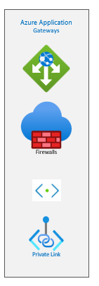
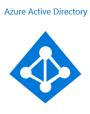
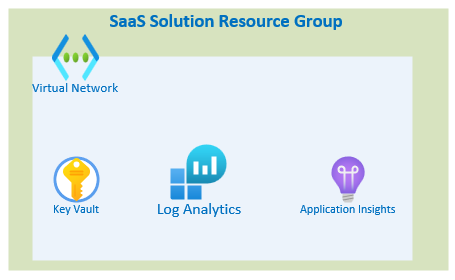
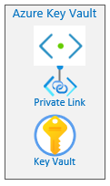
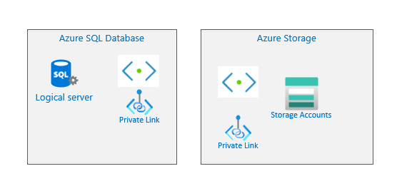
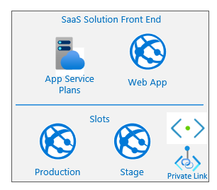

# Production Reference Architect Examples:
 Deploying SaaS Offer to production requirements following  [The Azure Well-Architected Framework](https://docs.microsoft.com/en-us/azure/architecture/framework/) which is a set of guiding tenets that can be used to improve the quality of a workload. The framework consists of five pillars of architectural excellence:
- Reliability
- Security
- Cost Optimization
- Operational Excellence
- Performance Efficiency

## First Look Architecture
The following diagram showing basic flow for the production deployment where engineering team follow basic security recommendation from [Azure Security Center](https://azure.microsoft.com/en-us/services/security-center/) where SaaS Solution is protected by Application gateway/Firewalls

 - User (publisher / subscriber) will attempt log into the SaaS Solution from public internet
 - Traffic will be intercepted by SaaS Solution Firewall i.e Application Gateway and after validating the request it will redirect it to the SaaS solution
 - The solution then validate the user token if it exists using Azure Active Directory
 - Based on Azure Active Directory validation, user will access the Saas Solution or prompt to login and generate new token

## Application Gateway

 

 Application gateway will act as first line of defense for SaaS Solution. It is highly recommended to deploy Application Gateway with VNET integration to the SaaS Solution VNET network and enabled Private Link so the service can communicate internally with SaaS Solution.

## Azure Active Directory
 

SaaS solution will validate  user token or request the user to login to validate his credential by using Azure Active Directory. SaaS Solution will send the token to AAD where it will be validate it then user will be allowed to access the solution or redirect to login again.

## SaaS Solution
The Solution usuallyl is hosted on one or more Resources Group. Resource Group will contain
 
-  Virtual Network  to connected SaaS Services together for internal communications
- Application Insights to monitor apps and data resources
- Log Analytics to store diagnostic and metrics  data
- Key Vault to store solution sensitive  secrets like database connection.

Following Azure security Center recommendation for KeyVault, it will be deployed to dedicated subnet and enable private link as following

  

In general SaaS Solution will require data layer and sometimes storage layer. If the **SaaS Solution** needs components like SQL Server, Storage Account, Cosmos Db, Azure function etc, each component will be deployed to a dedicated subnet and enable private link. **The Current SaaS Accelerator requires SQL Server Services only** 

  

 After deploying SaaS backend componentes, the front end is ready to deploy.
 
   

 The front-end contains a App Service Plan which represent the hosting machine. Also contains the WebApp service that present SaaS Solution front-end. 
 
 For Performance and Reliability, it is recommended to defined **2 Slots**
  - Production Slot: Where the live version for production code.
  - Stage Slot: where the new code get deploy and tested, once it confirms it readiness CI/CD pipeline will swap the slots to promote the new code.

Following Azure security Center recommendation for WebApp, the service will have its dedicated subnet and enable private link 

## Deployment
Please refer to Deployment checklist document [here](Enterprise-Reference-Architecture-Checklist.md)

# Other Reference Architect Examples
- Single Region architecture please check [here](./Enterprise-Reference-Architecture-Single-region.md)
- Single Region with custom SaaS solution architecture please check [here](./Enterprise-Reference-Architecture-Single-region-saas-rg.md)
- High Availability Region with custom SaaS solution architecture please check [here](./Enterprise-Reference-Architecture-multi-region-saas-rg.md)
 