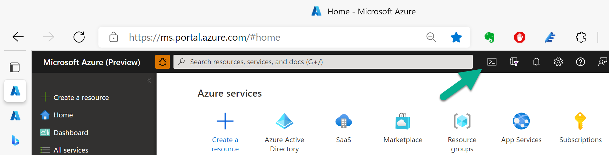

## Installating the Azure Marketplace SaaS Accelerator using Azure Cloud Shell

You can install the SaaS Accelerator code using a __single command__ line within the Azure Portal ([video tutorial](https://youtu.be/BVZTj6fssQ8)).
  
   1. Copy the following section to an editor and update it to match your company preference.

``` powershell
git clone https://github.com/Azure/Commercial-Marketplace-SaaS-Accelerator.git -b main --depth 1; `
 cd ./Commercial-Marketplace-SaaS-Accelerator/deployment/Templates; `
 Connect-AzureAD -Confirm; .\Deploy.ps1 `
 -WebAppNamePrefix "marketplacesaasgithub-SOME-UNIQUE-STRING" `
 -SQLServerName "marketplacesaasgithub" `
 -SQLAdminLogin "adminlogin" `
 -SQLAdminLoginPassword "a_very_PASSWORD_2_SymB0L@s" `
 -PublisherAdminUsers "user@email.com" `
 -ResourceGroupForDeployment "MarketplaceSaasGitHub" `
 -Location "East US" `
 -PathToARMTemplate ".\deploy.json" `
 ```

  The following lines are optional:
 ``` powershell
 -TenantID "xxxx-xxx-xxx-xxx-xxxx" `
 -AzureSubscriptionID "xxx-xx-xx-xx-xxxx" `
 -ADApplicationID "xxxx-xxx-xxx-xxx-xxxx" `
 -ADApplicationSecret "xxxx-xxx-xxx-xxx-xxxx" `
 -ADMTApplicationID "xxxx-xxx-xxx-xxx-xxxx" `
 -LogoURLpng "https://company_com/company_logo.png" `
 -LogoURLico "https://company_com/company_logo.ico"
 ```

   2. Open Powershell in the Azure Cloud (PowerShell)
 
   3. Paste the new single command and run the command to install the SaaS Accelerator:


## Parameters

| Parameter | Description |
|-----------| -------------|
| WebAppNamePrefix | A unique prefix used for creating web applications. Example: contoso |
| TenantID | The value should match the value provided for Active Directory TenantID in the Technical Configuration of the Transactable Offer in Partner Center |
| ADApplicationID | The value should match the value provided for Active Directory Single-Tenant Application ID in the Technical Configuration of the Transactable Offer in Partner Center |
| ADApplicationSecret | Secret key of the AD Application |
| ADMTApplicationID | The value should match the value provided for Active Directory Multi-Tenant Application ID in the Technical Configuration of the Transactable Offer in Partner Center |
| SQLServerName | A unique name of the database server (without database.windows.net) |
| SQLAdminLogin | SQL Admin login |
| SQLAdminLoginPassword | SQL Admin password |
| PublisherAdminUsers | Provide a list of email addresses (as comma-separated-values) that should be granted access to the Publisher Portal |
| PathToWebApplicationPackages | The base URI where artifacts required by the template are located. Ex: https://raw.githubusercontent.com/Azure/Commercial-Marketplace-SaaS-Accelerator/master/deployment/ |
| BacpacUrl | The url to the SaaS DB bacpac Ex: https://raw.githubusercontent.com/Azure/Commercial-Marketplace-SaaS-Accelerator/master/deployment/Database/AMPSaaSDB.bacpac |
| ResourceGroupForDeployment | Name of the resource group to deploy the resources |
| Location | Location of the resource group |
| AzureSubscriptionID | Subscription where the resources be deployed |
| PathToARMTemplate | Local Path to the ARM Template |
| LogoURLpng | The url of the company logo image in .png format with a size of 96x96 to be used on the website |
| LogoURLico | The url of the company logo image in .ico format |

## Alternative Deployments
There are other ways to deploy the SaaS Accelerator environment (e.g. development, maual deployment, etc).  Additional instruction can be found [here](Advanced-Instructions.md).
