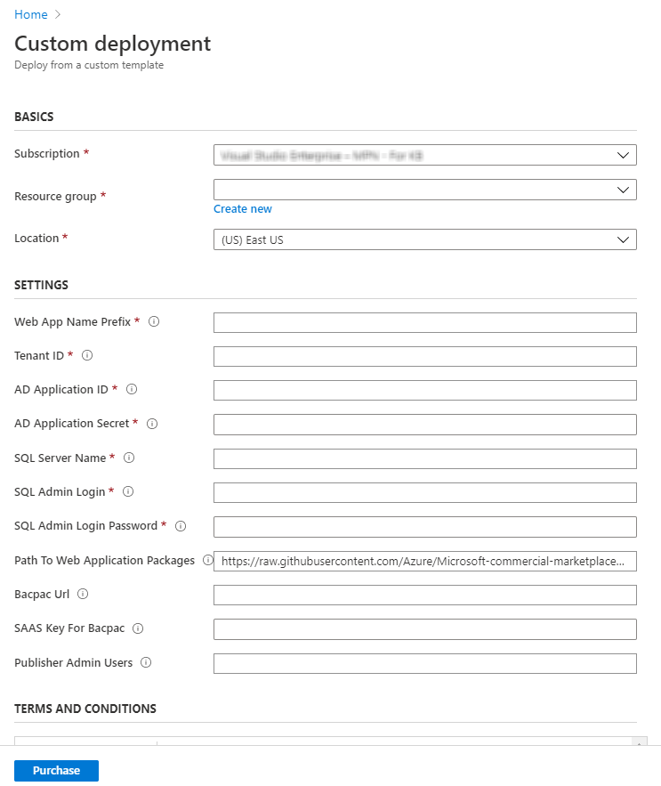

 # Installation instructions

  - [Overview](#overview)
  - [Deployment options](#deployment-options)
    * [Deploy web applications and SQL Azure database using an ARM template](#deploy-web-applications-and-sql-azure-database-using-an-arm-template)
    * [Deploy web applications and SQL Azure database using Powershell](#deploy-web-applications-and-sql-azure-database-using-powershell)
    * [Manual deployment](#manual-deployment)
      + [Clone the repository, create an Azure SQL Database single database and prepare](#clone-the-repository-create-an-azure-sql-database-single-database-and-prepare)
      + [Create Web Apps on Azure and deploy the code](#create-web-apps-on-azure-and-deploy-the-code)
  - [Change configuration](#change-configuration)
    * [(Optional but recommended) Setting and Loading above configuration values from KeyVault](#optional-but-recommended-setting-and-loading-above-configuration-values-from-keyvault)
  - [Running the solution locally](#running-the-solution-locally)
  - [Landing page and webhook settings for the SaaS offer on Partner Center](#landing-page-and-webhook-settings-for-the-saas-offer-on-partner-center)
  - [Next steps](#next-steps)
    - [Configuring the Customer Provisioning web application](./Customer-Experience.md)
    - [Configuring the Publisher Provisioning web application](./Publisher-Experience.md)
## Overview

This document describes how to implement the required components to enable the SDK for the SaaS Fulfillment API (v2), Marketplace Metering Service API, and additional components that demonstrate how to build a customer provisioning interface, logging, and administration of the customer's subscriptions.

Learn more about what's included and how to-use the SDK [here.](https://github.com/Azure/Microsoft-commercial-marketplace-transactable-SaaS-offer-SDK/blob/master/README.md)

Please note: this SDK is community-supported. If you need help or have questions using this SDK, please create a GitHub issue. Do not contact the marketplace pubisher support alias directly regarding use of this SDK. Thank you.

## Deployment options

The sample has two web apps to demonstrate the activation of a subscription for a SaaS offer, and potential scenarios for managing subscriptions and users. 

There are many ways to create Web App resources on [App Service](https://docs.microsoft.com/en-us/azure/app-service/) and deploy the code,
- Using Azure portal
- Using command line tools, [Azure CLI](https://docs.microsoft.com/en-us/azure/app-service/samples-cli), [Azure PowerShell](https://docs.microsoft.com/en-us/azure/app-service/samples-powershell) and [Resource Manager (ARM) templates](https://docs.microsoft.com/en-us/azure/app-service/samples-resource-manager-templates)
- [Using Visual Studio Code](https://docs.microsoft.com/en-us/azure/app-service/app-service-web-get-started-nodejs#deploy-the-app-to-azure), the example on this link is showing a Node.js app, but the same principles apply for a .NET solution.
- [Using Visual Studio](https://docs.microsoft.com/en-us/azure/app-service/app-service-web-get-started-dotnet#publish-your-web-app), this example demonstrates how to create a new web app on the Azure App Service, and deploy the code to it. 
- [Continuous deployment](https://docs.microsoft.com/en-us/azure/app-service/deploy-continuous-deployment)

Following are three different examples of deployment.

### Deploy web applications and SQL Azure database using an ARM template

- Log on to [Azure](https://portal.azure.com)
- Search for **Custom Template** and select the option - **Deploy a custom template**

- Click the link **Build your own template in the editor**

- Copy the content from the ARM template - [deploy.json](../deployment/Templates/deploy.json) and paste the text in the text area after clearing the existing content
- Click **Save**
- The template is validated and you are navigated to a page that presents a form for you to fill in the parameters used to deploy the resources


> Note: 
> - You can leave the **Path to Web Application Packages** as is to use the build packages from this repository
> - Make sure that you download the bacpac file from [here](../deployment/Database/AMPSaaSDB.bacpac) and upload it to an Azure blob storage. Use the URL to the file in the storage as the link to Github is not currently supported.
- Click **Purchase** to initiate the deployment of resources
> **Note**
>  - The template uses the **Web App Name Prefix** to create two web applications. For example, if the value provided for this field is **contoso**, the deployment creates the customer portal - https://contoso-portal.azurewebsites.net and the publisher portal - https://contoso-admin.azurewebsites.net.
> - **_Important_** For the login to the portals to work, it is important that you configure the **Redirect URIs** in the AD application to use these web applications. Here are the redirect Uris that should be in place:

> - https://contoso-portal.azurewebsites.net    
> - https://contoso-portal.azurewebsites.net/
> - https://contoso-portal.azurewebsites.net/Home/Index
> - https://contoso-portal.azurewebsites.net/Home/Index/
> - https://contoso-admin.azurewebsites.net
> - https://contoso-admin.azurewebsites.net/
> - https://contoso-admin.azurewebsites.net/Home/Index
> - https://contoso-admin.azurewebsites.net/Home/Index/

### Deploy web applications and SQL Azure database using Powershell

   1. Install [Powershell 7.0.2](https://github.com/PowerShell/PowerShell/releases)
   2. Clone the repository
   2. Start a Windows PowerShell window as administrator and run the following commands to install Azure modules:
> Note: Make sure that you are using the latest Powershell to avoid issues in Compress-Archive in 5.1 that got resolved in latest version.
```powershell
Install-Module -Name Az -AllowClobber
```

   3. Navigate to the folder **.\deployment\Templates**
   4. Set the priorities running Set-ExecutionPolicy -Scope Process -ExecutionPolicy Bypass. Choose "A", to change the policy to Yes to All. If you get a permission error, you can try:
        * Run the PowerShell terminal as an Administrator
        * Set the priorities running Set-ExecutionPolicy -ExecutionPolicy unrestricted.
   5. Run the command **.\Deploy.ps1** with the following paramters

| Parameter | Description |
|-----------| -------------|
| WebAppNamePrefix | Prefix used for creating web applications. Example: contoso |
| TenantID | The value should match the value provided for Active Directory TenantID in the Technical Configuration of the Transactable Offer in Partner Center |
| ADApplicationID | The value should match the value provided for Active Directory Application ID in the Technical Configuration of the Transactable Offer in Partner Center |
| ADApplicationSecret | Secret key of the AD Application |
| SQLServerName | Name of the database server (without database.windows.net) |
| SQLAdminLogin | SQL Admin login |
| SQLAdminLoginPassword | SQL Admin password |
| PublisherAdminUsers | Provide a list of email addresses (as comma-separated-values) that should be granted access to the Publisher Portal |
| PathToWebApplicationPackages | The base URI where artifacts required by the template are located. Ex: https://raw.githubusercontent.com/Azure/Microsoft-commercial-marketplace-transactable-SaaS-offer-SDK/master/deployment/ |
| BacpacUrl | The url to the SaaS DB bacpac Ex: https://raw.githubusercontent.com/Azure/Microsoft-commercial-marketplace-transactable-SaaS-offer-SDK/master/deployment/Database/AMPSaaSDB.bacpac |
| ResourceGroupForDeployment | Name of the resource group to deploy the resources |
| Location | Location of the resource group |
| AzureSubscriptionID | Subscription where the resources be deployed |
| PathToARMTemplate | Local Path to the ARM Template |


> **Example** 
```powershell
.\Deploy.ps1 
            -WebAppNamePrefix "contoso" 
            -TenantID "tenandId" 
            -ADApplicationID "clientId" 
            -ADApplicationSecret "secret" 
            -SQLServerName "contososqlsrv" 
            -SQLAdminLogin "adminlogin" 
            -SQLAdminLoginPassword "password" 
            -PublisherAdminUsers "user@contoso.com"              
            -BacpacUrl "https://raw.githubusercontent.com/Azure/Microsoft-commercial-marketplace-transactable-SaaS-offer-SDK/master/deployment/Database/AMPSaaSDB.bacpac" 
            -AzureSubscriptionID "subscriptionId" 
            -ResourceGroupForDeployment "resourcegroup" 
            -Location "East US" 
            -PathToARMTemplate ".\deploy.json"
```
### Manual deployment
#### Clone the repository create an Azure SQL Database single database and prepare
 Create a single database following the instructions on the SQL Database service [quickstart](https://docs.microsoft.com/en-us/azure/sql-database/sql-database-single-database-get-started?tabs=azure-portal) document.

 - Run the script **AMP-DB-2.1.sql** to initialize the database using your favorite SQL management tool, such as [SQL Server Management Studio](https://docs.microsoft.com/en-us/sql/ssms/download-sql-server-management-studio-ssms?view=sql-server-ver15), or [Azure Data Studio](https://docs.microsoft.com/en-us/sql/azure-data-studio/download-azure-data-studio?view=sql-server-ver15). The scripts are in [deployment/database](../deployment/Database) folder.

 - Add the email for the Azure Active Directory user you are planning to log in to the solution to **KnownUsers** table on the database, with value "1" for the RoleId column. For example, if the user is expected to login with **user@contoso.com** run the following script in your favorite management tool.

    ``` sql
      INSERT INTO KnownUsers (UserEmail, RoleId) VALUES ('user@contoso.com', 1)
    ```


#### Create Web Apps on Azure and deploy the code

 Give appropriate names to indicate the applications' roles, for example, **\<yourname\>provisioning**, and **\<yourname\>publisher**. Please remember that these names will be the dns prefix for the host names of your applications and will eventually be available as yournameprovisioning.azurewebsites.net and yournamepublisher.azurewebsites.net.
1. **Customer provisioning sample web application**, create and deploy the provisioning sample web application project in folder [src/SaaS.SDK.CustomerProvisioning](../src/SaaS.SDK.CustomerProvisioning)
1. **Publisher sample web application**, create and deploy the provisioning sample web application project in folder [src/SaaS.SDK.CustomerProvisioning](../src/SaaS.SDK.PublisherSolution)

Deploying the debug release, and choosing "self-contained" deployment mode is useful for the initial deployments.


**_Important_**, Add the redirect uri on the Azure AD app registration after deploying the publisher solution following the steps [here](https://docs.microsoft.com/en-us/azure/active-directory/develop/quickstart-configure-app-access-web-apis#add-redirect-uris-to-your-application). The value should be https://\<yourappname\>.azurewebsites.net/Home/Index

## Change configuration

Open the files **appsettings.json** under the project **SaaS.SDK.CustomerProvisioning** and **SaaS.SDK.PublisherSolution** update the values as follows:
- **GrantType** - Leave this as `client_credentials`
- **ClientId** - Azure Active Directory Application ID (the value for marketplace offer in Partner Center, under technical configuration tab). Steps to register an Azure AD application are [here](https://docs.microsoft.com/en-us/azure/marketplace/partner-center-portal/pc-saas-registration)
- **ClientSecret** - Secret from the Azure Active Directory Application
- **Resource** - Set this to *20e940b3-4c77-4b0b-9a53-9e16a1b010a7* **this value is important, it is the resource ID for the fulfillment API**
- **FulFillmentAPIBaseURL** - https://marketplaceapi.microsoft.com/api
- **SignedOutRedirectUri** - Set the path to the page the user should be redirected to after signing out from the application
- **TenantId** - Provide the tenant ID detail that was submitted in the. **Technical configuration** section of your marketplace offer in Partner Center.
- **FulfillmentApiVersion** - Use 2018-08-31 for the production version of the fulfillment APIs
- **AdAuthenticationEndpoint** - https://login.microsoftonline.com
- **SaaSAppUrl** - URL to the SaaS solution 
- **DefaultConnection** - Set the connection string to connect to the database.     

After making all of the above changes, the **appSettings.json** would look like sample below.

```json
{
  "Logging": {
    "LogLevel": {
      "Default": "Information",
      "Microsoft": "Warning",
      "Microsoft.Hosting.Lifetime": "Information"
    }
  },
  "SaaSApiConfiguration": {
    "GrantType": "client_credentials",
    "ClientId": "<Azure AD application ID>",
    "ClientSecret": "<client secret>",
    "Resource": "20e940b3-4c77-4b0b-9a53-9e16a1b010a7",
    "FulFillmentAPIBaseURL": "https://marketplaceapi.microsoft.com/api",
    "SignedOutRedirectUri": "<provisioning_or_publisher_web_app_base_path>/Home/Index",
    "TenantId": "<TenantID of AD application>",
    "FulFillmentAPIVersion": "2018-08-31",
    "AdAuthenticationEndPoint": "https://login.microsoftonline.com",
    "SaaSAppUrl" : "<Link-to-SaaS-application>"
  },
  "connectionStrings" : {
    "DefaultConnection": "Data source=<server>;initial catalog=<database>;user id=<username>;password=<password>"
    },
  "AllowedHosts": "*"
}
```

### (Optional but recommended) Setting and Loading above configuration values from KeyVault 
- [Enable Managed Identity on Apps (App Services created in the next section)](https://docs.microsoft.com/en-us/azure/app-service/app-service-key-vault-references)


- [Grant Apps access to Key Vault by setting Access Policies on Key Vault](https://docs.microsoft.com/en-us/azure/app-service/app-service-key-vault-references#granting-your-app-access-to-key-vault)


- [Add AppService-Configuration-**Application Settings** using Key Vault Reference Syntax](https://docs.microsoft.com/en-us/azure/app-service/app-service-key-vault-references#reference-syntax)


## Running the solution locally   

Press **F5** in Visual Studio 2019 to run the application locally.

**_Important_**, Add the redirect uri on the Azure AD app registration after deploying the publisher solution following the steps [here](https://docs.microsoft.com/en-us/azure/active-directory/develop/quickstart-configure-app-access-web-apis#add-redirect-uris-to-your-application). The value should be https://\<yourappname\>.azurewebsites.net/Home/Index

**_Important_**, the actual flow of subscribing to an offer on the Azure marketplace and managing the relevant lifetime events of the subscription, such as activation, cancellation and upgrade is only possible for the provisioning solution deployed to a location accessible on the internet.

## Landing page and webhook settings for the SaaS offer on Partner Center

The landing page and the webhook endpoint are implemented in the **SaaS.SDK.CustomerProvisioning** application. 

The landing page is the home page of the solution, for example, if you have deployed the solution to \<yourappname\>, the landing page value should be **https://\<yourappname\>.azurewebsites.net**.

Webhook endpoint is at **https://\<yourappname\>.azurewebsites.net/AzureWebhook**

The **Technical Configuration** section of the Marketplace offer with the values filled using the web app names would look like as shown here.


|Field | Value |
|--|--|
|Landing page URL | Path to the Provisioning Service. Eg: https://saaskit-portal.azurewebsites.net
|Connection webhook | Path to the web hook API in the Provisioning Service. Eg: https://saaskit-portal.azurewebsites.net/api/AzureWebhook
|Azure Active Directory Tenant ID | Tenant where the AD application is registered
|Azure Active Directory Application ID | ID of the registered AD application

## Next steps

* [Customer portal - Sample web application](./Customer-Experience.md): This document shows how to configure the web solution that enables the registration of a customer purchasing your SaaS Service and how a customer would manage their subscriptions and plans.
* [Publisher portal - Sample web application](./Publisher-Experience.md): This document shows how to configure the web solution that enables the activation of a customer purchasing your SaaS Service and how to send metered billing back to the Marketplace Metering Service API.
