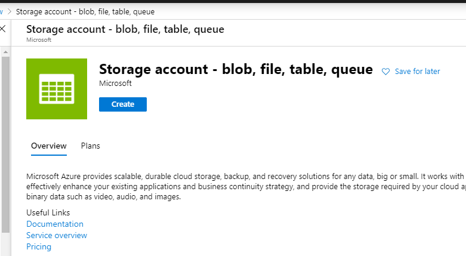
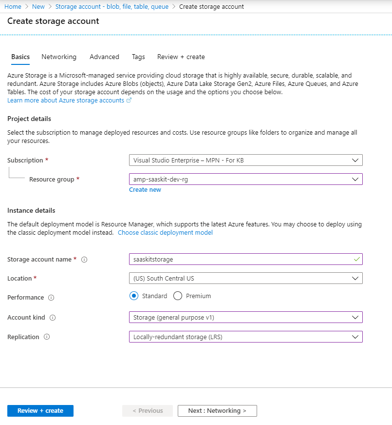
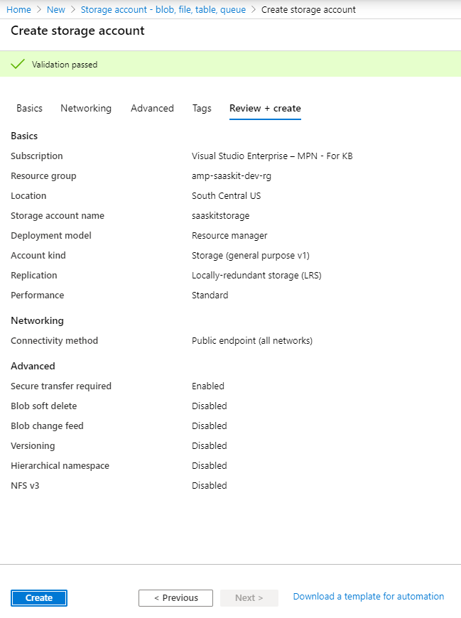

# Transactable SaaS Offer Fulfillment v2 and Metering SDK Instructions

* [Overview](#overview)
  * [Features](#features)
* [Prerequisites](#prerequisites)
* [Set up web application resources in Azure](#set-up-web-application-resources-in-azure)
* [Set up storage account for queues and blob storage](#set-up-storage-account-for-queues-and-blob-storage)
  * [Create queue](#create-queue)
  * [Create Blob storage](#create-blob-storage)
* [Create marketplace offer](#create-marketplace-offer)
* [Set up SQL database](#set-up-sql-database)
* [Set up the customer portal locally](#set-up-the-customer-portal-locally)
  * [Run the application locally](#run-the-application-locally)
  * [Deploy the application to Azure manually using VS 2019](#deploy-the-application-to-azure-manually-using-vs-2019)
  * [Deploy webjob](#deploy-webjob)
* [Landing page and Webhook settings in the Marketplace Offer](#landing-page-and-webhook-settings-in-the-marketplace-offer)
* [Troubleshooting issues](#troubleshooting-issues)
  * [Next steps](#next-steps)

## Overview

The SDK provides the components required for the implementations of the marketplace APIs (fulfillment v2 and metering service), and additional components that showcase how to build a customer portal, logging, and administration of the customer's subscriptions. These are the core projects in the SDK:  

* **Transactable SaaS Client Library (SaaS.SDK.Client)** implements the fulfillment v2 and metering service APIs and the webhook that handles messages from the Marketplace's E-commerce engine.
* **Customer portal (SaaS.SDK.CustomerProvisioning)** showcases how to register, provision, and activate the customer subscription. Implemented using ASP.Net Core 3.1, it uses the SaaS Client library and Data Access Library to to invoke and persists interactions with the fulfillment APIs. In addition, it provides interfaces for a customer to manage their subscriptions and plans.
* **Publisher portal (SaaS.SDK.PublisherSolution)** showcases how to generate metering based transactions, persistence of those transactions and transmission of these transactions to the metering service API.Implemented using ASP.Net Core 3.1, it uses the SaaS Client library and Data Access Library to to invoke and persists interactions with the fulfillment APIs. In addition, it provides interface for a publisher to manage offers, plans, subscriptions and metering.
* **Client Data Access library (SaaS.SDK.Client.DataAccess)** demonstrates how to persist the Plans, Subscriptions, and transactions with the fulfillment and metering service APIs.
* **Client Services (SaaS.SDK.Provisioning.Services)** contains the services used by the Customer and Publisher portals to orchestrate calls to the marketplace APIs / database.
* **Provisioning webjob (SaaS.SDK.Provisioning.Webjob)** implements the  background job in processing the requests from the Customer and the Publisher portals and moves the subscriptions through relevant statuses.

The sample and the SDK in this repository cover the components that comprise the highlighted area in this architecture diagram:


### Features

* The Azure Marketplace Metering SDK enables SaaS applications publish usage data to Azure so that customers are charged  according to non-standard units.
* The metering SDK ( .NET class library ) and a sample web application to report usage events for subscriptions against those plans that support metering ( have the dimensions defined and enabled ) correlate to SaaS Metering and SaaS Service blocks in the above image, respectively.
* More details on the fulfillment APIs can be found [here](https://docs.microsoft.com/en-us/azure/marketplace/partner-center-portal/pc-saas-fulfillment-api-v2#update-a-subscription)
* More details on the metering APIs can be found [here](https://docs.microsoft.com/en-us/azure/marketplace/partner-center-portal/marketplace-metering-service-apis).
* Steps to create a SaaS offer are available [here](https://docs.microsoft.com/en-us/azure/marketplace/partner-center-portal/create-new-saas-offer)

---

## Prerequisites

Ensure the following prerequisites are met before getting started:

* We recommend using an Integrated Development Environment (IDE):  [Visual Studio Code](https://code.visualstudio.com/),  [Visual Studio 2019](https://visualstudio.microsoft.com/thank-you-downloading-visual-studio/?sku=Community&rel=16#), etc...
* The SDK has been implemented using [.NET Core 3.1.4](https://dotnet.microsoft.com/download/dotnet-core/3.1)
* The Customer portal and Publisher portal applications have been implemented using [ASP.NET Core Runtime 3.1.4](https://dotnet.microsoft.com/download/dotnet-core/3.1)
* For Persistence we are using [Azure SQL Database](https://azure.microsoft.com/en-us/services/sql-database/) and [Entity Framework](https://docs.microsoft.com/en-us/ef/). However, feel free to use any data repository you are comfortable with. The Database Schema is located in the **deployment/Database** folder.

Besides, it is assumed that you have access to the following resources:

* [Azure subscription](https://portal.azure.com/) - to host the SDK components and sample web applications.
* [Partner Center](https://partner.microsoft.com/en-US/) - to create and publish a marketplace offer. This can be used to create a SQL Server instance in Azure.

---

## Set up web application resources in Azure

The section covers the set up of the following web applications:

* Customer portal
* Publisher portal

Here are the steps to set up a web application, say Customer portal and you are required to repeat the steps with appropriate detail to set up Publisher portal.

* Log on to [Azure](https://portal.azure.com)
* Click **All Services** in the menu on the left
* Click **App Services**
 

* Click **Add** button to add a new **App Service**
 

* Fill out the details for the new **App Service**

  * Select Subscription
  * Enter Name  of the instance
  * Select RunTime stack - **.Net Core 3.1(LTS)**
  * Select **Region**
  * Select  **App Service Plan**


* Click **Review + Create** to initiate the creation of the resource

* Go to the details of the resource after it is successfully created. You can use the notification in the top right portion of the menu bar to get a link to the resource

* Click **Overview** to see the details of the resource that is just created


* In the **Overview** tab, click **Get Publish Profile** button in the menu bar to download the publish profile to your local folder


> Note: We need to create two web application resources - the customer portal and the publisher portal.

## Set up storage account for queues and blob storage

* Log on to [Azure](https://portal.azure.com)
* Click **Create a resource** in the left menu


* Type **storage account** in the search box in the top bar
* Click the item labelled **Storage account - blob, file, table, queue** in the results to navigate to the **Storage Account** creation page
* Click **Create** button to initiate the creation of a storage account



* Fill out the details in the **Basics** tab
  * Select a **Subscription** and **Resource Group**


* Fill out the **Instance Details** section by providing the values for the following fields as illustrated in the below image
  


* Click **Review + Create**
* **Create** button appears after the validation of the input is complete
* Click **Create** to create the storage account


### Create queue

* After creating the **Storage Account**, navigate to the resource and search for **Queue**

* Click **Queues** from the menu in the left
* Click **Add Queue** button in the top bar
* In the pane that opens, provide the name of the queue as **saas-provisioning-queue**
* > Note: The name of the queue is important and should read **saas-provisioning-queue** as the webjob monitors the storage account for messages in a queue named **saas-provisioning-queue**


* Navigate to the **Storage Account**, click **Access Keys** item in the left menu
* Copy the value in the field labelled **Connection string** as shown in the below image


* The connection string is going to be used as the value for the keys **AzureWebJobsStorage** and **AzureBlobConfig** > **BlobConnectionString** in appSettings.json / Azure application configuration

## Create marketplace offer

For the purpose of the sample, a new marketplace offer is created and is made available in known tenants to test out the SaaS SDK with the Customer portal. More details on the creation of SaaS offers are available [here](https://docs.microsoft.com/en-us/azure/marketplace/partner-center-portal/create-new-saas-offer).

## Set up SQL database

If you want to set up the database locally or in Azure, you could create and initialize the database by following the steps given below:

* Create a database named **AMPSaaSDB**
* Switch to the database - **AMPSaaSDB**
* Run the script - **AMP-DB-1.0.sql** to initalize the database
* Add entries into **KnownUsers** table to allow login to **Publisher Portal**
* Update entries in **ApplicationConfiguration** table as appropriate. More details on the entries in the **ApplicationConfiguration** table are available [here](./deployment/Database/README.md)

---

## Set up the customer portal locally

In this section, we will go over the steps to download the latest sources from the repository, build the application ready for deployment to Azure. The steps help you to validate the subscription purchase experience by the customer.

* Clone or download the latest source code from [here](https://github.com/Azure/Microsoft-commercial-marketplace-transactable-SaaS-offer-SDK)
* Open the solution **SaaS.SDK.sln** in Visual Studio 2019


* Right-click on the project named **SaaS.SDK.CustomerProvisioning** and click **Set as StartUp Project**.
* Open the file **appsettings.json** under the project **SaaS.SDK.CustomerProvisioning** and update the values as follows:

  * **GrantType** - Leave this as `client_credentials`
  * **ClientId** - Azure Active Directory Application ID (as provided in the marketplace offer in Partner Center). Steps to create an Azure AD application for SaaS app can be found [here](https://docs.microsoft.com/en-us/azure/marketplace/partner-center-portal/pc-saas-registration)

   *Note:* Ensure that you have set the reply URL to the web application for the authentication to work properly.

* Update the Application Registration in the AAD tenant.

  * Log on to [Azure](https://portal.azure.com)
  * Click **Azure Active Directory** in the left menu
  * Click **App Registrations** in the menu on the left
  * Locate the AD application and click to go to details
  * Click on the hyperlink next to **Redirect URIs**  
    

  * Make sure you set <https://localhost:44363/Home/Index> as the redirect uri for the authentication to work when you run the app locally in Visual Studio.
    

  * Scroll down and check the box that reads **ID tokens** in the **Implicit grant** section
    

    * **ClientSecret** - Secret from the Azure Active Directory Application

    * **Resource** - Set this to *62d94f6c-d599-489b-a797-3e10e42fbe22*

    * **FulFillmentAPIBaseURL** - <https://marketplaceapi.microsoft.com/api>

    * **SignedOutRedirectUri** - Set the path to the page the user should be redirected to after signing out from the application

    * **TenantId** - Provide the tenant ID detail that was submitted in the. **Technical configuration** section of your marketplace offer in Partner Center.

    * **FulfillmentApiVersion** - Use 2018-08-31 for the production version of the fulfilment APIs

    * **AdAuthenticationEndpoint** - <https://login.microsoftonline.com>

    * **SaaSAppUrl** - URL to the Publisher SaaS application ( for this example. It should be the link to the SaaS application, in general)

    * **DefaultConnection** - Set the connection string to connect to the database
    * **AzureWebJobsStorage** - Connection string to the Azure storage queue. Adding a message to this queue would trigger the **Provisioning webjob** that monitors the queue for messages

After making all of the above changes, the **appSettings.json** would look like below sample.

```json
{
  "Logging": {
    "LogLevel": {
      "Default": "Information",
      "Microsoft": "Warning",
      "Microsoft.Hosting.Lifetime": "Information"
    }
  },
   // Comment the sections - SaaSApiConfiguration and Connection strings when deploying to Azure
  "SaaSApiConfiguration": {
    "GrantType": "client_credentials",
    "ClientId": "<Azure-AD-Application-ID>",
    "ClientSecret": "******",
    "Resource": "62d94f6c-d599-489b-a797-3e10e42fbe22",
    "FulFillmentAPIBaseURL": "https://marketplaceapi.microsoft.com/api",
    "SignedOutRedirectUri": "<provisioning_or_publisher_web_app_base_path>/Home/Index",
    "TenantId": "<TenantID-of-AD-Application>",
    "FulFillmentAPIVersion": "2018-08-31",
    "AdAuthenticationEndPoint": "https://login.microsoftonline.com",
    "SaaSAppUrl" : "<Link-to-SaaS-Application>"
  },
  "connectionStrings" : {
    "DefaultConnection": "Data source=<server>;initial catalog=<database>;user id=<username>;password=<password>"
    },
  "AllowedHosts": "*",
  "AzureWebJobsStorage": "<Connection String for storage queue. Enqueueing a message to this queue triggers the webjob>"  
}

```

> **Note**: When defining the keys in Azure App Service -> Configuration -> App Settings, refer to the below example for correctness:
> **Tip** __(double underscore) should be used to define the config items that appear as nested keys in appSettings.json

|Name| Value|
|--|--|
|SaaSApiConfiguration__GrantType| client_credentials|_
---

### Run the application locally

Press **Ctrl + F5** in Visual Studio 2019 to run the application locally.

*Note: Make sure that the home page url is listed in the **replyURLs** in the AD application for the authentication against Azure AD to work properly.*

---

### Deploy the application to Azure manually using VS 2019

* Open the solution in **Visual Studio 2019** and open **Solution Explorer**. Right click on **SaaS.SDK.CustomerProvisioning** Project and click **Publish ...**


* Click **Import Profile ...** to browse and select the publish profile that was downloaded earlier
* Click **Publish** to deploy the web application to Azure App Service
.

* Navigate to the  **URL (Instance Name)** to validate the deployment

> Note: The steps to set up the Publisher solution - **SaaS.SDK.PublisherSolution** locally are identical to the steps to set up the marketplace provisioning service.

### Deploy webjob

* Log on to [Azure](https://portal.azure.com)
* Click **All Services** in the menu on the left
* Click **Web App**
* Click **Create**

* Fill out the details for the new **Web App**


  * Select Subscription
  * Enter Name  of the instance
  * Select **Code** for Publish
  * Select RunTime stack - **.Net Core 3.1(LTS)**
  * Select Operating System - **Windows**
  * Select **Region**
  * Select  **App Service Plan**  or create a new one

* Click **Review + Create** to initiate the creation of the resource

* Go to the details of the resource after it is successfully created. You can use the notification in the top right portion of the menu bar to get a link to the resource

* Click **Overview** to see the details of the resource that is just created

* In the **Overview** tab, click **Get Publish Profile** button in the menu bar to download the publish profile to your local folder
* Right-click on the **SaaS.SDK.Provisioning.Webjob** project, click **Publish ...**
* Click **Import Profile ...** to browse and select the publish profile that was downloaded earlier
* Make sure to set the webjob type to be **Continuous**


* Click **Publish** to deploy the web application to Azure App Service
* Navigate to the web application resource
* Search for **web job**
* Click **WebJobs** to see the webjob in the list


## Landing page and Webhook settings in the Marketplace Offer

Suppose the names of the web applications deployed to Azure are as follows:
**Provisioning Service** - <https://saaskit-portal.azurewebsites.net>
**Publisher Application** - <https://saaskit-admin.azurewebsites.net>

The **Technical Configuration** section of the Marketplace offer with the values filled using the web app names would look like as shown here.


|Field | Value |
|--|--|
|Landing page URL | Path to the Provisioning Service. Eg: <https://saaskit-portal.azurewebsites.net>
|Connection webhook | Path to the web hook API in the Provisioning Service. Eg: <https://saaskit-portal.azurewebsites.net/api/AzureWebhook>
|Azure Active Directory Tenant ID | Tenant where the AD application is created and configured to have the redirect URIs as explained above.
|Azure Active Directory Application ID | ID of the AD application with the redirect URIs configured as explained above

## Troubleshooting issues

The Provisioning servie and the Publisher solution are configured to log the activity to console ( when running locally ). The logs are available via **Log Stream** when the applications are running in Azure as app services.
Logs in Azure can be viewed by following the below steps:

* Log on to [Azure](https://portal.azure.com)
* Navigate to the app service
* Click **App Service logs** and set the parameters as shown here:


* Click **Log Stream** in the menu on the left to look at the logs output by the application. You could see the view refreshing every minute with the latest log information due to the activity in the application as you access the application in another browser window.

* You can download the logs from the FTP URL that is available in the **App Service Logs** interface.
* The credentials to access the FTP location are available in the **Publish Profile** of the web application.

### Next steps

* [Customer purchase experience](./Customer-Experience.md)
* [Publisher experience](./Publisher-Experience.md)
