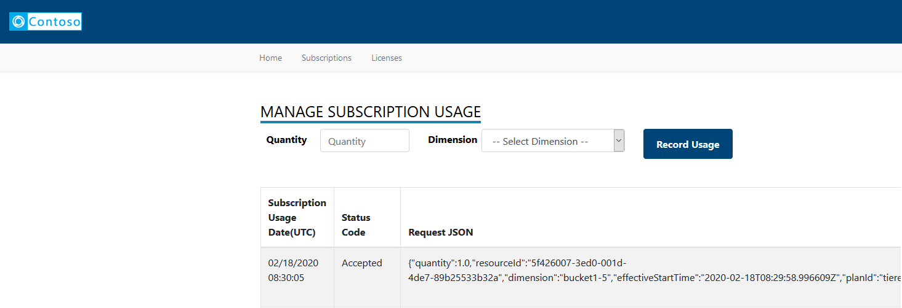

 # Transactable SaaS Offer Fulfillment v2 and Metering SDK Instructions

  * [Overview](#overview)
  * [Prerequisites](#prerequisites)
  * [Set up web application resources in Azure](#set-up-web-application-resources-in-azure)
  * [Marketplace Provisioning Service](#marketplace-provisioning-service)
    + [Create marketplace offer](#create-marketplace-offer)
    + [Set up the sample client application locally](#set-up-the-sample-client-application-locally)
    + [Deploy the application to Azure](#deploy-the-application-to-azure)
    + [Purchase the offer](#purchase-the-offer)
    + [Activate](#activate)
    + [Change plan](#change-plan)
    + [Unsubscribe](#unsubscribe)
    + [View activity log](#view-activity-log)
    + [Go to SaaS application](#go-to-saas-application)
  * [SaaS metering service](#saas-metering-service) 
    + [Emit usage events](#emit-usage-events)
  * [License Manager](#license-manager)
    + [Publisher: Manage Licenses](#publisher--manage-licenses)
    + [Customer: View Licenses](#customer--view-licenses)

## Overview

The SDK provides the components required for the implementations of the billing (fulfillment v2 and metered) APIs, and additional components that showcase how to build a customer provisioning interface, logging, and administration of the customer's subscriptions. These are the core projects in the SDK:  

- **Transactable SaaS Client Library** implements the fulfillment v2 and metered APIs and the Web-hook that handles messages from the Marketplace's E-commerce engine.
- **Customer provisioning sample web application** showcases how to register, provision, and activate the customer subscription. Implemented using ASP.Net Core 3.1, it uses the SaaS Client library and Data Access Library to to invoke and persists interactions with the fulfillment APIs. In addition, it provides interfaces for a customer to manage their subscriptions and plans. 
- **Publisher sample web application** showcases how to generate metered based transactions, persistence of those transactions and transmission of these transactions to the metered billing API. 
- **Client Data Access library** demonstrates how to persist the Plans, Subscriptions, and transactions with the fulfillment and Metered APIs.

The sample and the SDK in this repository cover the components that comprise the highlighted area in this architecture diagram:


### Features 

- The Azure Marketplace Metering SDK enables SaaS applications publish usage data to Azure so that customers are charged  according to non-standard units. 
- The metering SDK ( .NET class library ) and a sample web application to report usage events for subscriptions against those plans that support metering ( have the dimensions defined and enabled ) correlate to SaaS Metering and SaaS Service blocks in the below image, respectively.
- More details on the fulfillment APIs can be found [here](https://docs.microsoft.com/en-us/azure/marketplace/partner-center-portal/pc-saas-fulfillment-api-v2#update-a-subscription) 
- More details on the metering APIs can be found [here](https://docs.microsoft.com/en-us/azure/marketplace/partner-center-portal/marketplace-metering-service-apis).
- Steps to create a SaaS offer are available [here](https://docs.microsoft.com/en-us/azure/marketplace/partner-center-portal/create-new-saas-offer)

## Prerequisites

Ensure the following prerequisites are met before getting started:

- We recommend using an Integrated Development Environment (IDE):  [Visual Studio Code](https://code.visualstudio.com/),  [Visual Studio 2019](https://visualstudio.microsoft.com/thank-you-downloading-visual-studio/?sku=Community&rel=16#), etc...
- The SDK has been implemented using [.NET Core 3.1.1](https://dotnet.microsoft.com/download/dotnet-core/3.1)
- The Customer provisioning and Publisher web sample applications have been implemented using [ASP.NET Core Runtime 3.1.1](https://dotnet.microsoft.com/download/dotnet-core/3.1)
- For Persistence we are using [Azure SQL Database](https://azure.microsoft.com/en-us/services/sql-database/) and [Entity Framework](https://docs.microsoft.com/en-us/ef/). However, feel free to use any data repository you are comfortable with. The Database Schema is located in the **deployment/Database** folder. 

Besides, it is assumed that you have access to the following resources:
- [Azure subscription](https://ms.portal.azure.com/) - to host the SDK components and sample web applications.
- [Partner Center](https://partner.microsoft.com/en-US/) - to create and publish a marketplace offer.

## Set up web application resources in Azure

Follow the below steps to create a web application resource in an Azure subscription. The AMP SDK sample client application will be deployed against this resource. 

- Log on to [Azure](https://portal.azure.com) 
- Click **All Services** in the menu on the left
- Click **App Services**

 

-  Click **Add** button to add a new **App Service**


- Fill out the details for the new **App Service**


	- Select Subscription
    - Enter Name  of the instance 
	- Select RunTime stack - **.Net Core 3.1(LTS)**
    - Select **Region**
    - Select  **App Service Plan** 
    
- Click **Review + Create** to initiate the creation of the resource

- Go to the details of the resource after it is successfully created. You can use the notification in the top right portion of the menu bar to get a link to the resource

- Click **Overview** to see the details of the resource that is just created

.

- In the **Overview** tab, click **Get Publish Profile** button in the menu bar to download the publish profile to your local folder

.

> Note: We need to create two web application resources - one for the marketplace provisioning service and the other for SaaS service.

- Create another Web App for the marketplace provisioning service.

## Marketplace Provisioning Service

The marketplace provisioning service serves as an intermediary between Azure and the target SaaS application. In a real scenario, the intermediary would initiate the provisioning of the SaaS application and activate the subscription against the SaaS offer being purchased.

In this example, the sample client application allows the user to:
- Activate the subscription ( triggers the start of billing against the SaaS offer).
- Switch an existing subscription to another plan.
- Unsubscribe / delete an existing subscription.


### Create marketplace offer

For the purpose of the sample, a new marketplace offer is created and is made available in known tenants to test out the AMP SDK with the sample client application. More details on the creation of SaaS offers are available [here](https://docs.microsoft.com/en-us/azure/marketplace/partner-center-portal/create-new-saas-offer)


### Set up the sample client application locally

In this section, we will go over the steps to download the latest sources from the repository, build the application ready for deployment to Azure.

- Clone or download the latest source code from [here](https://dev.azure.com/AMP-SDKs/AMP%20SaaS%20SDK)
- Open the solution **Microsoft.Marketplace.SaaS.SDK.sln** in Visual Studio 2019


- Right-click on the project named **Microsoft.Marketplace.SaaS.SDK.CustomerProvisioning** and click **Set as StartUp Project**.
- Open the file **appsettings.json** under the project **Microsoft.Marketplace.SaaS.SDK.CustomerProvisioning** and update the values as follows:

    - **GrantType** - Leave this as *client_credentials*

    - **ClientId** - Azure Active Directory Application ID (as provided in the marketplace offer in Partner Center). Steps to create an Azure AD application for SaaS app can be found [here](https://docs.microsoft.com/en-us/azure/marketplace/partner-center-portal/pc-saas-registration)
    *Note:* Ensure that you have set the reply URL to the web application for the authentication to work properly
    > - Log on to [Azure](https://portal.azure.com)
    > - Click **Azure Active Directory** in the left menu
    > - Click **App Registrations** in the menu on the left
    > - Locate the AD application and click to go to details
    > - Click on the hyperlink next to **Redirect URIs**
    
    > - Make sure that you set https://localhost:44363/Home/Index as the redirect uri for the authentication to work when you run the app locally
    
    > - Scroll down and check the box that reads **ID tokens** in the **Implicit grant** section
    

    - **ClientSecret** - Secret from he Azure Active Directory Application

    - **Resource** - Set this to *62d94f6c-d599-489b-a797-3e10e42fbe22*

    - **FulFillmentAPIBaseURL** - https://marketplaceapi.microsoft.com/api

    - **SignedOutRedirectUri** - Set the path to the page the user should be redirected to after signing out from the application

    - **TenantId** - Provide the tenant ID detail that was submitted in the. **Technical configuration** section of your marketplace offer in Partner Center.

    - **FulfillmentApiVersion** - Use 2018-09-15 for mock API and 2018-08-31 for the production version of the fulfilment APIs

    - **AdAuthenticationEndpoint** - https://login.microsoftonline.com
    
    - **SaaSAppUrl** - URL to the SaaS Metering service ( for this example. It should be the link to the SaaS application, in general)
    
    - **DefaultConnection** - Set the connection string to connect to the database    

- Sample **appSettings.json** would look like below:

```json
{
  "Logging": {
    "LogLevel": {
      "Default": "Information",
      "Microsoft": "Warning",
      "Microsoft.Hosting.Lifetime": "Information"
    }
  },
  "AppSetting": {
    "GrantType": "client_credentials",
    "ClientId": "<Azure-AD-Application-ID>",
    "ClientSecret": "******",
    "Resource": "62d94f6c-d599-489b-a797-3e10e42fbe22",
    "FulFillmentAPIBaseURL": "https://marketplaceapi.microsoft.com/api",
    "SignedOutRedirectUri": "https://saaskitdemoapp.azurewebsites.net/Home/Index",
    "TenantId": "<TenantID-of-AD-Application>",
    "FulFillmentAPIVersion": "2018-09-15",
    "AdAuthenticationEndPoint": "https://login.microsoftonline.com",
    "SaaSAppUrl" : "https://saasdemoapp.azurewebsites.net"
  },
  "DefaultConnection": "Data source=<server>;initial catalog=<database>;user id=<username>;password=<password>",
  "AllowedHosts": "*"
}

```
- Deploy SQL database to Azure as follows:
  - Click the button <a href="https://portal.azure.com/#create/Microsoft.Template/uri/https%3A%2F%2Fraw.githubusercontent.com%2FSpektraSystems%2FAMP-SDK-Sample%2Fmaster%2Fdeploy%2Farm-deploy.md" target="_blank">
     
</a> to start the deployment of SQL database
   - Fill out the details on the template deployment form as shown here
    
   - Click **Purchase** after agreeing to the terms and conditions by checking the box to start the deployment of the database by name **AMPSaaSDB**
   - Update the connection string property in **appSettings.json** with the details related to SQL Server name, database and the credentials to connect to the database.
- If you want to set up the database locally, you could create and initialize the database by the running the SQL scripts available under **deployment/Database/AMP-DB.sql** folder.
  - Create a database named **AMPSaaSDB**
  - Switch to the database - **AMPSaaSDB**
  - Run the script - **AMP-DB.sql** to initalize the database
- Press **Ctrl + F5** in Visual Studio 2019 to run the application locally.
*Note: Make sure that the home page url is listed in the **replyURLs** in the AD application for the authentication against Azure AD to work properly.*

### Deploy the application to Azure

- Open solution in **Visual Studio 2019** and open **Solution Explorer**. Right click on **Microsoft.Marketplace.SaaS.SDK.CustomerProvisioning** Project and click **Publish ...**

.

- Click **Import Profile ...** to browse and select the publish profile that was downloaded earlier
- Click **Publish** to deploy the web application to Azure App Service

.

- Navigate to the  **URL (Instance Name)** to validate the deployment

> Note: The steps to set up the Publisher solution - **Microsoft.Marketplace.SaaS.SDK.PublisherSolution** locally are identical to the steps to set up the marketplace provisioning service.

### Purchase the offer
 
Assuming that the SaaS offer was published and is available in the known tenants, follow the steps to try out a purchase against your SaaS offer.
- Log on to [Azure](https://portal.azure.com) 

- Click **All Services** menu option on the left


- Search for resources of type **Software as a Service**.
- The page enlists all the SaaS offers that were previously purchased.

- Click **Add** to proceed to purchase a new SaaS offer.
> If you don't have prior subscriptions against SaaS offers, the list would be blank and you would get an option to **Create Software as a Service** button to help you proceed with the purchase.


- Clicking **Add** ( or **Create Software as a Service**) leads you to a page that lists down SaaS offers available for purchase.

- Search for **Cloud SaaS** and locate our SaaS offer in the listing


- Click on the tile to view the details of the offer

- **Select a software plan** and click **Create**
- Fill out the form and click **Subscribe**

- A new resource gets created and appears in the listing

- Click the text under **Name** to view the details of the resource
- Click **Configure Account** option in the header bar. You will now be redirected to the SaaS offer landing page offered by the **AMP SDK Sample Client Application** in a new tab / window
- The landing page presents the details of the offer that was purchased with an option to **Activate** the subscription.
> In a real scenario, the landing page would collect additional details relevant for provisioning the target SaaS application.

### Activate

The below diagram illustrates the flow of information between Azure and the Azure marketplace SDK client application.


- On the landing page, review the details presented and click **Activate**

> The AMP SDK sample application calls the following AMP SDK API methods in the background

```csharp
// Determine the details of the offer using the marketplace token that is available in the URL during the redirect from Azure to the landing page.
Task<ResolvedSubscriptionResult> ResolveAsync(string marketPlaceAccessToken);

// Activates the subscription to trigger the start of billing 
Task<SubscriptionUpdateResult> ActivateSubscriptionAsync(Guid subscriptionId, string subscriptionPlanID);

```

- Upon successful activation of the subscription, the landing page switches to a view that enlists the subscriptions against the offer. 
> You can switch to Azure and note that the **Configure Account** button is replaced by **Manage Account** button indicating that the subscription has been materialized.

### Change plan
The below diagram illustrates the flow of information between Azure and the Azure marketplace SDK client application.

- Log on to [AMP SDK sample application]().
- Click **Subscriptions** from the menu on the top, in case you are not on the page that shows you the list of subscriptions.
- The table on this page enlists all the subscriptions and their status.
- Click **Change Plan** against any of the active subscriptions.

- A popup appears with a list of plans that you can switch to.
- Select a desired plan and click **Change Plan**.


> The AMP SDK sample application calls the following AMP SDK API methods in the background

```csharp
// Initiate the change plan process
Task<SubscriptionUpdateResult> ChangePlanForSubscriptionAsync(Guid subscriptionId, string subscriptionPlanID);

```
>The operation is asynchronous and the call to **change plan** comes back with an operation location that should be queried for status.

```csharp
// Get the latest status of the subscription due to an operation / action.
Task<OperationResult> GetOperationStatusResultAsync(Guid subscriptionId, Guid operationId);
```

### Unsubscribe

- Log on to [AMP SDK sample application]().
- Click **Subscriptions** from the menu on the top, in case you are not on the page that shows you the list of subscriptions.
- The table on this page enlists all the subscriptions and their status.
- Click **Unsubscribe** against an active subscription.

- Confirm your action to trigger the deletion of the subscription.
> The AMP SDK sample application calls the following AMP SDK API methods in the background.

```csharp
// Initiate the change plan process
Task<SubscriptionUpdateResult> DeleteSubscriptionAsync(Guid subscriptionId, string subscriptionPlanID);
```

> The operation is asynchronous and the call to **change plan** comes back with an operation location that should be queried for status.

```csharp
// Get the latest status of the subscription due to an operation / action.
Task<OperationResult> GetOperationStatusResultAsync(Guid subscriptionId, Guid operationId);
```
 
### View activity log

- Log on to [AMP SDK sample application]().
- Click **Subscriptions** from the menu on the top, in case you are not on the page that shows you the list of subscriptions.
- The table on this page enlists all the subscriptions and their status.
- Click **Activity Log** to view the log of activity that happened against the subscription.


### Go to SaaS application

- Log on to [AMP SDK sample application]().
- Click **Subscriptions** from the menu on the top, in case you are not on the page that shows you the list of subscriptions.
- The table on this page enlists all the subscriptions and their status.
- Click **Go to SaaSApp** to navigate to the target SaaS application.


## SaaS metering service

The **SaaS metering service** is the web application that helps ISVs to look at the subscriptions against the marketplace offer.


For subscriptions against the plans that support metered billing, a button is enabled to post usage events against the subscription.

> Only one usage event is accepted for the hour interval. The hour interval starts at minute 0 and ends at minute 59. If more than one usage event is emitted for the same hour interval, any subsequent usage events are dropped as duplicates.

> Usage can be emitted with a delay and the maximum delay allowed between is 24 hours.
The usage / consumption is consolidated

### Emit usage events

The following interface in the **Saas metering service** allows the user to manual report the usage against a selected dimension.

> In this example, suppose the SaaS service is offering a notification service that helps its customers send out emails / text. Email and Text are modeled as dimensions and the plan in the marketplace offer captures the definition for charges by these dimensions.



> The SaaS metering service calls the below API to emit usage events
```csharp
/// <summary>
/// Emits the usage event asynchronous.
/// </summary>
/// <param name="usageEventRequest">The usage event request.</param>
/// <returns></returns>
Task<MeteringUsageResult> EmitUsageEventAsync(MeteringUsageRequest usageEventRequest);
```

The service tracks the requests sent and the response received from the marketplace metering APIs for auditing purposes.

## License Manager

The license management feature in the SaaS metering service allows the Publisher to assign licenses to the active subscriptions. 
The intent here is to illustrate how the assignment can be done via the interface and how the customer user can consume this detail via the **SaaS Provisioning** application

### Publisher: Manage Licenses

- Log on to [SaaS Metering Service application]()
- Click **Licenses** menu at the top to view the list of subscriptions and licenses.
- There is an option to **Revoke** an active license and **Activate** an already revoked license.

- Click **Add License** for a popup that allows the user assign a license to a subscription.

- Select a subscription, enter license key detail and hit **Save** to save the details.

### Customer: View Licenses

- Log on to [AMP SDK Sample application]()
- Click **Licenses** menu at the top to view the list of subscriptions and licenses.
- Use the **Copy** button to copy the license text to clipboard


 
