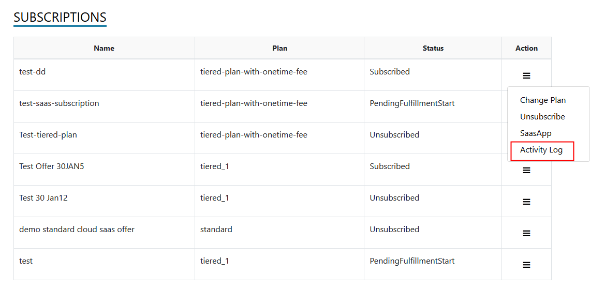
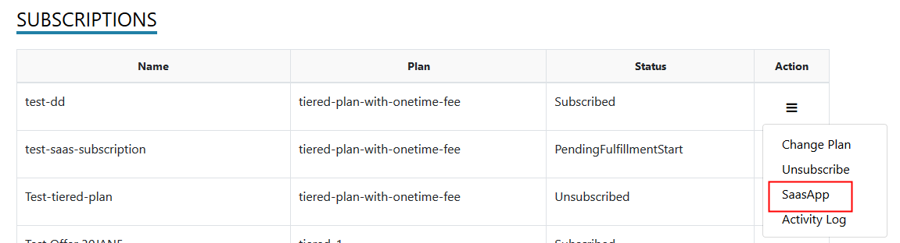
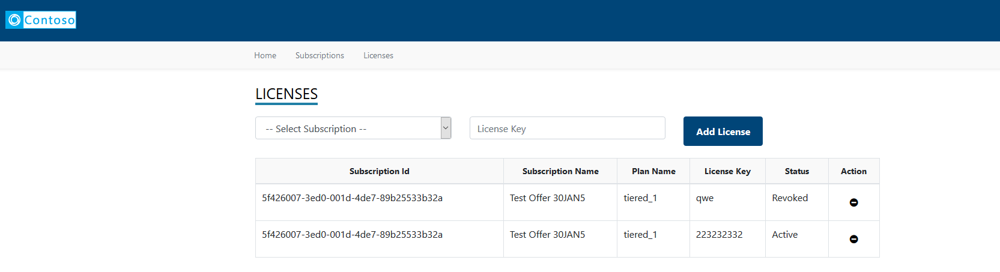

 # Transactable SaaS Offer Fulfillment v2 and Metering SDK Instructions

- [Overview](#overview)
- [Clone the repository and create an Azure SQL Database](#clone-the-repository-and-create-an-azure-sql-database)
- [Change configuration](#change-configuration)
- [Create Web Apps on Azure and deploy the code](#create-web-apps-on-azure-and-deploy-the-code)
  * [To run the application Locally](#to-run-the-application-locally)
- [Landing page and webhook settings for the SaaS offer on Partner Center](#landing-page-and-webhook-settings-for-the-saas-offer-on-partner-center)
- [Subscribing to the offer](#subscribing-to-the-offer)
  * [Activate](#activate)
  * [Change plan](#change-plan)
  * [Unsubscribe](#unsubscribe)
  * [Change Quantity](#change-quantity)
  * [View activity log](#view-activity-log)
  * [Go to SaaS application](#go-to-saas-application)
- [Metering example](#metering-example)
  * [Emit usage events](#emit-usage-events)
- [License Manager](#license-manager)
  * [Publisher: Manage Licenses](#publisher--manage-licenses)
  * [Customer: View Licenses](#customer--view-licenses)
- [Troubleshooting issues](#troubleshooting-issues)

## Overview

This document describes how to implement the required components to enable the SDK for the SaaS Fulfillment API (v2), Marketplace Metering Service API, and additional components that demonstrate how to build a customer provisioning interface, logging, and administration of the customer's subscriptions.

Learn more about what's included and how to-use the SDK [here.](https://github.com/Azure/Microsoft-commercial-marketplace-transactable-SaaS-offer-SDK/blob/master/README.md)

**Note: before you start, reminder that this SDK is community-supported. If you need help or have questions using this SDK, please create a GitHub issue. Do not contact the marketplace pubisher support alias directly regarding use of this SDK. Thank you.**

## Clone the repository and create an Azure SQL Database
 Create a single database following the instructions on the SQL Database service [quickstart] (https://docs.microsoft.com/en-us/azure/sql-database/sql-database-single-database-get-started?tabs=azure-portal) document.

 Run the scripts **AMP-DB-1.0.sql** and **AMP-DB-2.0.sql** to initialize the database using your favorite SQL management tool, such as [SQL Server Management Studio](https://docs.microsoft.com/en-us/sql/ssms/download-sql-server-management-studio-ssms?view=sql-server-ver15), or [Azure Data Studio](https://docs.microsoft.com/en-us/sql/azure-data-studio/download-azure-data-studio?view=sql-server-ver15). The scripts are in [deployment/database](../deployment/Database) folder.

 Add the email for the Azure Active Directory user you are planning to log in to the solution to **KnownUsers** table on the database, with value "1" for the RoleId column.

## Change configuration

Open the files **appsettings.json** under the project **SaaS.SDK.CustomerProvisioning** and **SaaS.SDK.PublisherSolution** update the values as follows:
- **GrantType** - Leave this as `client_credentials`
- **ClientId** - Azure Active Directory Application ID (the value for marketplace offer in Partner Center, under technical configuration tab). Steps to register an Azure AD application are [here](https://docs.microsoft.com/en-us/azure/marketplace/partner-center-portal/pc-saas-registration)
- **ClientSecret** - Secret from the Azure Active Directory Application
- **Resource** - Set this to *62d94f6c-d599-489b-a797-3e10e42fbe22* **this value is important, it is the resource ID for the fulfillment API**
- **FulFillmentAPIBaseURL** - https://marketplaceapi.microsoft.com/api
- **SignedOutRedirectUri** - Set the path to the page the user should be redirected to after signing out from the application
- **TenantId** - Provide the tenant ID detail that was submitted in the. **Technical configuration** section of your marketplace offer in Partner Center.
- **FulfillmentApiVersion** - Use 2018-08-31 for the production version of the fulfillment APIs
- **AdAuthenticationEndpoint** - https://login.microsoftonline.com
- **SaaSAppUrl** - URL to the SaaS Metering service ( for this example. It should be the link to the SaaS application, in general)
- **DefaultConnection** - Set the connection string to connect to the database.     

After making all of the above changes, the **appSettings.json** would look like sample below.

```json
{
  "Logging": {
    "LogLevel": {
      "Default": "Information",
      "Microsoft": "Warning",
      "Microsoft.Hosting.Lifetime": "Information"
    }
  },
   // Comment the sections - SaaSApiConfiguration and Connection strings when deploying to Azure
  "SaaSApiConfiguration": {
    "GrantType": "client_credentials",
    "ClientId": "<Azure-AD-Application-ID>",
    "ClientSecret": "******",
    "Resource": "62d94f6c-d599-489b-a797-3e10e42fbe22",
    "FulFillmentAPIBaseURL": "https://marketplaceapi.microsoft.com/api",
    "SignedOutRedirectUri": "<provisioning_or_publisher_web_app_base_path>/Home/Index",
    "TenantId": "<TenantID-of-AD-Application>",
    "FulFillmentAPIVersion": "2018-09-15",
    "AdAuthenticationEndPoint": "https://login.microsoftonline.com",
    "SaaSAppUrl" : "<Link-to-SaaS-Application>"
  },
  "connectionStrings" : {
    "DefaultConnection": "Data source=<server>;initial catalog=<database>;user id=<username>;password=<password>"
    },
  "AllowedHosts": "*"
}

```
## Create Web Apps on Azure and deploy the code

The sample has two web apps to demonstrate the activation of a subscription for a SaaS offer, and potential scenarios for managing subscriptions and users. 

There are many ways to create Web App resources on [App Service](https://docs.microsoft.com/en-us/azure/app-service/) and deploy the code,
- Using Azure portal
- Using command line tools, [Azure CLI](https://docs.microsoft.com/en-us/azure/app-service/samples-cli), [Azure PowerShell](https://docs.microsoft.com/en-us/azure/app-service/samples-powershell) and [Resource Manager (ARM) templates](https://docs.microsoft.com/en-us/azure/app-service/samples-resource-manager-templates)
- [Using Visual Studio Code](https://docs.microsoft.com/en-us/azure/app-service/app-service-web-get-started-nodejs#deploy-the-app-to-azure), the example on this link is showing a Node.js app, but the same principles apply for a .NET solution.
- [Using Visual Studio](https://docs.microsoft.com/en-us/azure/app-service/app-service-web-get-started-dotnet#publish-your-web-app), this example demonstrates how to create a new web app on the Azure App Service, and deploy the code to it. 
- [Continuos deployment](https://docs.microsoft.com/en-us/azure/app-service/deploy-continuous-deployment)

You can use any of the methods above to create the web apps and deploy the code, but for the rest of this document, let's assume the use of [Visual Studio method](https://docs.microsoft.com/en-us/azure/app-service/app-service-web-get-started-dotnet#publish-your-web-app) to deploy the following two apps. Give appropriate names to indicate the applications' roles, for example, **\<yourname\>provisioning**, and **\<yourname\>publisher**. Please remember that these names will be the dns prefix for the host names of your applications and will eventually be available as yournameprovisioning.azurewebsites.net and yournamepublisher.azurewebsites.net.
1. **Customer provisioning sample web application**, create and deploy the provisioning sample web application project in folder [src/SaaS.SDK.CustomerProvisioning](../src/SaaS.SDK.CustomerProvisioning)
1. **Publisher sample web application**, create and deploy the provisioning sample web application project in folder [src/SaaS.SDK.CustomerProvisioning](../src/SaaS.SDK.PublisherSolution)

Deploying the debug release, and choosing "self-contained" deployment mode is useful for the initial deployments.


**_Important_**, Add the redirect uri on the Azure AD app registration after deploying the publisher solution following the steps [here](https://docs.microsoft.com/en-us/azure/active-directory/develop/quickstart-configure-app-access-web-apis#add-redirect-uris-to-your-application). The value should be https://\<yourappname\>.azurewebsites.net/Home/Index


### To run the application locally      

Press **F5** in Visual Studio 2019 to run the application locally.

**_Important_**, Add the redirect uri on the Azure AD app registration after deploying the publisher solution following the steps [here](https://docs.microsoft.com/en-us/azure/active-directory/develop/quickstart-configure-app-access-web-apis#add-redirect-uris-to-your-application). The value should be https://\<yourappname\>.azurewebsites.net/Home/Index

**_Important_**, the actual flow of subscribing to an offer on the Azure marketplace and managing the relevant lifetime events of the subscription, such as activation, cancellation and upgrade is only possible for the provisioning solution deployed to a location accessible on the internet.


## Landing page and webhook settings for the SaaS offer on Partner Center

The landing page and the webhook endpoint are implemented in the **SaaS.SDK.CustomerProvisioning** application. 

The landing page is the home page of the solution, for example, if you have deployed the solution to \<yourappname\>, the landing page value should be **https://\<yourappname\>.azurewebsites.net**.

Webhook endpoint is at **https://\<yourappname\>.azurewebsites.net/AzureWebhook**

The **Technical Configuration** section of the Marketplace offer with the values filled using the web app names would look like as shown here.


|Field | Value |
|--|--|
|Landing page URL | Path to the Provisioning Service. Eg: https://saaskit-portal.azurewebsites.net
|Connection webhook | Path to the web hook API in the Provisioning Service. Eg: https://saaskit-portal.azurewebsites.net/api/AzureWebhook
|Azure Active Directory Tenant ID | Tenant where the AD application is registered.
|Azure Active Directory Application ID | ID of the registered AD application


## Subscribing to the offer
 
Assuming that the SaaS offer was published and is available for the known tenants, or you have logged on as one of the preview users, if the offer is in preview stage, follow the steps for subscribing to the SaaS offer.

1. Log on to [Azure](https://portal.azure.com) 
2. Click **All Services** menu option on the left.


3. Search for resources of type **Software as a Service**. The page lists all the SaaS offers that were previously purchased.


4. Click **Add** to proceed to purchase a new SaaS offer.

> If you don't have prior subscriptions against SaaS offers, the list would be blank and you would get an option to **Create Software as a Service** button to help you proceed with the purchase.


5. Clicking **Add** ( or **Create Software as a Service**) leads you to a page that lists down SaaS offers available for purchase.

6. Search for your SaaS offer 


7. Click on the tile to view the details of the offer


8. **Select a software plan** and click **Create**
9. Fill out the form and click **Subscribe**


- A new resource gets created and appears in the listing


10. Click the text under **Name** to view the details of the subscription. The subscription is not active at this point, and will not be charged before it is activated.
11. Click **Configure Account** option in the header bar. You will now be transferred to the SaaS offer landing page as configured on the technical configuration page of the offer, in a new tab / window

> In a real scenario, the landing page would collect additional details relevant for starting the on-boarding process for the customer.

### Activate

> The below diagram illustrates the flow of information between Azure and the Azure marketplace SDK client application.


On the landing page, review the details presented and click **Activate**


> The sample application calls the following client methods in the background

```csharp
// Determine the details of the offer using the marketplace token that is available in the URL during the redirect from Azure to the landing page.
Task<ResolvedSubscriptionResult> ResolveAsync(string marketPlaceAccessToken);

// Activates the subscription to trigger the start of billing 
Task<SubscriptionUpdateResult> ActivateSubscriptionAsync(Guid subscriptionId, string subscriptionPlanID);

```

- Upon successful activation of the subscription, the landing page switches to a view that lists the subscriptions against the offer. 
> You can switch to Azure and note that the **Configure Account** button is replaced by **Manage Account** button indicating that the subscription has been activated.

> **Note** If activation workflow is enabled, by turning on the flag - **IsAutomaticProvisioningSupported** in the ApplicationConfiguration table, the application would put the subscription in PendingActivation status and the Fulfillment API to activate the subscription is not called. Publisher has the option to activate the subscription via the action menu in the subscription listing in the publisher sample application.

### Change plan

> The below diagram illustrates the flow of information between Azure and the Azure marketplace SDK client application.

1. Log on to the customer provisioning application.
2. Click **Subscriptions** from the menu on the top, in case you are not on the page that shows you the list of subscriptions. The table on this page lists all the subscriptions and their status.
3. Click **Change Plan** option in the dropdown menu that appears when the icon under the **Actions** column against any of the active subscriptions is clicked.

A popup appears with a list of plans that you can switch to.

4. Select a desired plan and click **Change Plan**.


> The sample application calls the following client methods in the background

```csharp
// Initiate the change plan process
Task<SubscriptionUpdateResult> ChangePlanForSubscriptionAsync(Guid subscriptionId, string subscriptionPlanID);

```
>The operation is asynchronous and the call to **change plan** comes back with an operation location that should be queried for status.

```csharp
// Get the latest status of the subscription due to an operation / action.
Task<OperationResult> GetOperationStatusResultAsync(Guid subscriptionId, Guid operationId);
```

> **Note** If activation workflow is enabled, by turning on the flag - **IsAutomaticProvisioningSupported** in the ApplicationConfiguration table, the option to **Change Plan** is disabled for customers. Publisher has the option to change the plan of the subscription via the action menu in the subscription listing in the Publisher Portal.

### Unsubscribe

1. Log on to the customer provisioning application.
2. Click **Subscriptions** from the menu on the top, in case you are not on the page that shows you the list of subscriptions. The table on this page lists all the subscriptions and their status.
3. Click **Unsubscribe** against an active subscription.

4. Confirm your action to trigger the deletion of the subscription.

> The sample application calls the following client methods in the background.

```csharp
// Initiate the delete subscription process
Task<SubscriptionUpdateResult> DeleteSubscriptionAsync(Guid subscriptionId, string subscriptionPlanID);
```

> The operation is asynchronous and the call to **change plan** comes back with an operation location that should be queried for status.

```csharp
// Get the latest status of the subscription due to an operation / action.
Task<OperationResult> GetOperationStatusResultAsync(Guid subscriptionId, Guid operationId);
```
> **Note** If activation workflow is enabled, by turning on the flag - **IsAutomaticProvisioningSupported** in the ApplicationConfiguration table, the option to **Unsubscribe** is disabled for customers. Publisher has the option to delete the subscription via the action menu in the subscription listing in the Publisher Portal.

### Change Quantity

1. Log on to the customer provisioning application.
2. Click **Subscriptions** from the menu on the top, in case you are not on the page that shows you the list of subscriptions. The table on this page lists all the subscriptions and their status.
3. Click **Change quantity** in the menu as shown in the below picture


4. Provide the new quantity and click **Change Quantity** to update the quantity on the subscription


> Note: The update to quantity is applicable if only the subscription is against a Plan that is set to be billed per user
  

> The sample application calls the following client methods in the background.

```csharp
Task<SubscriptionUpdateResult> ChangeQuantityForSubscriptionAsync(Guid subscriptionId, int? subscriptionQuantity);
```
> The operation is asynchronous and the call to **change plan** comes back with an operation location that should be queried for status.
```csharp
// Get the latest status of the subscription due to an operation / action.
Task<OperationResult> GetOperationStatusResultAsync(Guid subscriptionId, Guid operationId);
```

**Update Plan to indicate per user pricing**

Use the following script as an example / template to update the records in **Plans**

```sql
UPDATE Plans SET IsPerUser = 1 WHERE PlanId = '<ID-of-the-plan-as-in-the-offer-in-partner-center>'
```

The Plan ID is available in the **Plan overview** tab of the offer as shown here:


### View activity log

1. Log on to the customer provisioning application.
2. Click **Subscriptions** from the menu on the top, in case you are not on the page that shows you the list of subscriptions.
3. The table on this page lists all the subscriptions and their status.
4. Click **Activity Log** to view the log of activity that happened against the subscription.
 
 

### Go to SaaS application

1. Log on to the customer provisioning application.
2. Click **Subscriptions** from the menu on the top, in case you are not on the page that shows you the list of subscriptions.
3. The table on this page lists all the subscriptions and their status.
4. Click **SaaSApp** from options menu under **Actions** to navigate to the target SaaS application.


## Metering example

The publisher web application sample demonstrates how the metering APIs are used.


A button is enabled for subscriptions with plans having custom meter dimensions.

> Please see the [frequently asked questions document](https://docs.microsoft.com/en-us/azure/marketplace/partner-center-portal/marketplace-metering-service-apis-faq) for the details of emitting usage events.

### Emit usage events

The following interface in the sample allows the user to manual report the usage against a selected dimension.

> In this example, suppose the SaaS service is offering a notification service that helps its customers send out emails / text. Email and Text are modeled as dimensions and the plan in the marketplace offer captures the definition for charges by these dimensions.


> Note: You are need to manually update the Plan record in the database to indicate that it supports metering. Additionally, the meters for the plan should be available in the **MeteredDimensions** table
 
**Update Plan to indicate support for metering**

Use the following script as an example / template to update the records in **Plans**

```sql
UPDATE Plans SET IsmeteringSupported = 1 WHERE PlanId = '<ID-of-the-plan-as-in-the-offer-in-partner-center>'
```
The Plan ID is available in the **Plan overview** tab of the offer as shown here:


**Initialize meters for plan**

Use the following script as an example / template to initialize meters in **MeteredDimensions** table

```sql
INSERT INTO MeteredDimensions ( Dimension, PlanId, Description, CreatedDate)
SELECT '<dimension-as-in-partner-center', '<id-of-the-plan>', '<description>', GETDATE()
```

The **Dimension** in the above example should be the attribute of a meter in the plan as shown in the below image:


> The SaaS metering service calls the below API to emit usage events
```csharp
/// <summary>
/// Emits the usage event asynchronous.
/// </summary>
/// <param name="usageEventRequest">The usage event request.</param>
/// <returns></returns>
Task<MeteringUsageResult> EmitUsageEventAsync(MeteringUsageRequest usageEventRequest);
```

The service tracks the requests sent and the response received from the marketplace metering APIs for auditing purposes.

## License Manager

The license management feature in the publisher application allows the publisher to assign licenses to the active subscriptions. 
The intent here is to illustrate how the assignment can be done via the interface and how the customer user can consume this detail via the **provisioning** application

### Publisher: Manage Licenses

1. Log on to the publisher application
2. Click **Licenses** menu at the top to view the list of subscriptions and licenses.
3. There is an option to **Revoke** an active license and **Activate** an already revoked license.

4. Select a subscription, enter license key detail and hit **Add License** to assign a license.


### Customer: View Licenses

1. Log on to the customer provisioning application
2. Click **Licenses** menu at the top to view the list of subscriptions and licenses.
3. Use the **Copy** button to copy the license text to clipboard


## Troubleshooting issues

The provisioning application and the publisher application are configured to log the activity to console ( when running locally ). The logs are available via **Log Stream** when the applications are running in Azure as app services.
Logs in Azure can be viewed by following the below steps:

1. Log on to https://portal.azure.com
2. Navigate to the app service 
3. Click **App Service logs** and set the parameters as shown here:


4. Click **Log Stream** in the menu on the left to look at the logs output by the application. You could see the view refreshing every minute with the latest log information due to the activity in the application as you access the application in another browser window.

- You can download the logs from the FTP URL that is available in the **App Service Logs** interface.
- The credentials to access the FTP location are available in the **Publish Profile** of the web application.


 
