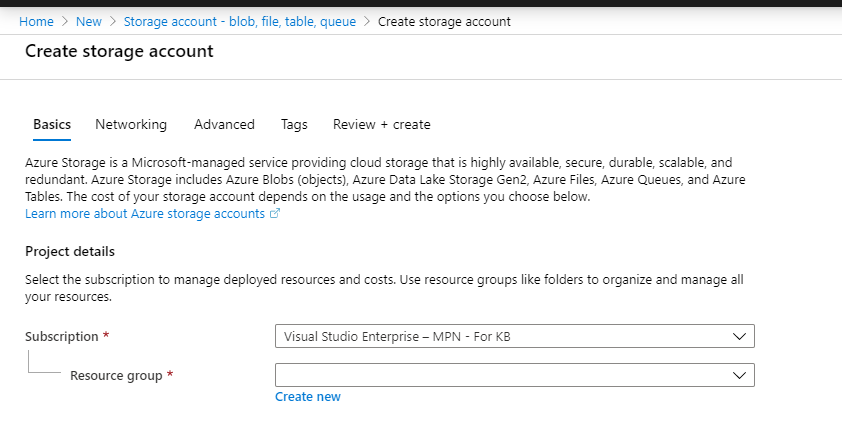
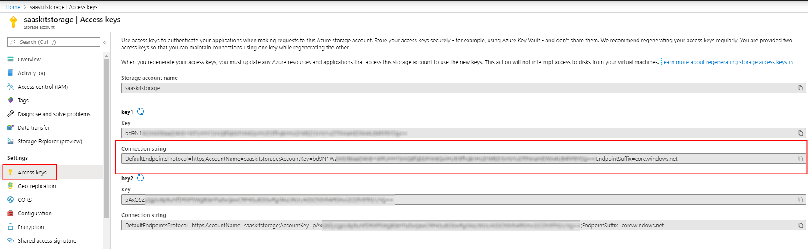
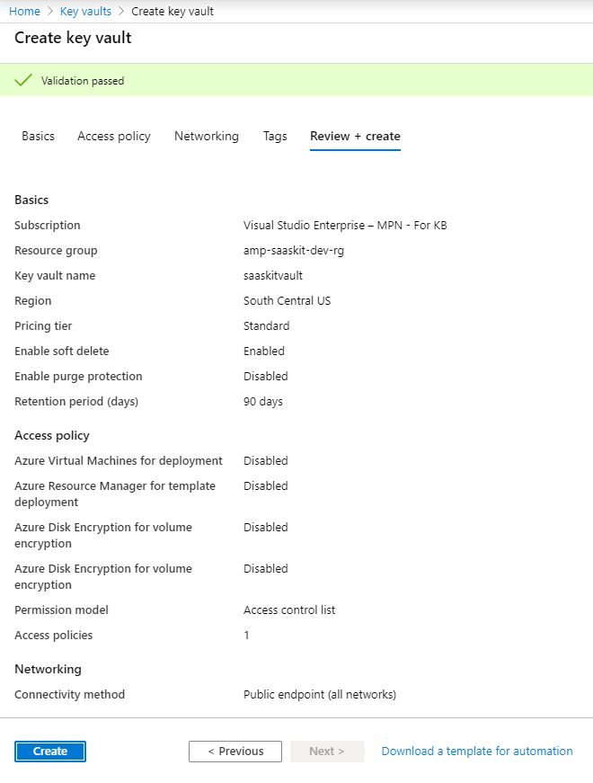
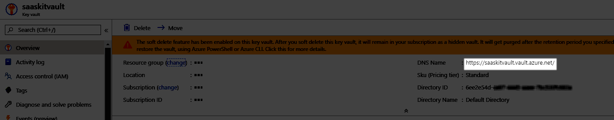
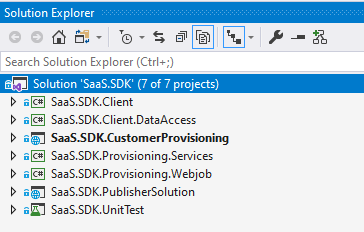

 # Transactable SaaS Offer Fulfillment v2 and Metering SDK Instructions

  * [Overview](#overview)
    + [Features](#features)
  * [Prerequisites](#prerequisites)
  * [Set up web application resources in Azure](#set-up-web-application-resources-in-azure)
  * [Set up storage account for queues and blob storage](#set-up-storage-account-for-queues-and-blob-storage)
    + [Create queue](#create-queue)
    + [Create Blob storage](#create-blob-storage)
  * [Set up key vault](#set-up-key-vault)
  * [Grant key vault access to an Azure AD application](#grant-key-vault-access-to-an-azure-ad-application)
  * [Customer Provisioning Service](#customer-provisioning-service)
    + [Create marketplace offer](#create-marketplace-offer)
    + [Set up the sample client application locally](#set-up-the-sample-client-application-locally)
    + [Deploy the application to Azure](#deploy-the-application-to-azure)
      - [Using an ARM template and Azure CLI](#using-an-arm-template-and-azure-cli)
      - [Manual deployment using VS 2019](#manual-deployment-using-vs-2019)
    + [Landing page and Webhook settings in the Marketplace Offer](#landing-page-and-webhook-settings-in-the-marketplace-offer)
  * [Troubleshooting issues](#troubleshooting-issues)
    + [Next steps](#next-steps)

## Overview

The SDK provides the components required for the implementations of the billing (fulfillment v2 and metered) APIs, and additional components that showcase how to build a customer provisioning interface, logging, and administration of the customer's subscriptions. These are the core projects in the SDK:  

- **Transactable SaaS Client Library** implements the fulfillment v2 and metered APIs and the Web-hook that handles messages from the Marketplace's E-commerce engine.
- **Customer provisioning sample web application** showcases how to register, provision, and activate the customer subscription. Implemented using ASP.Net Core 3.1, it uses the SaaS Client library and Data Access Library to to invoke and persists interactions with the fulfillment APIs. In addition, it provides interfaces for a customer to manage their subscriptions and plans. 
- **Publisher sample web application** showcases how to generate metered based transactions, persistence of those transactions and transmission of these transactions to the metered billing API. 
- **Client Data Access library** demonstrates how to persist the Plans, Subscriptions, and transactions with the fulfillment and Metered APIs.
- **Client Services** contains the services used by the Customer provisioning and Publisher solution to orchestrate calls to the API / database.
- **Provisioning webjob** implements the  background job in processing the requests from the Customer Provisioning and the Publisher portals and moves the subscriptions through relevant statuses.

The sample and the SDK in this repository cover the components that comprise the highlighted area in this architecture diagram:


### Features 

- The Azure Marketplace Metering SDK enables SaaS applications publish usage data to Azure so that customers are charged  according to non-standard units. 
- The metering SDK ( .NET class library ) and a sample web application to report usage events for subscriptions against those plans that support metering ( have the dimensions defined and enabled ) correlate to SaaS Metering and SaaS Service blocks in the below image, respectively.
- More details on the fulfillment APIs can be found [here](https://docs.microsoft.com/en-us/azure/marketplace/partner-center-portal/pc-saas-fulfillment-api-v2#update-a-subscription) 
- More details on the metering APIs can be found [here](https://docs.microsoft.com/en-us/azure/marketplace/partner-center-portal/marketplace-metering-service-apis).
- Steps to create a SaaS offer are available [here](https://docs.microsoft.com/en-us/azure/marketplace/partner-center-portal/create-new-saas-offer)

## Prerequisites

Ensure the following prerequisites are met before getting started:

- We recommend using an Integrated Development Environment (IDE):  [Visual Studio Code](https://code.visualstudio.com/),  [Visual Studio 2019](https://visualstudio.microsoft.com/thank-you-downloading-visual-studio/?sku=Community&rel=16#), etc...
- The SDK has been implemented using [.NET Core 3.1.1](https://dotnet.microsoft.com/download/dotnet-core/3.1)
- The Customer provisioning and Publisher web sample applications have been implemented using [ASP.NET Core Runtime 3.1.1](https://dotnet.microsoft.com/download/dotnet-core/3.1)
- For Persistence we are using [Azure SQL Database](https://azure.microsoft.com/en-us/services/sql-database/) and [Entity Framework](https://docs.microsoft.com/en-us/ef/). However, feel free to use any data repository you are comfortable with. The Database Schema is located in the **deployment/Database** folder. 

Besides, it is assumed that you have access to the following resources:
- [Azure subscription](https://ms.portal.azure.com/) - to host the SDK components and sample web applications.
- [Partner Center](https://partner.microsoft.com/en-US/) - to create and publish a marketplace offer.

## Set up web application resources in Azure

Follow the below steps to create a web application resource in an Azure subscription. The AMP SDK sample client application will be deployed against this resource. 

- Log on to [Azure](https://portal.azure.com) 
- Click **All Services** in the menu on the left
- Click **App Services**

 

-  Click **Add** button to add a new **App Service**


- Fill out the details for the new **App Service**


	- Select Subscription
    - Enter Name  of the instance 
	- Select RunTime stack - **.Net Core 3.1(LTS)**
    - Select **Region**
    - Select  **App Service Plan** 
    
- Click **Review + Create** to initiate the creation of the resource

- Go to the details of the resource after it is successfully created. You can use the notification in the top right portion of the menu bar to get a link to the resource

- Click **Overview** to see the details of the resource that is just created

.

- In the **Overview** tab, click **Get Publish Profile** button in the menu bar to download the publish profile to your local folder

.

> Note: We need to create two web application resources - one for the marketplace provisioning service and the other for SaaS service.

- Create another Web App for the marketplace provisioning service.

## Set up storage account for queues and blob storage
- Log on to [Azure](https://portal.azure.com)
- Click **Create a resource** in the left menu


- Type **storage account** in the search box in the top bar
- Click the item labelled **Storage account - blob, file, table, queue** in the results to navigate to the **Storage Account** creation page
- Click **Create** button to initiate the creation of a storage account


- Fill out the details in the **Basics** tab 
  - Select a **Subscription** and **Resource Group**


- Fill out the **Instance Details** section by providing the values for the following fields as illustrated in the below image
   


- Click **Review + Create**
- **Create** button appears after the validation of the input is complete
- Click **Create** to create the storage account


### Create queue

- After creating the **Storage Account**, navigate to the resource and search for **Queue**

- Click **Queues** from the menu in the left
- Click **Add Queue** button in the top bar
- In the pane that opens, provide the name of the queue as **saas-provisioning-queue**
- > Note: The name of the queue is important and should read **saas-provisioning-queue** as the webjob monitors the storage account for messages in a queue named **saas-provisioning-queue**


- Navigate to the **Storage Account**, click **Access Keys** item in the left menu
- Copy the value in the field labelled **Connection string** as shown in the below image


- The connection string is going to be used as the value for the keys **AzureWebJobsStorage** and **AzureBlobConfig** > **BlobConnectionString** in appSettings.json / Azure application configuration

### Create Blob storage

- Azure blob storage is used to hold the ARM template files
- Navigate to the **Storage Account** that was created earlier
- Click **Containers** in the **Blob service** section in the left menu
- Click **+ Container** button in the top bar
- Give the container a name and set the access level as **Private (no anonymous access)** 


- The name of the container should be set as value for the key **AzureBlobConfig** > **BlobContainer** in appSettings.json / Azure application configuration

## Set up key vault

- Log on to [Azure](https://portal.azure.com)
- Search for **Key vaults** in the search box in the top bar
- Click **Key vaults**
- Click **+ Add** to add a new key vault
- Fill out the **Basics** using the below image as a reference


- Click **Review + Create**  to trigger the validation of the input detail



- Click **Create** to create the key vault

## Grant key vault access to an Azure AD application

- Log on to [Azure](https://portal.azure.com)
- Click **Azure Active Directory** in the left menu
- Click **App registrations** in the left menu
- Click **+ New registration** button in the top bar
- Provide a name to the application and click **Create**


- Grab the **Application ID** and the **Tenant ID** values from the **Overview** section


- Click **Certificates & secrets** 
- Click **+ New client secret** to generate a new secret

- Give a name to the secret and copy the secret value to a text file. The secret, AD Application ID and the tenant ID 
- Click **API permissions** 
- Click **+ Add permission**
- Select **Azure Key Vault** from the list under **Microsoft APIs**


- Select the **user_impersonation** permission and click **Add permissions**


- Now, navigate to the key vault that we created in an earlier step
- Click **Access policies** menu item on the left
- Click **+ Add access policy**
- Open the dropdown - **key permissions** and **Select all**
- Open the dropdown - **secret permissions** and **Select all**
- Click the field next to **Select principal** and search for the AD app that was just created
- Select the AD app from the search results and Click **Select**


- Click **Add** to give the AD app permission to access the key vault
- Go to the **Overview** and copy the key vault URL ( DNS name)


- The key vault url should be used in the **keyVaultConfig** > **KeyVaultUrl** 

## Add the secret to hold the hosted subscription credentials

- Log on to [Azure](https://portal.azure.com)
- Search for **Key vaults** in the search box in the top bar
- Click **Key vaults**
- Locate the key vault that was just created
- Click **Secrets** from the left menu
- Click **+Generate/Import** button in the top bar
- Add the details as shown in the below image
    - Name : **HostedsubscriptionCredentials**
    - Value : 
```json    
{
"Tenant ID":"<tenantID>",
"Subscription ID":"<Azure Subscription ID>",
"Service Principal ID":"<service principal that has contributor permissions on the Azure subscription>",
"Client Secret":"<secret of the service principal>"
} 
```


## Customer Provisioning Service

The Customer provisioning service serves as an intermediary between Azure and the target SaaS application. In a real scenario, the intermediary would initiate the provisioning of the SaaS application and activate the subscription against the SaaS offer being purchased. The application would allow the customer to place a request, in case the activation requires a workflow that should be completed by the Publisher.

Assuming that the activation workflow is turned off, the sample client application allows the user to:
- Activate the subscription ( triggers the start of billing against the SaaS offer).
- Switch an existing subscription to another plan.
- Unsubscribe / delete an existing subscription.
- Change quantity


### Create marketplace offer

For the purpose of the sample, a new marketplace offer is created and is made available in known tenants to test out the AMP SDK with the sample client application. More details on the creation of SaaS offers are available [here](https://docs.microsoft.com/en-us/azure/marketplace/partner-center-portal/create-new-saas-offer)

### Set up the sample client application locally

In this section, we will go over the steps to download the latest sources from the repository, build the application ready for deployment to Azure.

- Clone or download the latest source code from [here](https://github.com/Azure/Microsoft-commercial-marketplace-transactable-SaaS-offer-SDK)
- Open the solution **SaaS.SDK.sln** in Visual Studio 2019



- Right-click on the project named **SaaS.SDK.CustomerProvisioning** and click **Set as StartUp Project**.
- Open the file **appsettings.json** under the project **SaaS.SDK.CustomerProvisioning** and update the values as follows:

    - **GrantType** - Leave this as *client_credentials*

    - **ClientId** - Azure Active Directory Application ID (as provided in the marketplace offer in Partner Center). Steps to create an Azure AD application for SaaS app can be found [here](https://docs.microsoft.com/en-us/azure/marketplace/partner-center-portal/pc-saas-registration)
    *Note:* Ensure that you have set the reply URL to the web application for the authentication to work properly
    > - Log on to [Azure](https://portal.azure.com)
    > - Click **Azure Active Directory** in the left menu
    > - Click **App Registrations** in the menu on the left
    > - Locate the AD application and click to go to details
    > - Click on the hyperlink next to **Redirect URIs**
    
    > - Make sure that you set https://localhost:44363/Home/Index as the redirect uri for the authentication to work when you run the app locally
    
    > - Scroll down and check the box that reads **ID tokens** in the **Implicit grant** section
    

    - **ClientSecret** - Secret from he Azure Active Directory Application

    - **Resource** - Set this to *62d94f6c-d599-489b-a797-3e10e42fbe22*

    - **FulFillmentAPIBaseURL** - https://marketplaceapi.microsoft.com/api

    - **SignedOutRedirectUri** - Set the path to the page the user should be redirected to after signing out from the application

    - **TenantId** - Provide the tenant ID detail that was submitted in the. **Technical configuration** section of your marketplace offer in Partner Center.

    - **FulfillmentApiVersion** - Use 2018-09-15 for mock API and 2018-08-31 for the production version of the fulfilment APIs

    - **AdAuthenticationEndpoint** - https://login.microsoftonline.com
    
    - **SaaSAppUrl** - URL to the SaaS Metering service ( for this example. It should be the link to the SaaS application, in general)
    
    - **DefaultConnection** - Set the connection string to connect to the database   
    - **AzureWebJobsStorage** - Connection string to the Azure storage queue. Adding a message to this queue would trigger the **Provisioning webjob** that monitors the queue for messages
    - **keyVaultConfig** - Contains the credentials to access the key vault. Key vault is used as the storage to keep the sensitive information related to deployment of ARM templates
        - **ClientID** - Azure AD Application ID that has access to the key vault
        - **ClientSecret** - Secret for the AD application ID that has access to the key vault
        - **KeyVaultUrl** - URL to the key vault
        - **TenantID** - ID of the tenant where the Azure AD application that can access the key vault exists
    - **AzureBlobConfig**  - Contains the access detail to the Azure blob storage. ARM templates uploaded via the publisher solution are stored in the Azure Blob storage
      - **BlobContainer** - Name of the container for the blob storage
      - **BlobConnectionString** - Connection string to the Azure Blob storage 

- Sample **appSettings.json** would look like below:

```json
{
  "Logging": {
    "LogLevel": {
      "Default": "Information",
      "Microsoft": "Warning",
      "Microsoft.Hosting.Lifetime": "Information"
    }
  },
   // Comment the sections - SaaSApiConfiguration and Connection strings when deploying to Azure
  "SaaSApiConfiguration": {
    "GrantType": "client_credentials",
    "ClientId": "<Azure-AD-Application-ID>",
    "ClientSecret": "******",
    "Resource": "62d94f6c-d599-489b-a797-3e10e42fbe22",
    "FulFillmentAPIBaseURL": "https://marketplaceapi.microsoft.com/api",
    "SignedOutRedirectUri": "<provisioning_or_publisher_web_app_base_path>/Home/Index",
    "TenantId": "<TenantID-of-AD-Application>",
    "FulFillmentAPIVersion": "2018-08-31",
    "AdAuthenticationEndPoint": "https://login.microsoftonline.com",
    "SaaSAppUrl" : "<Link-to-SaaS-Application>"
  },
  "connectionStrings" : {
    "DefaultConnection": "Data source=<server>;initial catalog=<database>;user id=<username>;password=<password>"
    },
  "AllowedHosts": "*",
  "AzureWebJobsStorage": "<Connection String for storage queue. Enqueueing a message to this queue triggers the webjob>",
  "keyVaultConfig": {
    "ClientID": "<Azure-AD-Application-ID>",
    "ClientSecret": "***********",
    "KeyVaultUrl": "<Url for azure key vault>",
    "TenantID": "<TenantID-of-AD-Application>"
  },
  "AzureBlobConfig": {
    "BlobContainer": "<Azure storage account container>",
    "BlobConnectionString": "<Azure storage account  connection string>"
  }
}

```
**Note**: When defining the keys in Azure App Service -> Configuration -> App Settings, refer to the below example for correctness:

|Name| Value|
|--|--|
|SaaSApiConfiguration__GrantType| client_credentials|_

> **Tip** __(double underscore) should be used to define the config items that appear as nested keys in appSettings.json

- Deploy SQL database to Azure as follows:
  - Click the button <a href="https://portal.azure.com/#create/Microsoft.Template/uri/https%3A%2F%2Fraw.githubusercontent.com%2FSpektraSystems%2FAMP-SDK-Sample%2Fmaster%2Fdeploy%2Farm-deploy-v1.json" target="_blank">
     
</a> to start the deployment of SQL database
   - Fill out the details on the template deployment form as shown here
    
   - Click **Purchase** after agreeing to the terms and conditions by checking the box to start the deployment of the database by name **AMPSaaSDB**
   - Update the connection string property in **appSettings.json** with the details related to SQL Server name, database and the credentials to connect to the database.
   - >**Note:** The application holds the configuration, feature flags and email templates in tables named **ApplicationConfiguration** and **EmailTemplate** tables. It is recommended that these tables are initialized and the values are validated by running the relevant SQL in **AMP-DB-2.0.sql**
- If you want to set up the database locally, you could create and initialize the database by following the steps given below:
  - Create a database named **AMPSaaSDB**
  - Switch to the database - **AMPSaaSDB**
  - Run the script - **AMP-DB-1.0.sql** to initalize the database
  - Run the script - **AMP-DB-2.0.sql** to update your existing database to 2.0
  - Run the script - **AMP-DB-2.1.sql** to update your existing database to 2.1
  - Add entries into KnownUsers table to allow login to **Publisher Portal**   
  > Note: If you already had created a database using an earlier version of the SDK, you just need to run the scripts with a higher version. 
      
- Press **Ctrl + F5** in Visual Studio 2019 to run the application locally.
*Note: Make sure that the home page url is listed in the **replyURLs** in the AD application for the authentication against Azure AD to work properly.*

### Deploy the application to Azure

#### Using an ARM template and Azure CLI

  - Click [](https://portal.azure.com/#create/Microsoft.Template/uri/https%3A%2F%2Fraw.githubusercontent.com%2FSpektraSystems%2FAMP-SDK-Sample%2Fmaster%2Fdeploy%2Fdeploy-webapp.json) to launch the template that deploys web applications to Azure
  - After navigating to the Azure portal, fill out the form that appears as below:
  
    - **Web App Name Prefix** - The template creates two web applications and the prefix is used to prepend the word before the names of the web applications and the app service plan.
      -Eg: Web App Name Prefix  = **saasdemo**. App service plan is created with the name - **saasdemoAmpAppSvcPlan**, provisioning service is created as **saasdemo-portal.azurewebsites.net** and publisher application is created as **saasdemo-admin.azurewebsites.net**
  - Fill out the Tenant ID, AD Application ID and secret, accept the terms and click **Purchase** to start the deployment
  - Deploy the packages to the web apps using Azure CLI by following these steps after the deployment of web apps is completed
    - While you are on the Azure Portal, click on Azure CLI button in the top bar
    
    - At the bottom of the window, a pane gets enabled with a request to choose the command shell. Click **Powershell** to proceed
    
    - Click **Create Storage** button for the Azure CLI to create a storage account to store media
    
    - Run the following commands in sequence to download and publish packages to web applications
    ```powershell
    azcopy copy https://msampbuilddbresources.blob.core.windows.net/msampcontainer/ProvisioningPortal.zip .

    Publish-AzWebapp -ResourceGroupName saas-demo-rg -Name saasdemo-portal  -ArchivePath ProvisioningPortal.zip

    azcopy copy https://msampbuilddbresources.blob.core.windows.net/msampcontainer/PublisherPortal.zip .

    Publish-AzWebapp -ResourceGroupName saas-demo-rg -Name saasdemo-admin -ArchivePath PublisherPortal.zip
    ```
    - Navigate to the web application -> Configuration and add an item to connection strings with the detail to connect to the database. The below screenshot illustrates the place where the setting has to be added.
    - >Note: DefaultConnection should be added to both the portals 
    

#### Manual deployment using VS 2019

- Open solution in **Visual Studio 2019** and open **Solution Explorer**. Right click on **SaaS.SDK.CustomerProvisioning** Project and click **Publish ...**


- Click **Import Profile ...** to browse and select the publish profile that was downloaded earlier
- Click **Publish** to deploy the web application to Azure App Service

.

- Navigate to the  **URL (Instance Name)** to validate the deployment

> Note: The steps to set up the Publisher solution - **SaaS.SDK.PublisherSolution** locally are identical to the steps to set up the marketplace provisioning service.

#### Deploy webjob

- Log on to [Azure](https://portal.azure.com)
- Click **All Services** in the menu on the left
- Click **Web App**
- Click **Create** 

- Fill out the details for the new **Web App**


	- Select Subscription
    - Enter Name  of the instance 
    - Select **Code** for Publish
	- Select RunTime stack - **.Net Core 3.1(LTS)**
    - Select Operating System - **Windows** 
    - Select **Region**
    - Select  **App Service Plan**  or create a new one    
    
- Click **Review + Create** to initiate the creation of the resource

- Go to the details of the resource after it is successfully created. You can use the notification in the top right portion of the menu bar to get a link to the resource

- Click **Overview** to see the details of the resource that is just created

- In the **Overview** tab, click **Get Publish Profile** button in the menu bar to download the publish profile to your local folder
- Right-click on the **SaaS.SDK.Provisioning.Webjob** project, click **Publish ...**
- Click **Import Profile ...** to browse and select the publish profile that was downloaded earlier
- Click **Publish** to deploy the web application to Azure App Service

.

- Navigate to the web application resource
- Search for **web job**
- Click **WebJobs** to see the webjob in the list


### Landing page and Webhook settings in the Marketplace Offer

Suppose the names of the web applications deployed to Azure are as follows:
**Provisioning Service** - https://saaskit-portal.azurewebsites.net
**Publisher Application** - https://saaskit-admin.azurewebsites.net

The **Technical Configuration** section of the Marketplace offer with the values filled using the web app names would look like as shown here


|Field | Value |
|--|--|
|Landing page URL | Path to the Provisioning Service. Eg: https://saaskit-portal.azurewebsites.net
|Connection webhook | Path to the web hook API in the Provisioning Service. Eg: https://saaskit-portal.azurewebsites.net/api/AzureWebhook
|Azure Active Directory Tenant ID | Tenant where the AD application is created and configured to have the redirect URIs as explained above.
|Azure Active Directory Application ID | ID of the AD application with the redirect URIs configured as explained above

## Troubleshooting issues

The Provisioning servie and the Publisher solution are configured to log the activity to console ( when running locally ). The logs are available via **Log Stream** when the applications are running in Azure as app services.
Logs in Azure can be viewed by following the below steps:

- Log on to https://portal.azure.com
- Navigate to the app service 
- Click **App Service logs** and set the parameters as shown here:


- Click **Log Stream** in the menu on the left to look at the logs output by the application. You could see the view refreshing every minute with the latest log information due to the activity in the application as you access the application in another browser window.
- You can download the logs from the FTP URL that is available in the **App Service Logs** interface.
- The credentials to access the FTP location are available in the **Publish Profile** of the web application.

### Next steps
- [Customer purchase experience](./Customer-Experience.md)
- [Publisher experience](./Publisher-Experience.md) 
