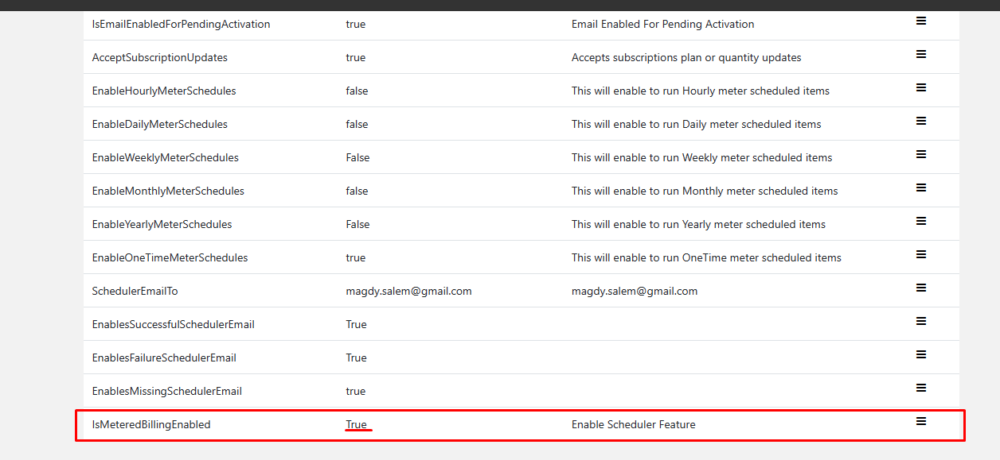
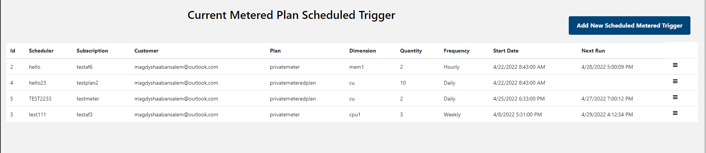
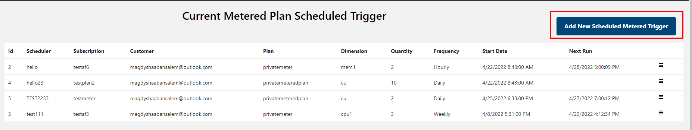
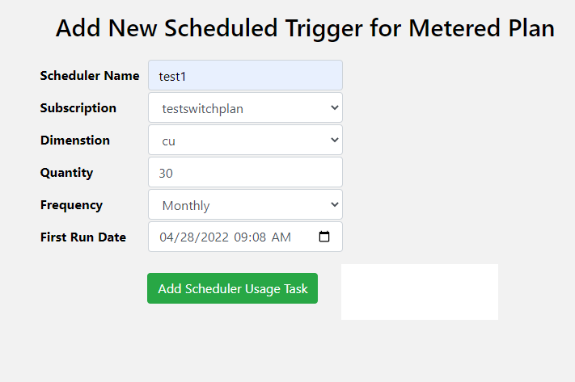
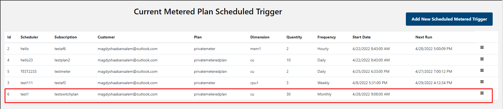
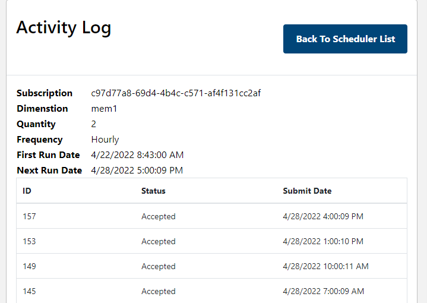

# SaaS Accelerator Metered Scheduler Manager 
Metered Scheduler Manager is a feature where Publisher can schedule **FIX Quantity** metered emiting tasks. The scheduler will monitor these tasks and trigger event based on the scheduled frequency time. Currenty the scheduler support the following time base trigger
1. Hourly
1. Daily
1. Weekly
1. Monthly
1. Yearly
1. OneTime

## Enable and Disable Metered Scheduler Manager Feature Post Installation
Publisher can active the **Metered Scheduler** feature by updating Admin portal App Setting and set **IsMeteredBillingEnabled** to **true**

Publisher can disable the feature by feature by updating Admin portal web configuration and set **IsMeteredBillingEnabled** to **false**

## IMPORTANT: Enable Scheduler Frequencies
Publisher must enable scheduler Frequencies before start scheduling tasks. From **App Config**, publisher can enable or disable available frequencies per business needs. Without enable the frequencies, Publisher will not able to add tasks also the scheduler engine will skip any disabled frequencies.

## Access Metered Scheduler Manager Dashboard
 Publisher can access **Scheduler Manager Dashboard** from **Home page** or side bar menu.

To access dashboad from **Home page**, Publisher will click on **Scheduler Tile** then publisher will be redirect to dashboard summary page.

## Add New Metered Scheduler Manager Task

> **Important**
> Publisher must enable frequencies from Application Configuration page before adding new task.

Publisher can add new scheduled task from by clicking **Add New Scheduled Metered Trigger** from **Dashboard page**

Publisher can schedule the task by click **Add Scheduler Usage Task** and the task will be added to the Sscheduled tasks.
Once the task is added, the new task will show up in **Dashboard page**

## Audit Metered Scheduler Manager Task
Publisher can audit scheduled task results by accessing the **Run History**

There is the example for task audit

## Delete Metered Scheduler Manager Task
Publisher can delete scheduled task by click **Delete**

## Restriction
Currently the scheduler managers can support **only one** scheduled task per
1. Subscription
1. Plan
1. Dimension

