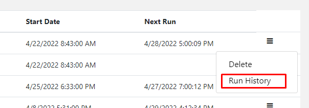
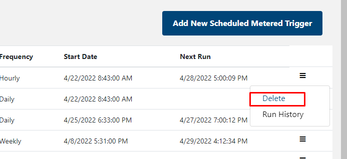

# SaaS Accelerator Metered Scheduler Manager 
Metered Scheduler Manager is an option feature where Publisher can scheduled **FIX Quantity** metered emiting event. The Scheduler then will monitor this task and trigger event based on the scheduled frequency time. Currenty the scheduler support the following time base trigger
1. Hourly
1. Daily
1. Weekly
1. Monthly
1. Yearly
## Enable Metered Scheduler Manager Feature
Publisher can enable this feature during the installion process by passing an option parameter **MeteredSchedulerSupportEnabled** with **YES** value as part of the installion script. Here is example for installtion script with **MeteredSchedulerSupportEnabled** 
``` powershell
wget https://dotnet.microsoft.com/download/dotnet/scripts/v1/dotnet-install.sh; `
chmod +x dotnet-install.sh; `
./dotnet-install.sh; `
$ENV:PATH="$HOME/.dotnet:$ENV:PATH"; `
git clone https://github.com/Azure/Commercial-Marketplace-SaaS-Accelerator.git -b 5.0.0 --depth 1; `
cd ./Commercial-Marketplace-SaaS-Accelerator/deployment/Templates; `
Connect-AzureAD -Confirm; `
.\Deploy.ps1 `
 -WebAppNamePrefix "marketplacesaasgithub-SOME-UNIQUE-STRING" `
 -SQLServerName "marketplacesaasgithub-SOME-UNIQUE-STRING" `
 -SQLAdminLogin "adminlogin" `
 -SQLAdminLoginPassword "a_very_PASSWORD_2_SymB0L@s" `
 -PublisherAdminUsers "user@email.com" `
 -ResourceGroupForDeployment "MarketplaceSaasGitHub" `
 -Location "East US" `
 -PathToARMTemplate ".\deploy.json" `
 -MeteredSchedulerSupportEnabled "YES"
 ```

One feature is enabled. Publisher can access **Scheduler Manager Dashboard** from **Home page** or side bar menu.


## Access Metered Scheduler Manager Dashboard
To access dashboad from **Home page**, Publisher will click on **Scheduler Tile** then publisher will be redirect to dashboard summary page.


## Add New Metered Scheduler Manager Task
Publisher can add new scheduled task from by clicking **Add New Scheduled Metered Trigger** from **Dashboard page**


The Add Task from will load


Once the task is added, the new task will show up in **Dashboard page**


## Audit Metered Scheduler Manager Task
Publisher can audit scheduled task results by accessing the **Run History**


There is the example for task audit


## Delete Metered Scheduler Manager Task
Publisher can deleted scheduled task by click **Delete**


## Restriction
Currently the scheduler managers can support **only one** scheduled task per
1. Subscription
1. Plan
1. Dimension


