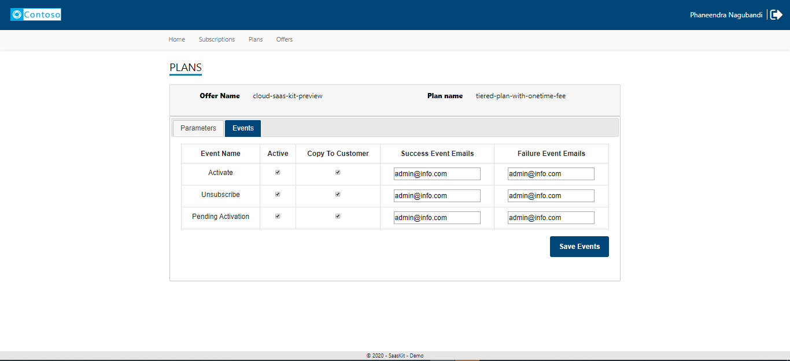

# Publisher Experience


## Overview
The Publisher web application is the admin console for the publisher to help:
- Manage offers - define the input fields that can appear on the landing page for the customer when an offer is purchased
- Manage ARM templates
- Manage plans 
  - control the fields that can appear on the landing page
  - configure events, email recipients, ARM templates that can be deployed
  - define if the ARM templates should be deployed to customer subscription or hosted subscription
- Manage subscriptions
  - Activate
  - Emit usage events
  - Change plan
  - Unsubscribe

## Test purchase to download the offer and plan details
SaaS offers that is published in Azure Market Place can be extracted and managed from the publisher portal.
	
Log on to [Azure](https://portal.azure.com) 

- Click **All Services** menu option on the left


- Search for resources of type **Software as a Service**.
- The page enlists all the SaaS offers that were previously purchased.

- Click **Add** to proceed to purchase a new SaaS offer.
> If you don't have prior subscriptions against SaaS offers, the list would be blank and you would get an option to **Create Software as a Service** button to help you proceed with the purchase.


- Clicking **Add** ( or **Create Software as a Service**) leads you to a page that lists down SaaS offers available for purchase.

- Search for **Cloud SaaS** and locate our SaaS offer in the listing


- Click on the tile to view the details of the offer

- **Select a software plan** and click **Create**
- Fill out the form and click **Subscribe**

- A new resource gets created and appears in the listing

- Click the text under **Name** to view the details of the resource
- Click **Configure Account** option in the header bar. You will now be redirected to the SaaS offer landing page offered by the **AMP SDK Sample Client Application** in a new tab / window
- The landing page presents the details of the offer that was purchased with an option to **Activate** the subscription.
> In a real scenario, the landing page would collect additional details relevant for provisioning the target SaaS application and any additional custom information from customer if required .

## Manage Offers

### Manage offer parameters

- Log on to the **Publisher Portal**
- Click **Offers** in the menu
- The page lists down the offer that is associated with the subscription and the plan that was created during the test purchase in the earlier step
- Click **Edit** under the **Action** column to navigate to the details of the offer and manage offer parameters


> Each row in the screen correlates to a field in the form on the Landing page.
- Click on **Add New Row** to add a new row and fill the details using the below information
  -  *ParameterId* : Usually the name of the field without spaces.
  -  *DisplayName* : Label for the field that should appear on the landing page
  -  *Description* : Description for the field (this will not be shown on the screen and is only for internal purposes)
  -  *ValueTypeId* : Datatype of the field
  -  *FromList*    : Check this box to set the field as a Pick list.
  -  *ValueList*   : Items of the pick list as comma delimited values
  -  *Max*         : Maximum value of the integer field
  -  *Min*         : Minimum value of the integer field
  -  *DisplaySequence* :Order / sequence in which the field appears along with other fields
  -  *IsActive*    : Check this box to have the field in effect. Uncheck the box so that the field stops appearing on the landing page
  -  *IsRequired*  : Check if the input on this field is mandatory
  -  *Remove*      : Remove the item

- Click **Save** after adding the desired number of rows / changes
- The set of the fields here are the global defaults available for override at the plans that are part of the offer

## Manage ARM templates

- Log on to the **Publisher Portal**
- Click **ARM templates** in the menu
- The page lists down the ARM Templates ( if already uploaded ). These are the ARM templates that can be associated to events like activation / unsubscription of a SaaS subscription


- Click **Add** to upload an ARM template
- Click **Browse** to browse to the file and click **Upload**


- The page presents the input and output parameters after parsing the template. The ARM template is stored as a file to the Azure blob storage ( refer to [Installation Instructions](./Installation-Instructions.md) for details on the configuration)


- You could define the values for the input parameters and the values support the following keywords. Here is an explanation on the keywords supported and how they get substituted at runtime just before the ARM template is deployed. The substituted values get saved against SaaS subscription as deployment parameters.

| Keyword | Value|
|---------|------|
| $\{Subscription} | Name of the subscription (spaces replaced with hyphen)|
| $\{Plan} | Name of the plan associated with the SaaS subscription (spaces replaced with hyphen) |
| $\{Offer} | Name of the offer associated with the SaaS subscription (spaces replaced with hyphen) |

       
## Manage Plans

- Log on to the **Publisher Portal**
- Click **Plans** in the menu
- The page lists down the plans against all the subscriptions created against the SaaS offers
- Click **Edit** under the **Action** column to navigate to the details of the plan and manage plan parameters and events

### Subscription input parameters

- Click **Parameters** tab to see a list of input parameters that can be configured to appear on the subscription landing page for the customer at the time of purchase
- Check the box under the column **Enable** to make the field appear on the landing page. Uncheck it to hide the input from appearing on the landing page


- Check the box - **Deploy to customer subscription** if the ARM template associated with the plan should be deployed to the customer subscription during provisioning. Checking this box would lead to additional input fields to show up on the landing page to collect the tenant, subscription, service principal and secret details from the customer.

 

### Subscription events   

- Click **Events** tab in the plan detail to see the configuration of ARM templates and the email recipients by events that are relevant in the provisioning of a SaaS subscription

- Check the box if an event configuration should ne activated
- Select an ARM Template in case it has to be deployed as part of processing the event for the SaaS subscription
- Check the box - **Copy to Customer** to include customer email address in the email notifications relevant to the event

### Subscriptions
- All the subscriptions purchased will be availabe under the subscriptions screen.
- The status of each subscription will be availbe in the list.
- From this scree the actions on the subscriptions like Change Plan, Chan Quantity,  Manage Usage, Activate and unsubscribe can be done depending on the status.


### Activate

The below diagram illustrates the flow of information between Azure and the Azure marketplace SDK client application.


- On the landing page, review the details presented and click **Activate**

> The AMP SDK sample application calls the following AMP SDK API methods in the background

```csharp
// Determine the details of the offer using the marketplace token that is available in the URL during the redirect from Azure to the landing page.
Task<ResolvedSubscriptionResult> ResolveAsync(string marketPlaceAccessToken);

// Activates the subscription to trigger the start of billing 
Task<SubscriptionUpdateResult> ActivateSubscriptionAsync(Guid subscriptionId, string subscriptionPlanID);

```

- Upon successful activation of the subscription, the landing page switches to a view that enlists the subscriptions against the offer. 
> You can switch to Azure and note that the **Configure Account** button is replaced by **Manage Account** button indicating that the subscription has been materialized.

> **Note** If activation workflow is enabled, by turning on the flag - **IsAutomaticProvisioningSupported** in the ApplicationConfiguration table, the application would put the subscription in PendingActivation status and the Fulfillment API to activate the subscription is not called. Publisher has the option to activate the subscription via the action menu in the subscription listing in the Publisher Portal.

### Change plan

The below diagram illustrates the flow of information between Azure and the Azure marketplace SDK client application.

- Log on to [AMP SDK sample application]().
- Click **Subscriptions** from the menu on the top, in case you are not on the page that shows you the list of subscriptions.
- The table on this page enlists all the subscriptions and their status.
- Click **Change Plan** option in the dropdown menu that appears when the icon under the **Actions** column against any of the active subscriptions is clicked.

- A popup appears with a list of plans that you can switch to.
- Select a desired plan and click **Change Plan**.


> The AMP SDK sample application calls the following AMP SDK API methods in the background

```csharp
// Initiate the change plan process
Task<SubscriptionUpdateResult> ChangePlanForSubscriptionAsync(Guid subscriptionId, string subscriptionPlanID);

```
>The operation is asynchronous and the call to **change plan** comes back with an operation location that should be queried for status.

```csharp
// Get the latest status of the subscription due to an operation / action.
Task<OperationResult> GetOperationStatusResultAsync(Guid subscriptionId, Guid operationId);
```

> **Note** If activation workflow is enabled, by turning on the flag - **IsAutomaticProvisioningSupported** in the ApplicationConfiguration table, the option to **Change Plan** is disabled for customers. Publisher has the option to change the plan of the subscription via the action menu in the subscription listing in the Publisher Portal.

### Unsubscribe

- Log on to [AMP SDK sample application]().
- Click **Subscriptions** from the menu on the top, in case you are not on the page that shows you the list of subscriptions.
- The table on this page enlists all the subscriptions and their status.
- Click **Unsubscribe** against an active subscription.

- Confirm your action to trigger the deletion of the subscription.
> The AMP SDK sample application calls the following AMP SDK API methods in the background.

```csharp
// Initiate the delete subscription process
Task<SubscriptionUpdateResult> DeleteSubscriptionAsync(Guid subscriptionId, string subscriptionPlanID);
```

> The operation is asynchronous and the call to **change plan** comes back with an operation location that should be queried for status.

```csharp
// Get the latest status of the subscription due to an operation / action.
Task<OperationResult> GetOperationStatusResultAsync(Guid subscriptionId, Guid operationId);
```
> **Note** If activation workflow is enabled, by turning on the flag - **IsAutomaticProvisioningSupported** in the ApplicationConfiguration table, the option to **Unsubscribe** is disabled for customers. Publisher has the option to delete the subscription via the action menu in the subscription listing in the Publisher Portal.

### Change Quantity

- Log on to [AMP SDK sample application]().
- Click **Subscriptions** from the menu on the top, in case you are not on the page that shows you the list of subscriptions.
- The table on this page enlists all the subscriptions and their status.
- Click **Change quantity** in the menu as shown in the below picture


- Provide the new quantity and click **Change Quantity** to update the quantity on the subscription


> Note: The update to quantity is applicable if only the subscription is against a Plan that is set to be billed per user
  


> The AMP SDK sample application calls the following AMP SDK API methods in the background.

```csharp
Task<SubscriptionUpdateResult> ChangeQuantityForSubscriptionAsync(Guid subscriptionId, int? subscriptionQuantity);
```

> The operation is asynchronous and the call to **change plan** comes back with an operation location that should be queried for status.

```csharp
// Get the latest status of the subscription due to an operation / action.
Task<OperationResult> GetOperationStatusResultAsync(Guid subscriptionId, Guid operationId);
```

**Update Plan to indicate per user pricing**

Use the following script as an example / template to update the records in **Plans**

```sql
UPDATE Plans SET IsPerUser = 1 WHERE PlanId = '<ID-of-the-plan-as-in-the-offer-in-partner-center>'
```

The Plan ID is available in the **Plan overview** tab of the offer as shown here:


### View activity log

- Log on to [AMP SDK sample application]().
- Click **Subscriptions** from the menu on the top, in case you are not on the page that shows you the list of subscriptions.
- The table on this page enlists all the subscriptions and their status.
- Click **Activity Log** to view the log of activity that happened against the subscription.
 
 

## Metering

For subscriptions against the plans that support metered billing, a button is enabled to post usage events against the subscription.

> Only one usage event is accepted for the hour interval. The hour interval starts at minute 0 and ends at minute 59. If more than one usage event is emitted for the same hour interval, any subsequent usage events are dropped as duplicates.

> Usage can be emitted with a delay and the maximum delay allowed between is 24 hours.
The usage / consumption is consolidated

### Emit usage events

The following interface in the **Publisher portal** allows the user to manual report the usage against a selected dimension.

> In this example, suppose the SaaS service is offering a notification service that helps its customers send out emails / text. Email and Text are modeled as dimensions and the plan in the marketplace offer captures the definition for charges by these dimensions.


>Note:

 > *  The option - Manage Usage is available against active subscriptions against a plan that supports metering. You are required to manually update the Plan record in the database to indicate that it supports metering. Besides, the meters for the plan should be initialized in the **MeteredDimensions** table
 
**Update Plan to indicate support for metering**

Use the following script as an example / template to update the records in **Plans**

```sql
UPDATE Plans SET IsmeteringSupported = 1 WHERE PlanId = '<ID-of-the-plan-as-in-the-offer-in-partner-center>'
```

The Plan ID is available in the **Plan overview** tab of the offer as shown here:


**Initialize meters for plan**

Use the following script as an example / template to initialize meters in **MeteredDimensions** table

```sql
INSERT INTO MeteredDimensions ( Dimension, PlanId, Description, CreatedDate)
SELECT '<dimension-as-in-partner-center', '<id-of-the-plan>', '<description>', GETDATE()
```

The **Dimension** in the above example should be the attribute of a meter in the plan as shown in the below image:


> The SaaS metering service calls the below API to emit usage events
```csharp
/// <summary>
/// Emits the usage event asynchronous.
/// </summary>
/// <param name="usageEventRequest">The usage event request.</param>
/// <returns></returns>
Task<MeteringUsageResult> EmitUsageEventAsync(MeteringUsageRequest usageEventRequest);
```

The service tracks the requests sent and the response received from the marketplace metering APIs for auditing purposes.

## Manage Licenses

- Log on to [Publisher portal]()
- Click **Licenses** menu at the top to view the list of subscriptions and licenses.
- There is an option to **Revoke** an active license and **Activate** an already revoked license.

- Select a subscription, enter license key detail and hit **Add License** to assign a license.

