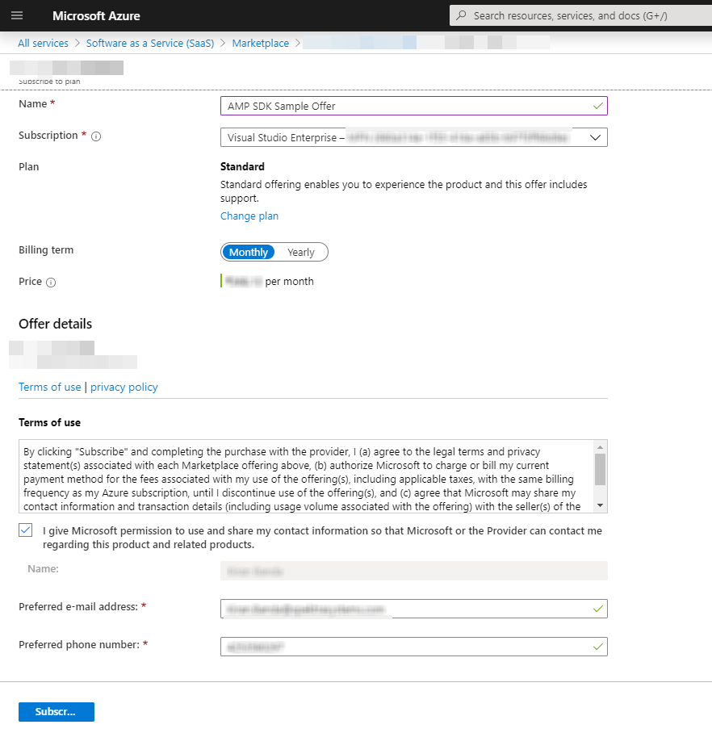
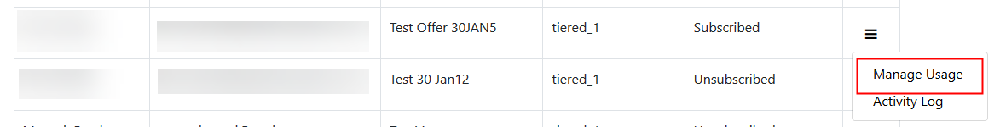
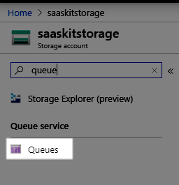
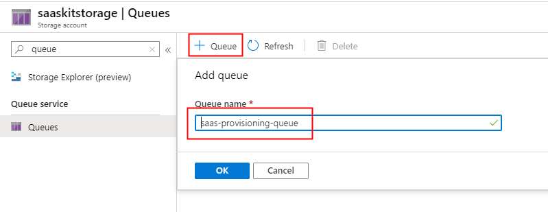

# Publisher Experience

 * [Overview](#overview)
 
 *  [Offers](#offers)
     * [Offer Parameters](#offers-parameters)
 * [Plans](#Plans)
     * [Plan Parameters](#plan-parameters)
     * [Plan Events](#plan-events)
 * [ARM Templates](#arm-templates)
 * [Subscriptions](#Subscriptions)
     * [Activate](#activate)
     * [Change plan](#change-plan)
     * [Unsubscribe](#unsubscribe)
     * [Change quantity](#change-quantity)
     * [View activity log](#view-activity-log)
     * [Go to SaaS application](#Go-to-SaaS-application)
     * [SaaS metering service](#SaaS-metering-service)
     * [Emit usage events](#Emit-usage-events)
     * [License Manager](#license-manager)
 * [Azure Web Job Sotrage Connection](#Azure-Web-Job-Sotrage-Connection)
 * [Azure Key Vault](#Azure-Key-Vault)
 * [Azure Blob Storage](#Azure-Blob-Storage)

## Overview
The Publisher web application showcases how to generate metered based transactions, persistence of those transactions and transmission of these transactions to the metered billing API. 
The application also provides feasibility to capture information from customer by defining the parameters in the offer level.

## Offers
SaaS offers that is published in Azure Market Place can be extracted and managed form the portal.
	
Log on to [Azure](https://portal.azure.com) 

- Click **All Services** menu option on the left


- Search for resources of type **Software as a Service**.
- The page enlists all the SaaS offers that were previously purchased.

- Click **Add** to proceed to purchase a new SaaS offer.
> If you don't have prior subscriptions against SaaS offers, the list would be blank and you would get an option to **Create Software as a Service** button to help you proceed with the purchase.


- Clicking **Add** ( or **Create Software as a Service**) leads you to a page that lists down SaaS offers available for purchase.

- Search for **Cloud SaaS** and locate our SaaS offer in the listing


- Click on the tile to view the details of the offer

- **Select a software plan** and click **Create**
- Fill out the form and click **Subscribe**

- A new resource gets created and appears in the listing

- Click the text under **Name** to view the details of the resource
- Click **Configure Account** option in the header bar. You will now be redirected to the SaaS offer landing page offered by the **AMP SDK Sample Client Application** in a new tab / window
- The landing page presents the details of the offer that was purchased with an option to **Activate** the subscription.
> In a real scenario, the landing page would collect additional details relevant for provisioning the target SaaS application and any additional custom information from customer if required .

## Add additional fields in the Landing page
### **Offer level fields setup**

- Navigat to the **Offers** screen, the offer that was published will be available here.
- Under the **Action**, click on **Edit** to see the offer atttributes screen.

> Each row in the screen representa a column in the Landing page.
- Click on **Add New Row** to add row and fill the detials like 
  -  *ParameterId* : usually the name of the field without spaces.
  -  *DisplayName* : Label of the field 
  -  *Description* : Some information about the fields, this will not be shown on the screen
  -  *ValueTypeId* : Datatype of the field
  -  *FromList*    : To set the field as a Pick list.
  -  *ValueList*   : Items of the pick list in "," separated
  -  *Max*         : Maximum value of the integer field.
  -  *Min*         : Minimum value of the integer field.
  -  *DisplaySequence* :Display sequence of the fields
  -  *IsActive*    : Activate or deactivate the filed.
  -  *IsRequired*  : Set if the field is required.
  -  *Remove*      : Remove the item. 

- After adding the all the information, save the details.
- These fields will be additional filed on offer level.
       
### **Plan level fields setup**

#### Plan Parameters
- Navigate to **Plans** screen, the plans registered under the offer will be available here.
- Under the **Action**, click on **Edit** to see the plan attributes screen.

>All the active fields created under the offer will be available here.
- The fields enabled in the plan parameters will be shown on the landing page to capture information form customer.
- By enabling **Deploy to Customer subscription**, additional fields required to deploy the app in customer subscription will be shown in the landing page.
- User need to provide the Fields like below which will help in deploying app in the subscription.
   - *Tenant Id*
   - *Subscription Id*
   - *Client ID*
   - *Client Secret*
    
#### Plan Events
- Here the ARM template to deploy the application and recipient of the notification email on a plan while activating or unsubscribing will be specified.
- Only Active records will be considered for Deploying or notifying.
- Copy to customer will send a notification to customer email address.


### ARM Templates
- An ARM Template will help in deploying web apps or database in Azure subscription.
- The ARM Template can be uploaded form the screen which will be saved to Azure storage account container / blob storage.
- The Input and Output parameters associated with the template will be shown on the screen after uploading the file.
- The input parameters should be filled at this time, there is an option of replacing the text in the input field while deploying the template.
If the Field is filled with ${Subscription} the value will be replaced with Subscription name (saas-offer-subscription)  while deploying.

| Code | Replaced With|
-----------------------
| ${Subscription} |  ‘Subscription Name’ |

| ${Plan} |  ‘Plan Name’ |

| ${ Offer } |  ‘Offer Name’ |
- The output parameters are disabled in the screen and will be filled after deployment.


### Subscription
- All the subscriptions purchased will be availabe under the subscriptions screen.
- The status of each subscription will be availbe in the list.
- From this scree the actions on the subscriptions like Change Plan, Chan Quantity,  Manage Usage, Activate and unsubscribe can be done depending on the status.


### Activate

The below diagram illustrates the flow of information between Azure and the Azure marketplace SDK client application.


- On the landing page, review the details presented and click **Activate**

> The AMP SDK sample application calls the following AMP SDK API methods in the background

```csharp
// Determine the details of the offer using the marketplace token that is available in the URL during the redirect from Azure to the landing page.
Task<ResolvedSubscriptionResult> ResolveAsync(string marketPlaceAccessToken);

// Activates the subscription to trigger the start of billing 
Task<SubscriptionUpdateResult> ActivateSubscriptionAsync(Guid subscriptionId, string subscriptionPlanID);

```

- Upon successful activation of the subscription, the landing page switches to a view that enlists the subscriptions against the offer. 
> You can switch to Azure and note that the **Configure Account** button is replaced by **Manage Account** button indicating that the subscription has been materialized.

> **Note** If activation workflow is enabled, by turning on the flag - **IsAutomaticProvisioningSupported** in the ApplicationConfiguration table, the application would put the subscription in PendingActivation status and the Fulfillment API to activate the subscription is not called. Publisher has the option to activate the subscription via the action menu in the subscription listing in the Publisher Portal.

### Change plan

The below diagram illustrates the flow of information between Azure and the Azure marketplace SDK client application.

- Log on to [AMP SDK sample application]().
- Click **Subscriptions** from the menu on the top, in case you are not on the page that shows you the list of subscriptions.
- The table on this page enlists all the subscriptions and their status.
- Click **Change Plan** option in the dropdown menu that appears when the icon under the **Actions** column against any of the active subscriptions is clicked.

- A popup appears with a list of plans that you can switch to.
- Select a desired plan and click **Change Plan**.


> The AMP SDK sample application calls the following AMP SDK API methods in the background

```csharp
// Initiate the change plan process
Task<SubscriptionUpdateResult> ChangePlanForSubscriptionAsync(Guid subscriptionId, string subscriptionPlanID);

```
>The operation is asynchronous and the call to **change plan** comes back with an operation location that should be queried for status.

```csharp
// Get the latest status of the subscription due to an operation / action.
Task<OperationResult> GetOperationStatusResultAsync(Guid subscriptionId, Guid operationId);
```

> **Note** If activation workflow is enabled, by turning on the flag - **IsAutomaticProvisioningSupported** in the ApplicationConfiguration table, the option to **Change Plan** is disabled for customers. Publisher has the option to change the plan of the subscription via the action menu in the subscription listing in the Publisher Portal.

### Unsubscribe

- Log on to [AMP SDK sample application]().
- Click **Subscriptions** from the menu on the top, in case you are not on the page that shows you the list of subscriptions.
- The table on this page enlists all the subscriptions and their status.
- Click **Unsubscribe** against an active subscription.

- Confirm your action to trigger the deletion of the subscription.
> The AMP SDK sample application calls the following AMP SDK API methods in the background.

```csharp
// Initiate the delete subscription process
Task<SubscriptionUpdateResult> DeleteSubscriptionAsync(Guid subscriptionId, string subscriptionPlanID);
```

> The operation is asynchronous and the call to **change plan** comes back with an operation location that should be queried for status.

```csharp
// Get the latest status of the subscription due to an operation / action.
Task<OperationResult> GetOperationStatusResultAsync(Guid subscriptionId, Guid operationId);
```
> **Note** If activation workflow is enabled, by turning on the flag - **IsAutomaticProvisioningSupported** in the ApplicationConfiguration table, the option to **Unsubscribe** is disabled for customers. Publisher has the option to delete the subscription via the action menu in the subscription listing in the Publisher Portal.

### Change Quantity

- Log on to [AMP SDK sample application]().
- Click **Subscriptions** from the menu on the top, in case you are not on the page that shows you the list of subscriptions.
- The table on this page enlists all the subscriptions and their status.
- Click **Change quantity** in the menu as shown in the below picture


- Provide the new quantity and click **Change Quantity** to update the quantity on the subscription


> Note: The update to quantity is applicable if only the subscription is against a Plan that is set to be billed per user
  


> The AMP SDK sample application calls the following AMP SDK API methods in the background.

```csharp
Task<SubscriptionUpdateResult> ChangeQuantityForSubscriptionAsync(Guid subscriptionId, int? subscriptionQuantity);
```

> The operation is asynchronous and the call to **change plan** comes back with an operation location that should be queried for status.

```csharp
// Get the latest status of the subscription due to an operation / action.
Task<OperationResult> GetOperationStatusResultAsync(Guid subscriptionId, Guid operationId);
```

**Update Plan to indicate per user pricing**

Use the following script as an example / template to update the records in **Plans**

```sql
UPDATE Plans SET IsPerUser = 1 WHERE PlanId = '<ID-of-the-plan-as-in-the-offer-in-partner-center>'
```

The Plan ID is available in the **Plan overview** tab of the offer as shown here:


### View activity log

- Log on to [AMP SDK sample application]().
- Click **Subscriptions** from the menu on the top, in case you are not on the page that shows you the list of subscriptions.
- The table on this page enlists all the subscriptions and their status.
- Click **Activity Log** to view the log of activity that happened against the subscription.
 
 

### Go to SaaS application

- Log on to [AMP SDK sample application]().
- Click **Subscriptions** from the menu on the top, in case you are not on the page that shows you the list of subscriptions.
- The table on this page enlists all the subscriptions and their status.
- Click **SaaSApp** from options menu under **Actions** to navigate to the target SaaS application.


## SaaS metering service

The **SaaS metering service** is the web application that helps ISVs to look at the subscriptions against the marketplace offer.



For subscriptions against the plans that support metered billing, a button is enabled to post usage events against the subscription.

> Only one usage event is accepted for the hour interval. The hour interval starts at minute 0 and ends at minute 59. If more than one usage event is emitted for the same hour interval, any subsequent usage events are dropped as duplicates.

> Usage can be emitted with a delay and the maximum delay allowed between is 24 hours.
The usage / consumption is consolidated

### Emit usage events

The following interface in the **Saas metering service** allows the user to manual report the usage against a selected dimension.

> In this example, suppose the SaaS service is offering a notification service that helps its customers send out emails / text. Email and Text are modeled as dimensions and the plan in the marketplace offer captures the definition for charges by these dimensions.


>Note:

 > *  The option - Manage Usage is available against active subscriptions against a plan that supports metering. You are required to manually update the Plan record in the database to indicate that it supports metering. Besides, the meters for the plan should be initialized in the **MeteredDimensions** table
 
**Update Plan to indicate support for metering**

Use the following script as an example / template to update the records in **Plans**

```sql
UPDATE Plans SET IsmeteringSupported = 1 WHERE PlanId = '<ID-of-the-plan-as-in-the-offer-in-partner-center>'
```

The Plan ID is available in the **Plan overview** tab of the offer as shown here:


**Initialize meters for plan**

Use the following script as an example / template to initialize meters in **MeteredDimensions** table

```sql
INSERT INTO MeteredDimensions ( Dimension, PlanId, Description, CreatedDate)
SELECT '<dimension-as-in-partner-center', '<id-of-the-plan>', '<description>', GETDATE()
```

The **Dimension** in the above example should be the attribute of a meter in the plan as shown in the below image:


> The SaaS metering service calls the below API to emit usage events
```csharp
/// <summary>
/// Emits the usage event asynchronous.
/// </summary>
/// <param name="usageEventRequest">The usage event request.</param>
/// <returns></returns>
Task<MeteringUsageResult> EmitUsageEventAsync(MeteringUsageRequest usageEventRequest);
```

The service tracks the requests sent and the response received from the marketplace metering APIs for auditing purposes.

## License Manager

The license management feature in the SaaS metering service allows the Publisher to assign licenses to the active subscriptions. 
The intent here is to illustrate how the assignment can be done via the interface and how the customer user can consume this detail via the **SaaS Provisioning** application
	
## Azure Web Job Sotrage Connection
Log on to [Azure](https://portal.azure.com)
- Click **Create a resource** in the left menu

- In the search box type **storage account** 
- Thae result will show **Storage account - blob, file, table, queue**, click on the result.
- In the Storage account  Pane click on the **create** button

- Select the **Basic** tab 
- Select a **Subscription** and **Resource Group**


- Under the Instance details pane fill the following Key vault name 
  - Storage account name
  - Location
  - Performance: standard
  - Account kind: Storage (general purpose v1)
  - Replication: Read-access geo-redundant storage (RA-GRS)
- Click on Review + Create
- If the details pass all the validations, create button will be shown up.
- Click on create


## Azure Key Vault 
Create Azure Key Vault:

Log on to [Azure](https://portal.azure.com)
- Click **Create a resource** in the left menu

- In the search box type **Key Vault** 

- resource will be shown in the search result
- Click on the **key vault**

- In the key vault pane click on the **create** button
- Select the **Basic** tab 

- Select a **Subscription** and **Resource Group**

- Under the Instance details pane fill the following Key vault name 
  - Region
  - Pricing tier
  - Soft delete: Enabled
  - Retention period (days)
  - Purge protection: Disabled
- Click on Review + Create
- If the details pass all the validations, create button will be shown up.
- Click on create

- Once the storage account created, go the resource and search for Queues in left pane.

- Click on the **Queue** button and give the name for the queue as **saas-provisioning-queue**

- In the left pane navigate to **Access Keys** and copy **Connection string** under **key1**

- Navigate to **Properties** and copy **File service**, **Queue service** and **Table service**.
- Prepare the AzureWebJobsStorage wiht the collected information and place it in application settings.
"AzureWebJobsStorage": <connection string>;BlobEndpoint=<Blob service>;QueueEndpoint=<Queue service>;TableEndpoint=<Table service>;FileEndpoint=<File service>;
- EndpointSuffix=core.windows.net is not required in the connection.
### Azure Blob Storage
- In the storage account Navigate to **Blob Service**.
- Select **containers**.

- Click on **+ Container**.
- Give a name to the container and set public access level to **Private (no anonymous access)**

- Click on create.
- In the left pane navigate to **Access Keys** and copy **Connection string** under **key1**
- EndpointSuffix=core.windows.net si required in the connection.
- Place the **BlobContainer** and the **BlobConnectionString** in the application config under **AzureBlobConfig**.
#### Azure App Registration
- Now Register the app in azure active directory.
- Go to home page of [Azure](https://portal.azure.com)
- Click **Azure Active Directory** in the left menu
- Click **App Registrations** in the menu on the left
- Click on **New Registration**

- Give a name to the app and click on **Register**.

- After registering the app, in the left menu click on **Certificate & secret**

- Click on **+ New client Secret**

- Give a name to the secret and copy the auto generated **secret value** (keep the secret safe as it cannot be retrieved again).
- Now click on the Overview of the app and copy **Application (client) ID** and **Dictionary (Tenant) ID**.

- All the gathered values should be added to the application config of the Saas application.

 - **ClientSecret** - Secret from he Azure Active Directory Application

    - **Resource** - Set this to *62d94f6c-d599-489b-a797-3e10e42fbe22*

    - **FulFillmentAPIBaseURL** - https://marketplaceapi.microsoft.com/api

    - **SignedOutRedirectUri** - Set the path to the page the user should be redirected to after signing out from the application

    - **TenantId** - Provide the tenant ID detail that was submitted in the. **Technical configuration** section of your marketplace offer in Partner Center.

    - **FulfillmentApiVersion** - Use 2018-09-15 for mock API and 2018-08-31 for the production version of the fulfilment APIs

    - **AdAuthenticationEndpoint** - https://login.microsoftonline.com
    
    - **SaaSAppUrl** - URL to the SaaS Metering service ( for this example. It should be the link to the SaaS application, in general)
    
    - **DefaultConnection** - Set the connection string to connect to the database    

- Sample **appSettings.json** would look like below:

```json
{
  "Logging": {
    "LogLevel": {
      "Default": "Information",
      "Microsoft": "Warning",
      "Microsoft.Hosting.Lifetime": "Information"
    }
  },
   // Comment the sections - SaaSApiConfiguration and Connection strings when deploying to Azure
  "SaaSApiConfiguration": {
    "GrantType": "client_credentials",
    "ClientId": "<Azure-AD-Application-ID>",
    "ClientSecret": "******",
    "Resource": "62d94f6c-d599-489b-a797-3e10e42fbe22",
    "FulFillmentAPIBaseURL": "https://marketplaceapi.microsoft.com/api",
    "SignedOutRedirectUri": "<provisioning_or_publisher_web_app_base_path>/Home/Index",
    "TenantId": "<TenantID-of-AD-Application>",
    "FulFillmentAPIVersion": "2018-09-15",
    "AdAuthenticationEndPoint": "https://login.microsoftonline.com",
    "SaaSAppUrl" : "<Link-to-SaaS-Application>"
  },
  "connectionStrings" : {
    "DefaultConnection": "Data source=<server>;initial catalog=<database>;user id=<username>;password=<password>"
    },
  "AllowedHosts": "*",
  "AzureWebJobsStorage": "<Connection String for webjob queue>",
  "keyVaultConfig": {
    "ClientID": "<Azure-AD-Application-ID>",
    "ClientSecret": "***********",
    "KeyVaultUrl": "<Url for azure key vault>",
    "TenantID": "<TenantID-of-AD-Application>"
  },
  "AzureBlobConfig": {
    "BlobContainer": "<Azure storage account container>",
    "BlobConnectionString": "<Azure storage account  connection string>"
  }

}

```
**Note**: When defining the keys in Azure App Service -> Configuration -> App Settings, refer to the below example for correctness:

|Name| Value|
|--|--|
|SaaSApiConfiguration__GrantType| client_credentials|_

> **Tip** __(double underscore) should be used to define the config items that appear as nested keys in appSettings.json


	
	
	
	
