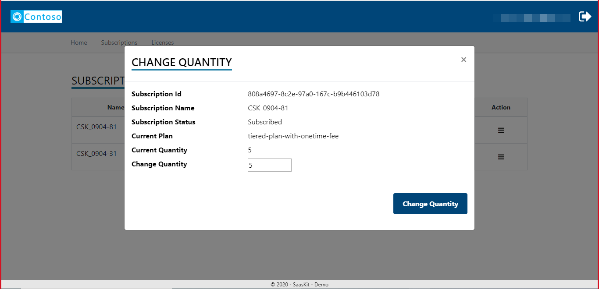

# Publisher Portal - Sample Web Application

## Table of contents

<!-- no toc -->
  - [Table of contents](#table-of-contents)
  - [Overview](#overview)
  - [Manage new subscription landing page input fields](#manage-new-subscription-landing-page-input-fields)
  - [Manage existing subscription landing page input fields](#manage-existing-subscription-landing-page-input-fields)
  - [Subscription events](#subscription-events)
  - [Email setup](#email-setup)
  - [Manage subscriptions](#manage-subscriptions)
  - [Activate a subscription](#activate-a-subscription)
  - [Change plan](#change-plan)
  - [Change quantity](#change-quantity)
  - [Emit usage events](#emit-usage-events)
  - [Unsubscribe](#unsubscribe)
  - [View activity log](#view-activity-log)
  - [External Web Notification Setup](#external-web-notification-setup)

  - [Metered Scheduler Manager](./Metered-Scheduler-Manager-Instruction.md)

## Overview

The publisher web application is the admin console for the publisher for defining the input fields on the landing page and managing marketplace subscriptions.

## Manage new subscription landing page input fields

* Log on to the **Publisher Portal**
* Click **Offers** in the menu
* The page lists down the offer that is associated with the subscription and the plan that was created during the test purchase in the earlier step
* Click **Edit** under the **Action** column to navigate to the details of the offer and manage offer parameters


> Each row in the screen corresponds to a field in the form on the Landing page.

* Click on **Add New Row** to add a new row and fill the details using the information below 
  * *ParameterId* : The name of the field without spaces.
  * *DisplayName* : Label for the field that should appear on the landing page
  * *Description* : Description for the field (this will not be shown on the screen and is only for internal purposes)
  * *ValueTypeId* : Datatype of the field
  * *FromList*    : Check this box to set the field as a Pick list.
  * *ValueList*   : Items of the pick list as comma delimited values
  * *Max*         : Maximum value of the integer field
  * *Min*         : Minimum value of the integer field
  * *DisplaySequence* : Order / sequence in which the field appears along with other fields
  * *IsActive*    : Check this box to have the field in effect. Uncheck the box so that the field stops appearing on the landing page
  * *IsRequired*  : Check if the input on this field is mandatory
  * *Remove*      : Remove the item

* Click **Save** after adding the desired number of rows / changes
* The set of the fields here are the global defaults available for override at the plans that are part of the offer

## Manage existing subscription landing page input fields

* Log on to the **Publisher Portal**
* Click **Plans** in the menu
* The page lists down the plans against all the subscriptions created against the SaaS offers
* Click **Edit** under the **Action** column to navigate to the details of the plan and manage plan parameters and events
* Click **Parameters** tab to see a list of input parameters that can be configured to appear on the subscription landing page for the customer at the time of purchase
* Check the box under the column **Enable** to make the field appear on the landing page. Uncheck it to hide the input from appearing on the landing page


## Subscription events

* Click **Events** tab in the plan detail to see the email recipients by events that are relevant in the provisioning of a SaaS subscription


* Check the box if an event configuration should be activated

* Check the box - **Copy to Customer** to include customer email address in the email notifications relevant to the event

## Email setup

1. **Configure SMTP:** Go to the **Publisher Portal** and in **Application Config**, make sure the **SMTP** values are updated

    


1. **Update settings:** In the **Application Config** page, enable the respective config values to send the emails in different scenarios:
      1. To send emails when a customer is requesting activation on Landing page, set **IsEmailEnabledForPendingActivation** to **True**
      1. To send emails when a subscription is activated, set **IsEmailEnabledForSubscriptionActivation** to **True**
      1. To send emails when a subscription is unsubscribed, set **IsEmailEnabledForUnsubscription** to **True**

    

1. **Add To addresses:** For global email setup, goto Email **Email Templates** page in the bottom on **Application Config** page, update the **ToRecipients** tab for each template. You can add mulitple email ( ; seperated)

	

    1. [Optional] To override for specific plan. In the **Plans** page, go to the **Events** tab
    2. Set the emails' recipients under **Success/Failure Event Emails** and mark them as active in the checkboxes under **Active** [To send the email to the customer, enable the **Copy To Customer** flag]

    

  
    3. To add Bcc emails, go to the **Email Template** in the **Application Config** page and add Bcc emails to the appropriate template


## Manage subscriptions

* All the subscriptions purchased will be available under the subscriptions screen.
* The status of each subscription will be available in the list.
* From this screen the actions on the subscriptions like Change Plan, Change Quantity,  Manage Usage, Activate and unsubscribe can be done depending on the status.


## Activate a subscription

The diagram below illustrates the flow of information between Azure and the Azure marketplace SDK client application.


* On the subscription page, review the details presented and click **Activate**


> The Publisher portal calls the following API client methods in the background.

```csharp
// Determine the details of the offer using the marketplace token that is available in the URL during the redirect from Azure to the landing page.
Task<ResolvedSubscriptionResult> ResolveAsync(string marketPlaceAccessToken);

// Activates the subscription to trigger the start of billing
Task<SubscriptionUpdateResult> ActivateSubscriptionAsync(Guid subscriptionId, string subscriptionPlanID);

```

* Upon successful activation of the subscription, the subscription detail page switches to a view that lists the subscriptions against the offer.

> The subscription for the offer on the Azure portal will display  **Manage Account** on the button for the landing page.

> **Note** If activation workflow is enabled, by turning on the flag - **IsAutomaticProvisioningSupported** in the ApplicationConfiguration table, the application would put the subscription in PendingActivation status and the Fulfillment API to activate the subscription is not called. Publisher has the option to activate the subscription via the action menu in the subscription listing in the Publisher Portal.

## Change plan

Pre-requisite: Set "AcceptSubscriptionUpdates" Key in App config to "True". If "False" or Key doesn't exist, updates will be rejected by the webhook.

The diagram below illustrates the flow of information between Azure and the Azure marketplace SDK client application.


* Log on to **Publisher portal**.
* Click **Subscriptions** from the menu on the top, in case you are not on the page that shows you the list of subscriptions.
* The table on this page lists all the subscriptions and their status.
* Click **Change Plan** option in the dropdown menu that appears when the icon under the **Actions** column against any of the active subscriptions is clicked.


* A popup appears with a list of plans that you can switch to.
* Select a desired plan and click **Change Plan**.
  
  

> The Publisher portal calls the following API client methods in the background.

```csharp
// Initiate the change plan process
Task<SubscriptionUpdateResult> ChangePlanForSubscriptionAsync(Guid subscriptionId, string subscriptionPlanID);

```

>The operation is asynchronous and the call to **change plan** comes back with an operation location that should be queried for status.

```csharp
// Get the latest status of the subscription due to an operation / action.
Task<OperationResult> GetOperationStatusResultAsync(Guid subscriptionId, Guid operationId);
```

> **Note** If activation workflow is enabled, by turning on the flag - **IsAutomaticProvisioningSupported** in the ApplicationConfiguration table, the option to **Change Plan** is disabled for customers. Publisher has the option to change the plan of the subscription via the action menu in the subscription listing in the Publisher Portal.

## Change quantity

Pre-requisite: Set "AcceptSubscriptionUpdates" Key in App config to "True". If "False" or Key doesn't exist, updates will be rejected by the webhook.

The update to quantity is applicable only for the plans with *per user* pricing model.
  


The record for the plan needs to reflect the *per user* pricing model. To update the record, see the following script as an example / template to update the records in **Plans**

```sql
UPDATE Plans SET IsPerUser = 1 WHERE PlanId = '<ID-of-the-plan-as-in-the-offer-in-partner-center>'
```

The Plan ID is available in the **Plan overview** tab of the offer as shown here:


* Log on to **Publisher portal**.
* Click **Subscriptions** from the menu on the top, in case you are not on the page that shows you the list of subscriptions.
* The table on this page lists all the subscriptions and their status.
* Click **Change quantity** in the menu as shown in the below picture


* Provide the new quantity and click **Change Quantity** to update the quantity on the subscription
  


> The Publisher portal calls the following API client methods in the background.

```csharp
Task<SubscriptionUpdateResult> ChangeQuantityForSubscriptionAsync(Guid subscriptionId, int? subscriptionQuantity);
```

> The operation is asynchronous and the call to **Change quantity** comes back with an operation location that should be queried for status.

```csharp
// Get the latest status of the subscription due to an operation / action.
Task<OperationResult> GetOperationStatusResultAsync(Guid subscriptionId, Guid operationId);
```

## Emit usage events

If the plan has custom metering dimensions, the record on the data store needs to reflect it. Use the following script as an example / template to update the records in **Plans**

```sql
UPDATE Plans SET IsmeteringSupported = 1 WHERE PlanId = '<ID-of-the-plan-as-in-the-offer-in-partner-center>'
```

The Plan ID is available in the **Plan overview** tab of the offer as shown here:


After marking the plan to reflect the support of meters, use the following script as an example / template to initialize meters in **MeteredDimensions** table

```sql
INSERT INTO MeteredDimensions ( Dimension, PlanId, Description, CreatedDate)
SELECT '<dimension-as-in-partner-center', '<id-of-the-plan>', '<description>', GETDATE()
```

The **Dimension** in the above example should be the attribute of a meter in the plan as shown in the below image:


A button is enabled to post usage events against the subscription if it's plan supports metering.

> Please see the [frequently asked question document](https://docs.microsoft.com/en-us/azure/marketplace/partner-center-portal/marketplace-metering-service-apis-faq) for the details about timing of emitting usage events.

The following interface in the **Publisher portal** allows the user to manual report the usage against a selected dimension.

> In this example, suppose the SaaS solution is a notification service that helps its customers send out emails / text. Email and Text are modeled as dimensions and the plan in the marketplace offer captures the definition for charges by these dimensions.


The SaaS metering service calls the below API to emit usage events

```csharp
/// <summary>
/// Emits the usage event asynchronous.
/// </summary>
/// <param name="usageEventRequest">The usage event request.</param>
/// <returns></returns>
Task<MeteringUsageResult> EmitUsageEventAsync(MeteringUsageRequest usageEventRequest);
```

The service tracks the requests sent and the response received from the marketplace metering APIs for auditing purposes.

## Unsubscribe

* Log on to **Publisher portal**.
* Click **Subscriptions** from the menu on the top, in case you are not on the page that shows you the list of subscriptions.
* The table on this page lists all the subscriptions and their status.
* Click **Unsubscribe** against an active subscription.

* Confirm your action to trigger the deletion of the subscription.

> The Publisher portal calls the following API client methods in the background.

```csharp
// Initiate the delete subscription process
Task<SubscriptionUpdateResult> DeleteSubscriptionAsync(Guid subscriptionId, string subscriptionPlanID);
```

> The operation is asynchronous and the call to **Unsubscribe** comes back with an operation location that should be queried for status.

```csharp
// Get the latest status of the subscription due to an operation / action.
Task<OperationResult> GetOperationStatusResultAsync(Guid subscriptionId, Guid operationId);
```

> **Note** If activation workflow is enabled, by turning on the flag - **IsAutomaticProvisioningSupported** in the ApplicationConfiguration table, the option to **Unsubscribe** is disabled for customers. Publisher has the option to delete the subscription via the action menu in the subscription listing in the Publisher Portal.


## View activity log

* Log on to **Publisher portal**.
* Click **Subscriptions** from the menu on the top, in case you are not on the page that shows you the list of subscriptions.
* The table on this page lists all the subscriptions and their status.
* Click **Activity Log** to view the log of activity that happened against the subscription.
 
 


## External Web Notification Setup

The "External Notification Configuration" feature enables publishers to set up an external notification URL to receive event notifications for specific actions performed by customers. Publishers can configure the URL to which notifications will be sent when customers interact on thie SaaS Accelerator instance with the following events:

1. **Subscribe or Activate Button Click:** Whenever a customer clicks on the "Subscribe" or "Activate" button on the Landing Page, an event notification will be triggered.
2. **Webhook Notifications is received:** This feature supports various webhook notifications, including "Change Plan," "Change Quantity," and "Unsubscribe" events. Whenever any of these events occur and as they are received on Webhook endpoint, the corresponding notifications will be sent to the configured external URL.

### How to setup

1. Go to Application configuration on the Admin portal
1. Edit the config ```WebNotificationUrl``` and set the external web notification URL value (If this setting doesnt exist please make sure you are running the latest version of the Accelerator)

### Monitoring 

ISV can review these events in the Application log page of the administration portal

### Payload information


Below is the format of the body, ISV can expect when they recieve the notification. 

`payloadFromLandingpage` is empty for Webhook notifications and `payloadFromWebhook` is empty for Landingpage notification.

#### Interesting JSON values

| Value | Notes |
| -------- | ------- |
| `applicationName` | App name from settings |
| `eventType` | LandingPage or Webhook |
| `payloadFromLandingpage` | Empty if `payloadFromWebhook` present |
| `payloadFromWebhook` | Empty if `payloadFromLandingpage` present |
| `payloadFromWebhook` > `action` | One of:  `ChangePlan`,  `ChangeQuantity`, `Renew`, `Suspend`, `Unsubscribe`, `Reinstate`. For more detail [see here](https://learn.microsoft.com/en-us/partner-center/marketplace/partner-center-portal/pc-saas-fulfillment-webhook). |

#### Landing page sample payload

```json
{
    "applicationName": "Contoso",
    "eventType": "LandingPage",
    "payloadFromLandingpage": {
        "landingpageSubscriptionParams":
        [
            
            {
                "key": "country",
                "value": "test"
            },
            {
                "key": "phone",
                "value": "test"
            }
        ],
        "id": "<Guid>",
        "publisherId": "test",
        "offerId": "test",
        "name": "test",
        "saasSubscriptionStatus": "PendingFulfillmentStart",
        "planId": "basic",
        "quantity": 0,
        "purchaser": {
            "tenantId": "<Guid>",
            "emailId": "test",
            "objectId": "<Guid>"
        },
        "beneficiary": {
            "tenantId": "<Guid>",
            "emailId": "test@test.com",
            "puid": null,
            "objectId": "<Guid>"
        },
        "term": {
            "endDate": "0001-01-01T00:00:00+00:00",
            "startDate": "0001-01-01T00:00:00+00:00",
            "termUnit": "P1M"
        }
    },
    "payloadFromWebhook": {}
}
```

#### Webhook `Unsubscribe` event sample payload

```json
{
    "applicationName": "Contoso", 
    "eventType": "Webhook", 
    "payloadFromLandingpage": {},
    "payloadFromWebhook": {
        "action": "Unsubscribe",
        "activityId": "<Guid>",
        "offerId": "test",
        "Id": "<Guid>",
        "PlanId": "test",
        "PublisherId": "test",
        "Quantity": 1,
        "status": "Succeeded",
        "subscriptionId": "<Guid>",
        "timeStamp": "2023-07-01T21:26:08.1492174+00:00",
        "subscription": {
            "id": "<Guid>",
            "name": "test",
            "offerId": "test",
            "planId": "test",
            "quantity": null,
            "saasSubscriptionStatus": "Unsubscribed"
        }
    }
}
```

#### Webhook `ChangePlan` event sample payload

```json
{
    "applicationName": "Contoso",
    "eventType": "Webhook",
    "payloadFromLandingpage": {},
    "payloadFromWebhook": {
        "action": "ChangePlan",
        "activityId": "<Guid>",
        "offerId": "test",
        "Id": "<Guid>",
        "PlanId": "basic",
        "PublisherId": "test",
        "Quantity": 1,
        "status": "InProgress",
        "subscriptionId": "<Guid>",
        "timeStamp": "2023-07-01T21:23:24.2354373+00:00",
        "subscription": {
            "id": "<Guid>",
            "name": "test",
            "offerId": "test",
            "planId": "test",
            "quantity": null,
            "saasSubscriptionStatus": "Subscribed"
        }
    }
}
```