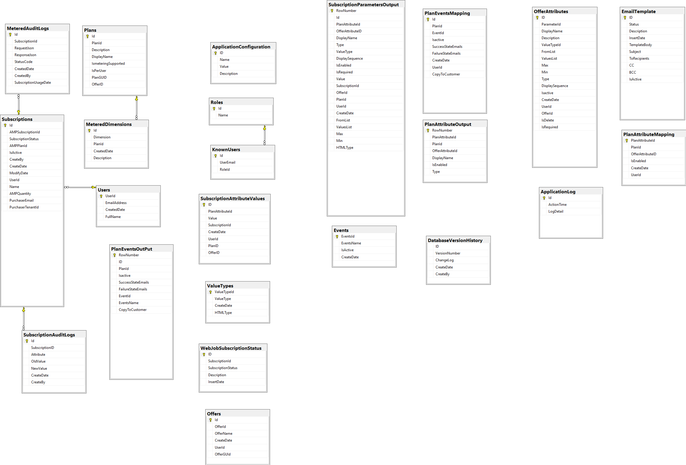

# Transactable SaaS SDK Sample Database

### Introduction

The Provisioning and the Publisher applications use SQL Server database as the data source to store subscriptions and the status, metered dimensions by plans and activity against subscriptions.

### Description 

The following picture illustrates the entities and the relationships among them:

 

| Entity | Description |
| --- | --- |  
| ApplicationLog  | Activity in the application is tracked via a custom logger implementation |
| Plans  | All the plans related to the marketplace offer are stored here|
| MeteredDimensions  | Stores the meters related to plans |
| Subscriptions  | Holds the Subscriptions against the marketplace offer and the latest status |
| SubscriptionAuditLogs  | Activity against a subscription due to actions like activation, change plan and unsubscribe are tracked here|
| SubscriptionLicenses | Licenses assigned to subscriptions are stored here |
| MeteredAuditLogs | The request and response against metering API is stored here. Helps troubleshoot issuses when posting usage data to Azure |
| Users | Holds the users auto-registered via the Provisioning service |
