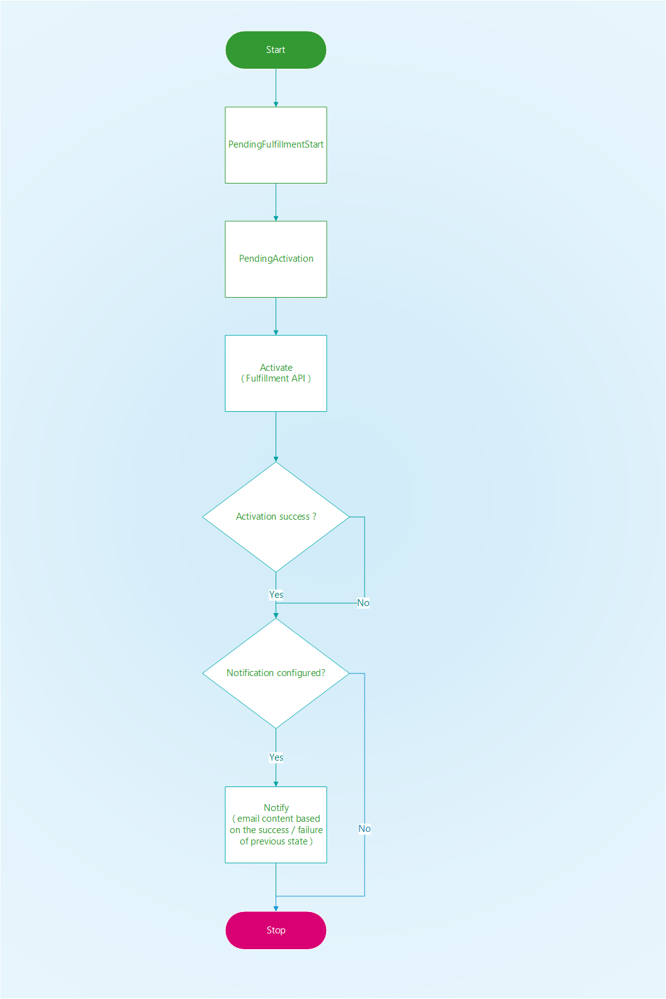
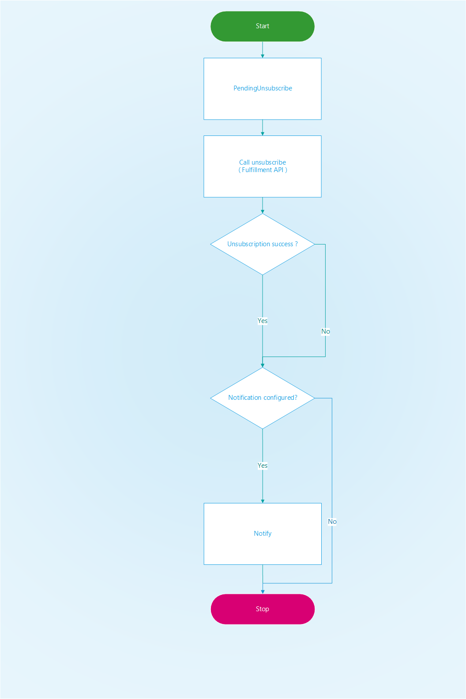

# SaaS provisioning webjob

## Introduction

Background job to process requests to provision SaaS subscriptions. The webjob gets triggered due to a message enqueued by the **Customer portal** application and the **Publisher portal** to a storage queue. The job moves the subscription through various statuses and takes care of the following actions:

* Activate / delete SaaS subscription
* Notify customer / publisher based on the event configuration set at the plan related to the subscription in context

## Subscription state transition

Subscription flows through the following statuses due to activation / deletion and the following diagrams illustrate the status flow:

### Activation

### Deletion

## Source Code

The Project is located in the **SaaS.SDK.Provisioning.Webjob** folder. The project is composed of the following sections:

| Section Name | Description |
| --- | --- |  
| Dependencies | Microsoft.Azure.Management.ResourceManager, Microsoft.Azure.WebJobs.Extensions, Microsoft.Azure.WebJobs.Extensions.Storage, Microsoft.Extensions.Logging.Console, Microsoft.Rest.ClientRuntime.Azure.Authentication|
| StatusHandlers | Interface - ISubscriptionStatusHandler and the various implementations to handle the statuses|
